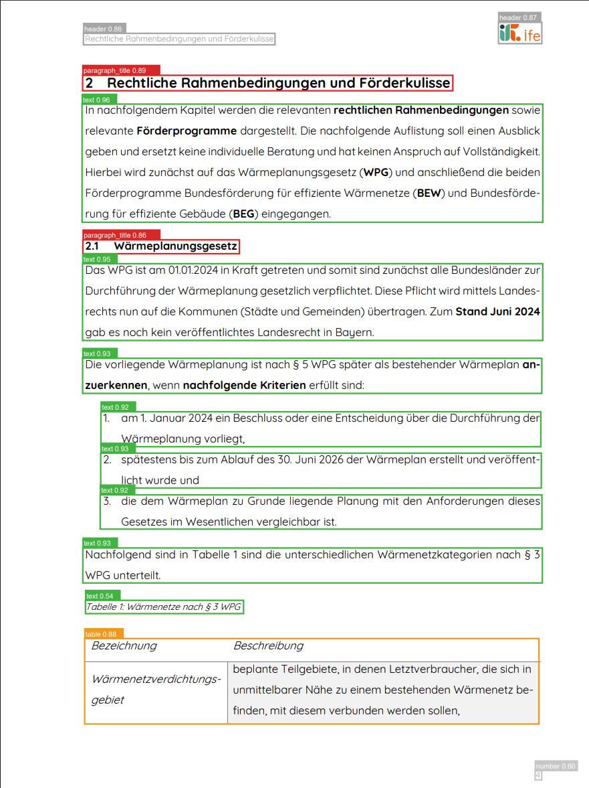
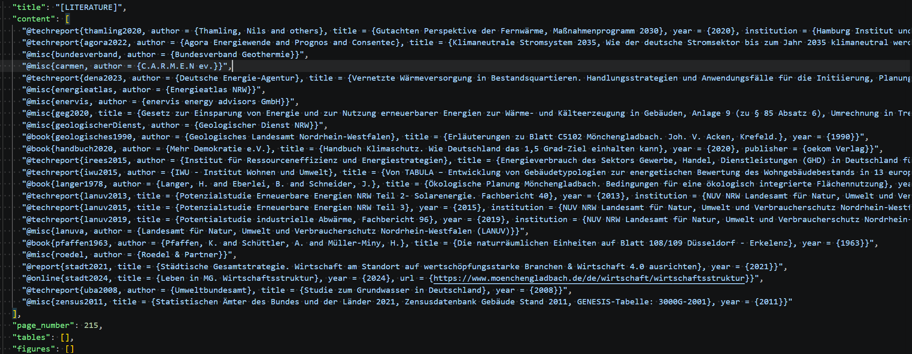
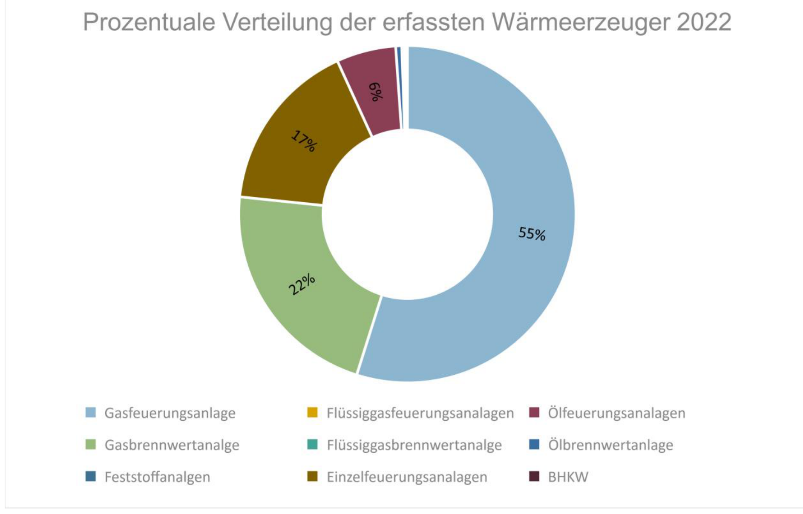
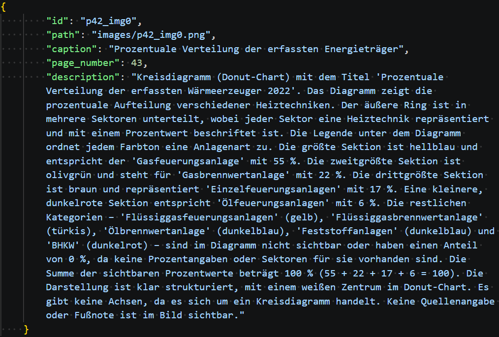

# KWP PDF-Processing-Pipeline – Zusammenfassung

**Felix Vossel, 14.04.2026**

---

## Überblick

Wir verarbeiten aktuell **617 kommunale Wärmepläne** in einer Pipeline aus **fünf Modulen** (`fileprocessing` → `preprocessing` → `textrefinement` → `imageprocessing` → `chunkingandembedding`), die aus den Roh-PDFs eine semantisch durchsuchbare Wissensbasis aufbaut, um damit (hoffentlich) die Entwicklung der MHPO zu untersützen. Die unten beschriebenen sechs logischen Verarbeitungsstufen verteilen sich auf diese fünf Module (`preprocessing` umfasst die Layout-Erkennung und den Strukturaufbau). Das Ergebnis sind strukturierte Daten, angereicherte Metadaten und multimodale Embeddings, die in einem FAISS-Index für die semantische Suche gespeichert werden. Diese Wissensbasis dient dann als Ausgangspunkt für vielfältige LLM gestützte Informationsextraktionen.

Dabei nutzen wir aktuellste open LLMs, DeepLearning-Modelle sowie RAG-Strategien. Alle KI-Modelle werden lokal auf dem HPC der Uni ausgeführt – die LLM- und Vision-Language-Stufen über **vLLM** (OpenAI-kompatibler Server, Continuous Batching), das Embedding direkt über HuggingFace Transformers.

---

## Pipeline-Architektur
### Stufe 1 – Dateiverwaltung (`fileprocessing`)

Als Ausgangspunkt dient die Excel-Tabelle der KWW  mit den Metadaten zu allen veröffentlichten Wärmeplänen: Gemeindename, Organisationseinheit, Bundesland, Veröffentlichungsdatum und PDF-Download-Link. Für jeden abgeschlossenen Wärmeplan mit gültigem PDF-Link lädt die Pipeline das Dokument herunter, extrahiert die Seitenanzahl und legt Dokument-, Organisations- und Gemeindeeinträge in einer SQLite-Datenbank an.

### Stufe 2 – Layout-Erkennung (`preprocessing`)

Jede PDF-Seite wird als hochauflösendes PNG gerendert und anschließend von **PP-DocLayoutV3** (PaddlePaddle, via HuggingFace Transformers) analysiert. Das Modell erkennt und klassifiziert die Struktur jeder Seite: Tabellen, Abbildungen, Überschriften, Textblöcke, Kopf-/Fußzeilen, Seitenzahlen und Bildunterschriften. Jedes erkannte Element erhält eine Bounding Box mit Pixelkoordinaten und einen Confidence Score. Diese räumlichen Informationen sind essenziell, um visuelle Inhalte sauber vom Fließtext zu trennen und Bildunterschriften korrekt zuzuordnen.

**Bsp.:**

### Stufe 3 – Textextraktion und Strukturaufbau (`preprocessing`)

Mit PyMuPDF wird Text auf Zeichenebene aus jeder PDF-Seite extrahiert. Der Rohtext wird dann mit den Layout-Erkennungsergebnissen aus Stufe 2 abgeglichen, um eine strukturierte JSON-Repräsentation des gesamten Dokuments aufzubauen.

Jedes Dokument wird in Abschnitte zerlegt, die jeweils einen Titel, eine Seitenzahl, Textinhalt und Referenzen auf enthaltene Tabellen und Abbildungen enthalten. Tabellen und Abbildungen werden anhand ihrer erkannten Bounding Boxes aus den gerenderten Seitenbildern ausgeschnitten und als einzelne PNG-Dateien gespeichert. Platzhalter-Tokens (z.B. `[p13_tbl0]`) werden an den entsprechenden Stellen im Abschnittstext eingefügt und erhalten die Lesereihenfolge aufrecht. Außerdem werden Textfragmente wie Kopf- und Fußzeilen, Firmentitel sowie Texte aus Tabellen oder Bildern anhand der Boundingboxes entfernt, sodass die Abschnitte jeweils nur noch inhaltlichen Fließtext enthalten ohne Fragmente. 

Ausgabe: `structured_output.json` pro PDF.

### Stufe 4 – LLM-Verfeinerung (`textrefinement`)

Die strukturierte Ausgabe aus Stufe 3 enthält häufig Extraktionsartefakte: fehlerhafte Titel, falsch zugeordnete Bildunterschriften, Resttext aus Kopf-/Fußzeilen und Inhaltsverzeichnisseiten, die eigentlich ausgeschlossen werden sollten. Vorab werden die deterministisch erkennbaren Fälle (wiederkehrende Kopf-/Fußzeilen, Verzeichnislisten, Titel-Normalisierung) bereits im Code in `preprocessing` bereinigt; den Rest übernimmt **Qwen3.5-122B-A10B-FP8** (ein multimodales 122B-Mixture-of-Experts-Modell, FP8), serviert über vLLM.

Das Modell normalisiert Abschnittstitel, korrigiert oder ergänzt fehlende Bildunterschriften, entfernt verbleibende Verzeichnisseiten und konvertiert Literaturverzeichnisse ins BibTeX-Format. Es operiert dabei in gleitenden Fenstern auf dem Abschnittskontext (inkl. Vorgänger-Kontext für fensterübergreifende Merges) und kann Abschnitte zusammenführen, aufteilen, entfernen oder ersetzen, um fundierte Entscheidungen über jedes Element treffen zu können.

Ausgabe: `structured_output_final.json`.

**Beispielliteratursection:**

### Stufe 5 – Bildverarbeitung (`imageprocessing`)

Die in Stufe 2–3 erkannten Tabellen und Abbildungen enthalten zu diesem Zeitpunkt nur ihre ausgeschnittenen Bilder und eventuell aus dem Text extrahierte Bildunterschriften. In dieser Stufe reichert **dasselbe Qwen3.5-122B-A10B-FP8-Modell** wie in Stufe 4 jedes visuelle Element über seine Vision-Language-Fähigkeiten an (ein vLLM-Server bedient beide Stufen). Diese Stufe kann parallel zu Stufe 4 durchgeführt werden, muss aber vor Stufe 6 abgeschlossen sein.

Für **Tabellen** erzeugt das Modell eine strukturierte Markdown-Transkription des Tabelleninhalts. Für **Abbildungen** wird eine detaillierte textuelle Beschreibung des visuellen Inhalts generiert. Wo Bildunterschriften fehlen, werden sie auf Basis des Bildinhalts und des umgebenden Kontexts ebenfalls erzeugt.

Die Verarbeitung läuft lokal über vLLM mit vielen parallelen Anfragen (Continuous Batching). Ein Retry-Mechanismus mit Konversations-Feedback behandelt JSON-Parse-Fehler, und ein QA-Gate (Coverage-/Dedup-Check mit gezieltem Retry) sichert die Tabellenextraktion ab. Im aktuellen Lauf blieben nur **5 von 17.879 Tabellen** ohne Markdown (≈0,03 %) und **0 Abbildungen** ohne Beschreibung; solche Restfälle behalten weiterhin ihr Vision-Language-Embedding (siehe Stufe 6) und verlieren lediglich das Text-Embedding.

Ausgabe: `structured_output_images.json`.

**Beispielgrafik:**

**Textuelle Beschreibung**

### Stufe 6 – Chunking, Embedding und Datenbankpopulation (`chunkingandembedding`)

Die letzte Stufe führt alle Ergebnisse zusammen und baut den semantischen Suchindex auf.

**Schritt 1 – Merge:** Die Abschnittsstruktur aus Stufe 4 dient als Basis. Tabellen und Abbildungen werden per ID-Matching mit den angereicherten Versionen aus Stufe 5 zusammengeführt, die nun Markdown-Transkriptionen und Beschreibungen enthalten. Ergebnis: `output.json`.

**Schritt 2 – Datenbankpopulation:** Abschnitte, Tabellen und Bilder werden mit Fremdschlüssel-Referenzen auf die bestehenden Dokumenteinträge in die SQLite-Datenbank eingetragen. Jeder Abschnitt speichert seinen Titel, die Seitenzahl und den Abschnittsindex. Tabellen speichern ihren Bildpfad, die Bildunterschrift und die Markdown-Transkription. Bilder (Abbildungen) speichern ihren Pfad, die Bildunterschrift und die textuelle Beschreibung.

**Schritt 3 – Embedding-Erstellung:** Es werden sechs Embedding-Typen erzeugt, unter Verwendung von **Qwen3-VL-Embedding-8B** (ein multimodales Embedding-Modell, 4096-dimensionale Vektoren). Das Modell läuft direkt über HuggingFace Transformers in **bfloat16**, datenparallel über alle vier H100 (eine Modell-Replica pro GPU), und die Eingaben aller Dokumente werden gesammelt und in vollen, dokumentübergreifenden Batches verarbeitet, um die GPUs auszulasten:

| Embedding-Typ | Inhalt | DB-Spalte |
|---|---|---|
| `section_text` | Titel + vollständiger Abschnittsinhalt (Platzhalter ersetzt durch Tabellen-Markdown / Abbildungsbeschreibungen) | Sections.text_embedding |
| `section_title` | Abschnittstitel einzeln | Sections.title_embedding |
| `table_text` | Tabelltitel + Markdown-Transkription | Tables.text_embedding |
| `table_vl` | Tabellenbild + Tabellentitel + Markdown (Vision-Language-Embedding) | Tables.image_embedding |
| `figure_text` | Bildunterschrift + textuelle Beschreibung | Images.text_embedding |
| `figure_vl` | Abbildungsbild + Bildunterschrift + Beschreibung (Vision-Language-Embedding) | Images.image_embedding |

Alle Embeddings werden L2-normalisiert und in einem globalen FAISS-Index gespeichert.

Die Datenbank dient als Single Source of Truth dafür, welche Elemente bereits embedded sind. Bei Wiederholungsläufen werden nur fehlende Embeddings erstellt.

---

## Infrastruktur

Die Pipeline läuft auf dem HPC-Cluster mit 4 NVIDIA H100 80GB GPUs, verwaltet über SLURM. Als Inference-Runtime für die LLM- und Vision-Language-Stufen (4–5) dient **vLLM** (OpenAI-kompatibler Server): das Qwen3.5-122B-A10B-FP8-Modell wird mit Tensor-Parallelität (TP=4) über alle vier GPUs geshardet und bedient beide Stufen über getrennte Ports. Das Embedding-Modell (Stufe 6) läuft in bfloat16 datenparallel über dieselben vier GPUs. Die zuvor blockierende alte CUDA-Version wurde auf **CUDA 12.9** angehoben, was den Wechsel von Ollama zu vLLM erst ermöglicht hat.

---

## Genutzte Modelle und Bibliotheken

### Modelle

| Modell | Anbieter | Parameter | Einsatz |
|---|---|---|---|
| PP-DocLayoutV3 | PaddlePaddle | — | Layout-Erkennung (Stufe 2) |
| Qwen3.5-122B-A10B-FP8 | Alibaba / Qwen | 122B MoE (FP8) | LLM-Verfeinerung **und** Bildverarbeitung (Stufen 4 & 5), via vLLM |
| Qwen3-VL-Embedding-8B | Alibaba / Qwen | 8B | Multimodales Embedding (Stufe 6) |

### Zentrale Bibliotheken

| Bibliothek | Zweck |
|---|---|
| PyMuPDF (fitz) | PDF-Textextraktion und Seitenrendering |
| Transformers | Modellbetrieb für Layout-Erkennung und Embedding |
| vLLM | Inference-Runtime (OpenAI-kompatibel, Continuous Batching) für LLM und VLM |
| FAISS | Vektorsuchindex für semantische Suche |
| SQLite | Metadaten- und Embedding-ID-Speicherung |
| spaCy | NLP-Verarbeitung und Entitätserkennung |

---

## Offene Punkte zur Diskussion

### 1) Umgang mit aktualisierten Wärmeplänen

Manche Kommunen veröffentlichen aktualisierte Versionen ihrer Wärmepläne. Aktuell identifizieren wir Dokumente über den Dateinamen und versionieren nicht. Die Frage ist: Nutzen wir immer die neueste Version und überschreiben die alte, oder versionieren wir?

Versionierung würde das Mapping zwischen Dokumenten und KWW-Metadaten deutlich komplizierter machen, weil die KWW ihrerseits Links aktualisiert und wir teilweise eigene korrigierte Versionen bestimmter Wärmepläne haben. In der Praxis ist vor jeder Erweiterung des Datensatzes ein kurzer manueller Doppelcheck nötig, die Extraktion ist also aktuell ca. 95% automatisch.

### 2) Modelldurchsatz und vLLM *(erledigt)*

Ursprünglich blockierte die alte CUDA-Version (12.1) den Einsatz von vLLM. Nach dem Upgrade auf CUDA 12.9 ist die Pipeline von Ollama auf **vLLM** umgestellt (Continuous Batching, PagedAttention, Tensor-Parallelität über 4 GPUs) – inkl. eines deutlich größeren, einheitlichen Modells (Qwen3.5-122B-A10B-FP8) für die Stufen 4 und 5. Auch das Embedding wurde auf bfloat16 + Datenparallelität über alle vier GPUs umgestellt. Offen bleibt das Feintuning des Durchsatzes (z. B. Parallelitätsgrade, DeepGEMM für dichte FP8-Pfade).

### 3) Wünsche und Anregungen

Falls es Ideen gibt zur Pipeline-Architektur, zur Embedding-Strategie, zum Datenbankschema oder zu zusätzlichen Verarbeitungsschritten – gerne einbringen. Zum Beispiel:

- Gibt es zusätzliche Metadatenfelder oder Strukturelemente, die wir extrahieren sollten?
- Sollten wir alternative Chunking-Strategien jenseits von Abschnitts-Level-Chunks in Betracht ziehen?
- Gibt es bestimmte Abfragemuster oder Suchszenarien, für die wir die Embedding-Strategie optimieren sollten?