# How the parts fit together

Every stage has its own chapter, built from its own module docstrings, and
each carries the depth this page does not: failure modes, configuration
tables, measured numbers, the tests that pin them. This page is the one
`docs/` page nobody generates (`build_docs.HANDWRITTEN`, checked by
`tests/test_docs_build.py::test_the_hand_written_page_is_never_overwritten`).
Its job is the view no stage chapter has on its own: the shape of the whole
run, what one stage leaves for the next, and the resume logic that only
makes sense once several stages are read together.

## The stage sequence

The pipeline has ten stages, each a package or an app, connected only by
the files and the database rows one leaves for the next.

```mermaid
flowchart LR
    fp[1 File processing] -->|Documents, DocumentMeta rows| pp[2-3 Preprocessing: layout, structure]
    pp -->|sections.json| rf[4 Refinement]
    rf -->|sections_refined.json| vi[5 Visuals]
    vi -->|visuals.json| ch[6 Chunking, embedding, database]
    ch -->|SQLite rows, FAISS index| corpus[(Corpus: SQLite and FAISS)]
    corpus --> ex[7 Extraction]
    ex -->|harvest JSONL, stamp| gr[8 The graph]
    gr -->|Turtle| ttl[(graph.ttl)]
    corpus --> app[Inference and the app]
    ttl -. optional .-> app
```



| Stage | Consumes | Produces |
|---|---|---|
| [1. File processing](stages/fileprocessing.md) | the profile's document list (an Excel register for `kwp`, a publication crawl index for `scenarios`, a folder of PDFs for `default`) | a `Documents` and `DocumentMeta` row per accepted PDF, plus the profile's own tables |
| [2. Layout detection](stages/preprocessing.md) | the PDF file | `pages.json`, one entry per page with every detected table, figure, title and caption |
| [3. Structure assembly](stages/preprocessing.md) | `pages.json` | `sections.json`, an ordered section list with table and figure placeholders |
| [4. Refinement](stages/refinement.md) | `sections.json` | `sections_refined.json` |
| [5. Visuals](stages/visuals.md) | `sections_refined.json`, or `sections.json` where refinement has not run | `visuals.json`: a Markdown transcription per table, a description per figure |
| [6. Chunking, embedding, database](stages/chunking.md) | `sections_refined.json` and `visuals.json`, then `document.json` | `document.json`, then rows in SQLite and vectors in the FAISS index |
| [7. Extraction](stages/extraction.md) | the corpus itself: SQLite and the FAISS index, plus, by default, the table and figure crops under each document's `images/` directory | one `<doc>.jsonl` harvest and one `<doc>.stamp.json` per document |
| [8. The graph](stages/graph.md) | the accepted tuple lines of a harvest | one Turtle file, written by the profile's own `kg.make_serializer` or from the `graph` block of its spec, and beside it the provenance file |
| [Inference](stages/inference.md) | one question, SQLite and the FAISS index, a word index and a harvest where there are ones, read live | a grounded answer with a citation; nothing written to the corpus |
| [The app](stages/app.md) | the same corpus, one chat turn at a time | a rendered answer, plus its own query cache and request log; from its review page, decisions for `gold.jsonl` |

## The stages

Each subsection gives only a summary; the linked chapter carries the
failure modes, the configuration table and the module-by-module read.

### 1. File processing

Full account: [stages/fileprocessing.md](stages/fileprocessing.md).

The stage decides which documents exist in the corpus at all. It reads a
profile's own document list: an Excel register filtered to complete plans
with a usable PDF link for `kwp` (`profiles/kwp/source.py`), a publication
crawl index plus two optional sibling files for `scenarios`
(`profiles/scenarios/source.py`), and for `default`, a folder of PDFs, each
one document (`docpipe/ingest/folder.py`). For every entry it fetches or locates the
PDF and grades whether its text layer is usable. A garbled or unreadable
document is refused and left out of the corpus, but a scan, a PDF with no
text layer at all, is registered anyway and listed for stage 2's optional
`--transcribe-missing-text` pass rather than refused
(`docpipe/ingest/pipeline.py:62` to `71`). A `kwp` PDF missing from the data
directory is downloaded, streamed to disk and refused over a size limit; a
second URL that ends in the file name of one already downloaded is refused
and listed, and a `scenarios` PDF is expected already staged and never
fetched over the network. For `default`, a folder's PDFs show their own title
and date in the catalog. This is the only stage with no model and no
GPU. Resume is keyed on the filename already present in `Documents`
(`docpipe/store/documents.py:59` to `62`); the profile's own metadata write
still runs on an already-registered document, which is how a profile
refreshes metadata without re-registering the file.

### 2. Layout detection

Full account: [stages/preprocessing.md](stages/preprocessing.md).

Each page is rendered and passed through PP-DocLayoutV3, an object
detector that classifies tables, figures, titles, captions, headers and
footers, each with a bounding box and a confidence score
(`docpipe/preprocessing/stage2_layout.py`). Detected tables and figures are
cropped from the rendered page and saved as PNGs under the document's
`images/` directory. A page with no PDF text layer can optionally be
transcribed by a vision model instead, off unless the flag
`--transcribe-missing-text` is set, since nothing else in preprocessing
calls a model. The vision server is asked once, before the first page that
lacks its text, and a run in which every page has its text asks no server; a
page the model gave no readable reply for keeps no text and is named, with the
cause, in `page_transcription_report.json`. The result, one entry per page, is written to `pages.json`. Resume
works at the level of the whole document: the cache is invalidated by
`--force-reextract`, by a `pages.json` that will not parse, or by a prior
run that recorded a failed page.

### 3. Structure assembly

Full account: [stages/preprocessing.md](stages/preprocessing.md).

No model runs here. PyMuPDF's extracted text is combined with the stage 2
layout into an ordered list of sections, each with a title, a page number
and placeholder tokens such as `[p13_tbl0]` marking where a table or figure
sits in the reading order (`docpipe/preprocessing/stage3_structure.py`). A
page with more than one text column has its blocks reordered column by
column instead of by raw position (`docpipe/preprocessing/columns.py`),
governed by the profile's `column_layout` setting. Repeated running headers
and footers are stripped, directory and index-listing sections are
dropped, and a caption is resolved by the same rule the read side uses
later (`docpipe/captions.py`). The output is `sections.json`. A narrower
`--rebuild-stage3` reruns only this step from an existing `pages.json`,
touching neither the PDF nor the layout model. A run that transcribed pages
drops the `sections.json` built before it, so that this step runs again over
the pages that now have text.

### 4. Refinement

Full account: [stages/refinement.md](stages/refinement.md).

An LLM repairs what a fixed rule cannot: hyphen breaks across a line,
leaked headers or footers, garbled ligatures, and numbering or label
prefixes left on a caption; it also converts bibliography sections to
BibTeX. It reads a sliding window of a document's sections at a time,
`WINDOW_SIZE` sections per call, 3 by default
(`docpipe/refinement/config.py:39` to `41`), keeping
context from the previous window so a merge can cross a boundary. A second,
mechanical pass then holds every section to a fixed word ceiling for the
embedding stage that follows; the model only proposes where to cut, the cut
itself always happens at a segment boundary (`docpipe/refinement/
split.py:11` to `12`). The output, `sections_refined.json`, is written
atomically, so a run killed mid-document leaves the previous refinement
rather than nothing (`docpipe/refinement/refine.py:1327` to `1331`). Resume
skips a document once that file exists and no `sections_refined.partial.json`
sits beside it; `--force-stale` redoes only documents whose recorded
prompt hash no longer matches the profile's current prompts.

Every request sends its reply schema as the grammar, and the reply is read as
exactly one JSON object (`docpipe/reading.py`): nothing is stripped, cut out or
closed, and nothing is salvaged from a reply that was cut off. A reply that is
not that object is asked again with its cause named. A reply cut off at its
token limit is asked in halves, by sections, and a section on its own, which has
no halves, is asked once more with more room: the smaller of twice what it asked
and the largest reply the budget counts plus what the window the server reported
holds beyond the budget, in tokens (a hole `cut_off` at once where the window
leaves no more room, twice where the window is not known). A window that is
still unread after that is a
hole with its cause (`cut_off`, `syntax`, `refused` and the others listed in
the stage's page): it keeps its original text, `sections_refined.json` is
written all the same, `refinement_report.json` lists the window under
`failed_windows` with the cause, and the sections the model's cut did not
place under `mechanical_cuts`, and `sections_refined.partial.json` stays
beside the output. The next plain run asks exactly the windows the report
lists. A hole changes no exit code.

A window the model server did not serve (no connection, a timeout, a 429, a
5xx) is not a window that needed no change, so the document is not written as
refined: the sections as cut and the usable replies go to
`sections_refined.partial.json`, which also lists the missing windows as
`unserved_windows`, `refinement_report.json` is left as it was, and the
stage exits non-zero. The next run asks only for those windows, provided the
sections, the prompts, the window size and the model are the same
(`docpipe/refinement/refine.py:1372` to `1391`). The cut of an oversized
section is asked again while the server does not answer; if it stays
unanswered nothing at all is written, because a section cut mechanically
for the want of an answer would keep those cuts, and the next run starts
with the cut (`refine.py:1043` to `1048`, `1405` to `1409`). The context budget
the stage prints is the prompt, a full window of maximum-size sections and one
largest reply, in tokens.

### 5. Visuals

Full account: [stages/visuals.md](stages/visuals.md).

Every cropped table and figure PNG is sent to a vision-capable model behind
its own OpenAI-compatible endpoint: a table gets a Markdown transcription,
a figure gets a prose description, both with a caption
(`docpipe/visuals/process.py`). The model is the same one refinement uses,
served by a second vLLM instance, which is what lets stage 5 run beside
stage 4 rather than after it. A QA gate checks a table's transcription for
coverage against the page's native PDF text and for repeated-row
duplication, and retries a transcription that fails the gate, with
feedback (`docpipe/visuals/qa.py`). The stage prefers `sections_refined.json` over
`sections.json`, and separately rereads `sections.json` for the native
table text the QA gate needs, since refinement drops that field. The
output is `visuals.json`. Resume is per item, not per document: an item
already carrying a `markdown` or `description` key is not sent again, so a
run interrupted partway through a large plan continues from exactly what
is still missing. A reply is read as exactly one JSON object, as in stage 4,
and no plain-text request fills in for one that could not be read: an item the
model gave no object for has neither key, says why in `vlm_why`, is written with
the document and is asked again by the next run, without a change of the exit
code. An image has no halves, so a reply cut off at its token limit is asked
once more, once, with more room: the smaller of twice `max_tokens` and
`max_tokens` plus what the window the server reported holds beyond the budget,
in tokens (a hole `cut_off` at once where the window leaves no more room, twice
where the window is not known). The context budget the stage prints is the
longer system prompt, one page image and one reply, in tokens.

### 6. Chunking, embedding, database

Full account: [stages/chunking.md](stages/chunking.md).

Three steps run in sequence, each independently resumable and each callable
alone with `--step`. Merge combines `sections_refined.json` and
`visuals.json` into one `document.json` per PDF, cached against the mtimes
of both inputs. The db step loads `document.json` into the shared SQLite
corpus as `Sections`, `Pages`, `SectionPages`, `Segments`, `Tables` and
`Images` rows, carrying page-level provenance down to a bounding box for
some segments. The embed step produces up to six typed vectors per
document (section text, section title, table text, figure text, plus a
table or figure with its image) with the Qwen3-VL-Embedding-8B model, adds
them to one shared FAISS index, and writes matching `Embeddings` rows
recording the vector's
`faiss_id`, type and owner. A batch the embedder fails does not end the
run: the others are finished and the index is saved, and the stage then
ends non-zero saying how many inputs of which embedding type have no vector. Three further, additive steps (`enrich-bbox`,
`enrich-page-source`, `enrich-caption`) backfill one column family on an
already-built corpus without touching a section, an embedding or the FAISS
index. Resume differs by step: merge on the mtime cache, db on whether a
document already has `Sections` rows, embed on whether the database
already has a matching embedding, reconciled against what the FAISS index
file actually holds so a crash between a database write and an index save
is never read as done (`docpipe/chunking/database.py:734` to `765`).

### 7. Extraction

Full account: [stages/extraction.md](stages/extraction.md).

Extraction reads the already-built corpus, SQLite and the FAISS index,
plus, by default, the table and figure crops under each document's own
`images/` directory (`EXTRACT_ATTACH_IMAGES=0` turns that off); no PDF and
no `results/` file. For each document it plans which passages
answer which of the active profile's spec questions, groups them into
model requests, and checks every claim's quote against its source before
a claim becomes an accepted tuple; a claim that fails is a refusal, not a
row (`docpipe/extraction/verify.py`). The output is one JSONL harvest file
per document (tuples, refusals, one state line per parameter, one summary line)
and one stamp file recording what produced it. Six further passes act on an
already-written harvest without repeating the whole document: `--recheck`
reapplies the answer-in-quote rule with no model, `--remap` re-resolves a
coordinate's wording against a changed vocabulary with no model, `--top-up`
resweeps only the coordinates a stamp says moved, `--top-up-parameters`
appends the rows of a parameter the spec has gained since the harvest,
`--review` reads the lowest trust level values a second time, and
`--serialize` hands accepted tuples to stage 8.
Resume answers per question rather than per document; see
[The extraction stamp](#the-extraction-stamp) below.

### 8. The graph

Full account: [stages/graph.md](stages/graph.md).

A profile-agnostic core walks a harvest directory and groups tuple lines per
document (`docpipe/extraction/serialize.py`); a profile-owned serializer,
`profiles/<name>/kg.py`, decides IRI minting, node shape and predicate
choice, turning tuples into the profile's target graph: MHPKG Turtle for
`kwp`, OEKG Turtle for `scenarios`. A profile with no serializer of its own
is written by the generic writer (`docpipe/extraction/graph.py`) from the
`graph` block of its spec. Beside the graph, a second file,
`<graph>.prov.ttl`, says where each value comes from: the page, the quote,
the run and the trust level (`docpipe/extraction/provenance.py`). A refusal
never reaches the serializer. Every IRI a serializer mints is a pure
function of a normalized name, so two runs over one document produce
identical Turtle (pinned by `tests/test_scenarios_extraction.py::
test_the_iri_is_a_pure_function_of_the_name`). Nothing here is a model call
or a GPU step, only a read-only pass over SQLite for a document's identity
and over the harvest files themselves. There is no resume: a `--serialize`
call always walks the whole harvest directory again.

### Inference

Full account: [stages/inference.md](stages/inference.md).

`docpipe.inference`, paired with `docpipe.embedding`, is the
retrieval-and-answer core the app is built on. It opens the corpus's SQLite
database read-only (`docpipe/inference/db.py:24` to `36`) and its FAISS
index once, then answers one question at a time: a search phrase, an
embedded query, a search over the selected documents or the whole corpus,
by meaning and, where a word index exists beside the database, by word as
well, and an answer with a citation resolved down to the page, and where a
bounding box was stored, to the passage highlighted in the source PDF. The
query is embedded with its own embedder, kept separate from the one that built
the corpus, so one question does not need a whole GPU.

Two further answer paths read what extraction wrote, and carry its
guarantee. Where a harvest is configured, a question for a number is first
answered from the harvest itself, with the quote, page and trust level
extraction wrote, and the answer from the documents follows. Where a profile's
Turtle graph exists, a closed question can be answered from it directly (the
app does not offer that route while no corpus graph exists). An answer from
the documents carries a different guarantee: a claim extraction would refuse
can still surface, unchecked, in a grounded answer.

It writes nothing to the corpus; its own durable side effects are two SQLite
files, a query-embedding cache, read on every question to skip re-embedding a
repeated query (`embed_query` in `docpipe/app/app.py`), and a request log that
is write-only.

### The app

Full account: [stages/app.md](stages/app.md).

`docpipe/app/app.py`, started with `docpipe chat`, is the Streamlit front
end over `docpipe.inference`, and the only module in the whole pipeline that
imports Streamlit. It opens one profile's SQLite database, FAISS index, and,
once a `--serialize` run has produced one, a Turtle graph; every retrieval
and answering decision is made by `docpipe.inference` and
`docpipe.embedding`, never reimplemented in the app. A conversation's state,
which documents are open and its turns so far, lives only in the running
process and is discarded when the selection changes or the process restarts.
An optional code-exec sandbox lets an answer run a short calculation (sums,
shares, unit conversions) in an isolated container reached over a localhost
HTTP service rather than in the app's own process. A second page of the app
is where people decide whether harvested values are right, field by field;
those decisions are the gold that [measuring a
harvest](stages/evaluation.md) counts against. Nothing here is a resumable
batch job; one question is one turn.

## The hand-off between stages

**Artifacts.** Every per-document file the pipeline writes is named once,
in `docpipe/artifacts.py`, so no stage hard-codes a filename of its own. A
document's own output directory holds a `results/` folder (`pages.json`,
`sections.json`, `sections_refined.json`, `visuals.json`, `document.json`,
each written by the stage that owns it, plus `sections_refined.partial.json`
while a refinement pass is unfinished or a window of its output is a hole) and an `images/` folder holding the
cropped table and figure PNGs stage 2 produces. Stage 1 writes three
further worklists at the top of the data directory, each removed before a
clean run leaves nothing stale on it: `rejected_pdfs.txt` names a garbled
document refused from the corpus, `unreachable_pdfs.txt` names a link that
could not be fetched or a download that was refused (a second URL for a
taken file name, a body over the size limit), and `scanned_pdfs.txt` names a document registered
with no text layer (`docpipe/ingest/pipeline.py:153` to `164`). All three
are written for an operator to read, in the log and on disk; none is read
back by any stage. Stage 2's `--transcribe-missing-text` pass instead
decides, per page and per document, at run time, which pages carry no
usable text, through `needs_transcription`
(`docpipe/preprocessing/page_text_fallback.py:78`), called from
`fill_missing_page_text`
(`docpipe/preprocessing/page_text_fallback.py:163` to `196`), itself
called from `docpipe/preprocessing/pipeline.py:383` to `432`.

**The per-document results directory.** Chunking's db step is the last
one to open anything under `results/`. Extraction, the graph and the app
read only SQLite and the FAISS index; none of them opens `sections.json`
or `document.json` again. Refinement (stage 4) reads `sections.json`
alone. Visuals (stage 5) reads whichever of `sections_refined.json` and
`sections.json` is already on disk, preferring the refined file, and
separately rereads `sections.json` on its own for the native table text
its QA gate needs (`docpipe/visuals/pipeline.py:59` to `71` and `74` to
`96`). This is what
lets the two stages run against two separate model servers at the same
time in the common case, visuals starting on a document before refinement
has finished it; visuals does read refinement's file once it exists, so
the two stages are not fully independent, only not blocking on each
other.

**The database.** From stage 6 on, "already done" is answered by a
database row or a FAISS id, never by a file's presence: extraction checks
a document's stamp, the embed step checks a `(embedding_type,
section_index, item_id)` triple, and the app has no notion of a results
directory at all. Once `document.json` has been folded in, the database is
what current means. A document repaired on disk after that point, a
hand-edited `sections.json`, a swapped-in PDF, stays invisible downstream
until it is pushed back through chunking's db step; no later stage rereads
`results/` on its own.

## Resuming

| Stage | Skips work when | Force it with |
|---|---|---|
| 1 file processing | the filename is already a row in `Documents` | delete the row |
| 2 layout detection | `pages.json` exists and loads cleanly | `--force-reextract` |
| 3 structure assembly | `sections.json` exists and loads cleanly | `--force-reextract`, or `--rebuild-stage3` for stage 3 alone |
| 4 refinement | `sections_refined.json` exists and no `sections_refined.partial.json` sits beside it | `--force` for every document, `--force-stale` only where the recorded prompt moved; either way an unfinished pass is resumed, not started over |
| 5 visuals | an item already carries `markdown` or `description` | `--force` for every item, `--force-stale` only for stale items |
| 6, merge | `document.json` is newer than both its inputs | `--force` |
| 6, db | the document's rows are already in `Sections` | `--force` |
| 6, embed | the database already has a matching `Embeddings` row; an input whose batch failed has none, so the next run embeds exactly those | `--force`, which also evicts the item's old FAISS ids first |
| 7 extraction | the document's stamp matches what today's run would produce | `--force`, `--force-stale`, repair one key with `--top-up`, or append a parameter the spec has gained with `--top-up-parameters` |
| 8 the graph | never; a `--serialize` call always rewalks the harvest | nothing to force |
| inference and the app | nothing to resume; one question is one turn | nothing to force |

Running `--force` across the db and embed steps together needs one detail
the two steps cannot each see on their own: a document's old FAISS ids
have to be read off before the db step's forced delete removes its
`Embeddings` rows, or the embed step has nothing left naming which vectors
to evict from the index (`docpipe/chunking/pipeline.py:180` to `181`).

## The extraction stamp

Extraction is the one stage whose resume answers per question rather than
per document, so this section documents its stamp on its own.
`<doc>.stamp.json` is
written only once `finish_document` decides a harvest actually happened;
a document is left unstamped, so the next run redoes it, when more than
half its planned sources came back unreachable (`UNREACHABLE_LIMIT = 0.5`,
`docpipe/extraction/runner.py:4552`, `:4574` to `4575`), when nothing
answered at all (`:4576` to `4577`), or when any one of its requests ended
on a 429 or a 5xx, which is no answer (`:4578` to `4581`); `not_happened`
(`:4555` to `4582`) tells the three apart, and the pass that appends a
parameter asks it too.
`finish_document` removes an earlier stamp before it writes the file, so a
withheld stamp is not replaced by one that vouched for the file it
overwrote (`:4638` to `4639`), and it returns whether the document is
stamped. A document written but left unstamped is a failure of the run:
`harvest_document` returns it as not finished and `main` exits 1
(`:5870` to `5871`, `5927`). Inside it:

| Key | What it records | Compared on a redo |
|---|---|---|
| `spec` | sha256 of the whole `extraction_spec.json` file | only while no finer key is present |
| `model` | the model served at harvest time (`LLM_MODEL`) | never |
| `anchors` | sha of the retrieval anchors the plan searched with | never |
| one entry per `PROMPT_IDS` id | sha256 of that prompt file | never |
| `parameter/<uri>` | fingerprint of one parameter's own question | yes |
| `value/<uri>` | fingerprint of a value's own closed list: its classes and their spellings, not their definitions | yes |
| `axis/<uri>/<name>` | fingerprint of one axis's question and vocabulary | yes |
| `slot/parameter` | fingerprint of the value question itself | yes |
| `slot/unit` | fingerprint of the unit question and every numeric parameter's `units_accepted` | yes |
| `question_text/<key>` | the sentence this document was actually searched with | never |
| `review/*` | what a second reading of a value came to | never |
| `document` | the sha256 and size of the PDF the harvest was read from, as the database holds them | the sha256, where the stamp and the database both carry one; a stamp without the key is not compared |
| `docpipe` / `producers` | the version, and every pass that wrote into the harvest in order (a top-up marks the coordinates it re-read, and the pass that appends a parameter marks every coordinate of the rows it wrote, with `<axis>_producer`, a position in this list; the second also names the `parameters` and the `frame` it used) | never |

The owner decided on 2026-09-10 that a stamp rests on the KG/ontology
parameters alone (`parameter/`, `value/`, `axis/`, `slot/`,
`docpipe/extraction/runner.py:4385`). The model, the anchors and every
prompt id are still written into the stamp, so a reader can place a
harvest, but a reworded prompt or another model no longer makes a
document stale. The fine keys come from
`spec.fingerprints()` (`docpipe/extraction/spec.py:649` to `674`), and
their presence is what licenses ignoring the coarse `spec` key. An earlier
design hashed the whole spec file as one number, so one new label anywhere
in it made a whole corpus stale together, about 93 GPU hours to reread
1,082 documents over one added word (`docpipe/extraction/runner.py:4248`
to `4381`); the ontology behind the spec is revised repeatedly, so the
same cost would recur each time it is. With one key per parameter, per value list
and per axis, `stale()` names exactly which question changed and leaves
the rest of the corpus alone; it checks both directions, so a question
dropped from the spec counts as changed too, the one case the old
whole-file hash used to catch that a purely additive scheme would
otherwise miss (`docpipe/extraction/runner.py:4458` to `4459`). A parameter
added to the spec is the one change with no stored key to compare: the stamp has
never seen `parameter/<uri>`, so every stored document reads stale in it, and a
harvest would read each from its first passage for the sake of one parameter.
`--top-up-parameters` appends that parameter instead, and a run that skips such
a document names the parameters and the flag in a second warning. The PDF is
the one addition to the ontology's keys: where the stamp and the database both
name its sha256 and the two differ, the document is reported stale, named in a
warning, skipped, and read again only under `--force-stale`. The database's
checksum is the one taken when the file was first registered and ingest does
not refresh it for a file replaced under the same name, so this fires when the
`Documents` row is created anew and not for a file edited in place. A file
with no stamp at all is read as fully stale, on principle: the opposite
reading, a missing stamp taken as nothing left to do, had already let a
run silently skip 165 documents with exit code 0
(`scripts/change_audit.py:10`).

The review prompt (`extraction/review`) is deliberately left out of
`PROMPT_IDS` itself, not merely out of the comparison: a review leaves a
value unchanged, only its `flags` grow, so folding the review prompt's sha
into every stamp would report the whole corpus stale the day that one
prompt is edited (`docpipe/extraction/runner.py:300` to `302`).

Four passes act on a moved or missing key without harvesting the document
again.

- `--remap`, no model, no index: maps a coordinate's recorded wording onto
  the vocabulary as the spec reads today, a pure function of the harvest
  file and the spec file. It carries a document's stamp forward for
  exactly the answer spaces it could fully resolve; a wording that matches
  nothing in either list is left open for `--top-up` instead of guessed.
- `--recheck`, no model, no index: reapplies the answer-in-quote rule to
  what a harvest already wrote, drops a coordinate whose recorded
  quote does not actually carry the answer, and clears the stamp (unless
  `--keep-stamps`) so the next harvest redoes exactly those. A profile
  that closes choice lists per document has each file read against its own
  document's lists, and for such a profile the pass opens the corpus
  database read-only; a document whose lists cannot be closed is left
  alone, stamp included.
- `--top-up`, one of the two that need the model and the index: rereads
  only the coordinates a document's stamp says moved, over the harvest's own
  sweep logic, instead of harvesting the document again from its first
  passage; `--top-up-key axis/<uri>/<name>` narrows it to one named key. It
  skips a document whole rather than half repairing it whenever the stamp
  names something other than a coordinate, since a changed frame axis, model
  or prompt decides which rows exist at all, and that is not something one
  coordinate's resweep can safely settle. The keys that only a parameter the
  spec gained moved are not such a thing: it leaves them, counts the document
  as left to `--top-up-parameters`, and writes none of them.
- `--top-up-parameters`, the other, and not to be given beside `--top-up`
  (exit 2): for a parameter added to the spec since a document was harvested
  it searches the document for that parameter alone, asks the frame with the
  stored pairs as its start and appends the new rows, refusals and one state
  line after the stored lines, which stay as the same bytes, with the summary
  built again last. It carries forward only the stamp keys of the addition
  and enters itself into `producers`; its rows carry `<axis>_producer`. A
  document whose stamp moved in anything else (a reworded, renamed or removed
  parameter, a list, the PDF, no stamp, a stored row that the new parameter
  would derive to another parameter) stays stale as a whole. A document it did
  not read completely, one with a request that ended on a 429 or a 5xx for
  instance, is left as it was with no file and no stamp written, and the run
  returns 1. The state line of a new parameter is what tells a second run
  that the parameter was read, so a crash between file and stamp is completed
  by the next run without a request. Its traces go to `trace-topup/`.

## Running it end to end

One profile, one run, in this order. Refinement needs the model already
served at `LLM_BASE_URL`, or a hosted API; visuals needs its own instance of
the same model at `VLM_BASE_URL`, which is what lets it run beside refinement
rather than after it; the embed half of chunking needs a visible GPU. Each of
refinement, visuals and extraction checks the served model's context size
before its first document and refuses to start rather than fail midway
(`docpipe/llm_preflight.py`).

Select the profile once: in the project file (`docpipe init` writes it there),
with `--profile` on a command, or in the environment:

```bash
export DOCPIPE_PROFILE=kwp
```

`docpipe run` starts stages 1 to 6 and the word index one after the other,
each as its own `docpipe <stage>` process with the arguments the profile gives
it, and stops at the first that ends non-zero with that stage's exit code;
`docpipe status` says, for each document, which stage has left its output. The
commands below are the same stages one at a time. Started by itself,
`docpipe preprocess` needs its PDF folder and `docpipe refine` and
`docpipe visuals` need `--batch`, as shown; `docpipe run` supplies exactly
those from the profile. For a profile whose document list has no default
place (`kwp`, `scenarios`) it starts nothing and says so: run
`docpipe ingest --source FILE` first, then `docpipe run --skip ingest`. It
leaves out the harvest, which has its own command.

File processing, reading the profile's own document list:

```bash
docpipe ingest --source kww.xlsx
```

Layout detection and structure assembly, stages 2 and 3, over the whole
data directory:

```bash
docpipe preprocess data/kwp/pdf
```

Refinement over every document under the profile's processed directory:

```bash
docpipe refine --batch
```

Visuals, over the same processed directory, against its own served model:

```bash
docpipe visuals --batch
```

Chunking, embedding and the database, merge, db and embed in one call:

```bash
docpipe chunk
```

Before extraction, the profile's spec, prompts and graph writer are checked
without a GPU; the command exits 1 when a check fails:

```bash
docpipe preflight
```

Extraction, over the corpus the previous steps built:

```bash
docpipe extract data/kwp/kwp.db data/kwp/faiss_index.bin \
    data/kwp/extraction
```

The graph, serializing the same harvest directory:

```bash
docpipe extract data/kwp/kwp.db data/kwp/faiss_index.bin \
    data/kwp/extraction --serialize data/kwp/graph.ttl
```

The app, reading the corpus:

```bash
docpipe chat
```

With `INFERENCE_HARVEST_DIR` set to the harvest directory, the chat shows the
numbers the harvest holds for a question before it searches the documents, and
offers the review page. A word index built with `docpipe lexical
data/kwp/kwp.db` makes it search by word beside the search by meaning. The
Turtle file at `INFERENCE_KG_TTL_PATH` is read by no route while the app does
not offer the graph route.

Every path comes from the profile on its own: ingest's database and PDF
folder, stage 3's output directory and all of stage 6 need nothing more than
the profile. Extraction's three positionals, `db`, `index` and `out`, have no
profile default and always have to be spelled out.

## What sits beside the stages

- **The command and its settings.** `docpipe` runs every stage, and a project
  is a `docpipe.toml` with a profile of its own; see [the command and its
  settings](stages/command.md).
- **The provider layer.** Every stage that asks a model asks through one client
  shape, whether the API is a server of one's own or a hosted one. A cassette
  records the answers of a run so that the run can be made again without a
  model; see [which API a request goes to](stages/providers.md).
- **Measuring a harvest.** People decide on the chat's review page whether
  harvested values are right. `docpipe evaluate` counts precision and recall
  against those decisions, and `docpipe benchmark` makes a recorded harvest
  again; see [measuring a harvest](stages/evaluation.md).
- **Handing the values on.** `docpipe export` and `docpipe serve` give the
  harvested values, with their quotes and trust levels, as a table, an API or
  an assistant's tool; see [handing the values on](stages/serve.md).
- **Drafting a spec.** `docpipe compile` drafts an extraction spec from the
  shapes and the ontology of a graph; see [the spec compiler](stages/compile.md).
- **Checking a profile.** `docpipe preflight` holds any profile to what a
  corpus run rests on, without a GPU: its spec, its prompts, the shape it
  publishes and the writer of its graph; see [the check before a
  run](stages/extraction.md).

## Where the promises are written down

**The contracts.** [What a coordinate's state means](contract/states.md)
names the seven states a coordinate can carry, so `unstated` (the plan does
not say it) and `exhausted` (the run stopped looking) stay two different
findings rather than one. [How much of a value the run can stand
behind](contract/trust.md) names the three trust levels and the closed
list of reasons behind the lowest one. The harvest contract per profile,
[kwp](contract/kwp.md) and [scenarios](contract/scenarios.md), is
generated from `profiles/<name>/extraction_schema.json`, itself generated
from the spec that profile names (`extraction.SPEC_PATH`) by `docpipe/extraction/
schema.py`, never hand-written.

**The tests.** `tests/test_docs_build.py::test_the_checked_in_docs_are_the_generated_ones`
requires every generated page under `docs/` to equal a fresh render, made
once per test module for all the tests that read a page
(`test_a_stale_generated_page_fails_the_check` shows the comparison can
fail); this
page, `running.md` and `glossary.md` are the three the build refuses to
overwrite and refuses to run without
(`build_docs.HANDWRITTEN`). The commands the hand-written pages print are
themselves checked: `test_every_command_the_hand_written_pages_print_can_be_run`
confirms every `python -m` module they name against the packages on
disk, and every flag named in backticks against every `add_argument`
call under `docpipe/` and `scripts/`. `tests/test_architecture.py` holds
the profile boundary from the other side: the core under `docpipe/` never
imports a profile module, and every prompt id or `profile.require()` call
the core code makes by name is something each profile actually supplies,
with no prompt file left over that the core never loads.

**The docs build.** `scripts/build_docs.py` renders every page but the
three hand-written ones from the docstrings, schemas and constants already
in the code, so a page can never say something the code no longer does.
`.github/workflows/docs.yml` runs `build_docs.py --check` on a pull
request and on a tag, before anything is rendered, and regenerates and
commits the pages on a push to `develop`; Read the Docs builds the same
Sphinx project from `.readthedocs.yaml`, with warnings treated as errors,
so a broken cross-reference fails the build rather than shipping quietly.
