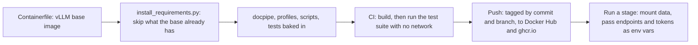

# Running the pipeline

[How the parts fit together](pipeline.md) lists ten stages: file
processing, layout detection, structure assembly, refinement, visuals,
chunking and embedding, extraction, the knowledge graph, inference and
the app. This page covers the first eight as batch commands, then
inference and the app together as one runnable unit, since a question
is a turn inside the running Streamlit process, not a command of its
own.

## Installation and environment

Nothing pins a Python version for the pipeline itself; the one fixed
version is for the documentation build, where Read the Docs and the CI
workflow both provision Python 3.11 (`.readthedocs.yaml` line 12;
`.github/workflows/docs.yml` line 46).

`requirements.txt` (213
lines) covers the batch pipeline: PyMuPDF, OpenCV, torch, faiss-cpu,
pandas for the KWW workbook, openai for every LLM and vision call, and
pytest at its tail (`requirements.txt` lines 210 to 213), installed
with `pip install -r requirements.txt`. `docs/requirements.txt` is a
separate three-line list (sphinx, myst-parser, furo) for the
documentation build. `scripts/inference_app/requirements.txt` is a
third list, for the chat application's own environment.

The GPU stack is optional: nothing refuses to start without one. Stage
2's layout model and the local embedding backend move to CUDA when
available and fall back to the CPU otherwise
(`docpipe/preprocessing/stage2_layout.py` line 108;
`docpipe/chunking/qwen3_vl_embedding.py` lines 423 to 424). Refinement,
visuals and extraction load no model in the pipeline's process: each is
an HTTP client to an OpenAI-compatible server, so their GPU can run on
a different machine.

`DOCPIPE_PROFILE` (`docpipe/profile.py` line 20) names the profile
`load_profile` imports: `profiles/kwp` or `profiles/scenarios` (lines
124 to 149). A profile's document list, prompts, extra database tables
and extraction contract come from `Profile.component`, `Profile.require`,
`prompts_dir` and `schema_sql` (lines 57 to 96). It belongs in the
environment, not only the command line: a stage binds its prompts at
import time, before `--profile` is parsed, so a profile that overrides
prompts and is named only there is refused (lines 178 to 197).
`DOCPIPE_DATA_ROOT` moves a profile's PDFs, database and FAISS index to
`<root>/<profile name>/`, in place of the repository's own `data/`
(lines 100 to 105). A `.env` file is read into the environment before
any submodule's config module can capture its values (`docpipe/__init__.py`
lines 2 and 5); only a key not already set is copied in, so an explicit
variable always wins (`docpipe/dotenv.py` line 45); `.env.example`
lists what a deployment usually sets.

## Container image

`docker/Containerfile` builds one OCI image for stages 1 to 8, on top of
`vllm/vllm-openai:v0.23.0-cu129-ubuntu2404`, pinned by digest so a moved tag
cannot change what gets built (`docker/Containerfile` line 8). The base image
starts `vllm serve`; this one clears the entrypoint, so every invocation says
whether it runs the server or a stage (lines 13 to 14). `docpipe/`,
`profiles/`, `scripts/`, `tests/`, `docker/` and `requirements.txt` are copied
in under `/opt/docpipe` (lines 22 to 27). Weights (the HF cache), `data/`, the database, the FAISS
index, outputs and tokens are not baked in: they are mounted or passed at run
time, through the same environment variables as the venv (see the
configuration reference below).

`requirements.txt` is installed by `docker/install_requirements.py`, not by
pip directly (`docker/Containerfile` lines 18 to 20): a package the base image
already has (torch, its CUDA wheels, transformers, ...) is skipped so the base
version wins, every base package is passed to pip as a constraint so nothing
pulled in drags one along, a plain `opencv-python` is installed headless since
the image carries no libGL, and the build fails if installing anyway changed a
base package (`docker/install_requirements.py` lines 56 to 72, 82 to 110).
`tests/test_container_requirements.py` covers that logic directly, no image
needed.

Every push to `production` builds the image in CI
(`.github/workflows/image.yml`), runs the test suite inside it and publishes
it as `ghcr.io/openenergyplatform/municipal-heat-planning-pdf-processing` and,
with the user and token from the `dockerhub` environment (restricted to
`production`), as `<user>/docpipe` on Docker Hub, both tagged with the commit
(12 characters) and the branch. To build and check it by hand, from a clean
export of one commit, without a GPU or network:

```bash
podman build -f docker/Containerfile --build-arg REVISION="$(git rev-parse HEAD)" -t docpipe .
podman run --rm --network none -e DOCPIPE_PROFILE=kwp docpipe python3 -c "import sys,types,pytest; m=types.ModuleType('tests'); m.__path__=['tests']; sys.modules['tests']=m; sys.exit(pytest.main(['tests','-q','--ignore=tests/test_docs_build.py']))"
```

`tests` is pinned because the base image ships its own top-level `tests`
package, which shadows the repo's. To run a stage, mount the data at
the paths the profile expects, pass the endpoints and tokens as environment
variables, and set `PYTHONSAFEPATH=1` when the working directory holds another
copy of the code. The code-exec sandbox is not part of the image. The same
image runs under Apptainer.

The image, end to end:



## Running each stage

Every stage also accepts `--log-level` (`DEBUG`, `INFO`, `WARNING` or
`ERROR`, default `INFO`; `docpipe/preprocessing/pipeline.py` lines 485
to 486), omitted below.

### 1. File processing

```bash
export DOCPIPE_PROFILE=kwp
python -m scripts.fileprocessing --source kww.xlsx --db data/kwp/kwp.db --data-dir data/kwp/pdf
```

`--source` is the profile's document list: an Excel export for `kwp`, a
crawl index for `scenarios`. `--backfill-meta` skips the run and only
refreshes metadata for municipalities already registered, with no
downloads (`scripts/fileprocessing/pipeline.py` lines 39 to 41). No
separate step creates the database: `ingest` applies the core schema,
then the profile's own `schema.sql`, before registering any document
(`docpipe/store/schema.py` line 40; `docpipe/ingest/pipeline.py` line
79). The stage writes rows into `Documents` and, for `kwp` on every run,
`OrganisationUnits`, `Municipalities`, `DocumentMeta` and
`MunicipalityMeta` (`profiles/kwp/source.py` lines 193 to 196;
`docpipe/ingest/pipeline.py` line 102). It resumes on the filename
already in `Documents` (`docpipe/store/documents.py` lines 29 to 32):
removing the PDF alone does not trigger a refetch; deleting the row
does.

### 2 and 3. Layout and structure (preprocessing)

```bash
python -m docpipe.preprocessing data/kwp/pdf
```

The input is a PDF file or a folder of PDFs
(`docpipe/preprocessing/pipeline.py` lines 461 to 463); the output
directory defaults to the profile's processed directory. `--glob` filters
a folder run's files, default `*.pdf`; `--pages START END` limits a
single-PDF run to a 0-indexed page range (lines 480 to 481).
`--force-reextract` reruns layout detection and text extraction from the
PDF, ignoring both caches; `--rebuild-stage3` reruns only section
assembly, from a cached `pages.json`, with no PDF and no layout model;
`--transcribe-missing-text` turns on a vision fallback for pages with no
text layer (lines 475 to 479), reusing the visuals stage's client at
`VLM_BASE_URL` (`docpipe/preprocessing/page_text_fallback.py` lines 339
to 340). The stage writes `pages.json`, then `sections.json`.
It resumes on those two files existing and loading cleanly; a run that
dies partway through a document leaves no cache for it and starts that
document over.

### 4. LLM refinement

```bash
python -m docpipe.refinement --batch
```

`--batch` refines every document subdirectory under the input path,
which defaults to the profile's processed directory. `--force`
re-refines even where `sections_refined.json` already exists;
`--force-stale` only where the recorded prompt hash moved;
`--print-context-budget` prints the worst-case tokens one request needs
and exits, to size the vLLM server's maximum context length
(`docpipe/refinement/pipeline.py` lines 210 to 214). The stage writes
`sections_refined.json` and resumes on that file already existing; the
server at `LLM_BASE_URL` is checked for the needed context first
(`docpipe/llm_preflight.py`).

### 5. Image processing (visuals)

```bash
python -m docpipe.visuals --batch
```

`--batch` processes every subdirectory under the input path; `--dry-run`
reports cached and pending counts without contacting the server;
`--force` reprocesses every table and figure regardless of cache,
`--force-stale` only where the prompt changed
(`docpipe/visuals/pipeline.py` lines 419 to 451). The stage writes
`visuals.json` and resumes per item, not per document: an item already
carrying a `markdown` or `description` key is copied through unchanged,
so an interrupted run continues on exactly the items missing one.

### 6. Chunking, embedding, database

```bash
python -m docpipe.chunking
```

With no `--step`, the run does merge, database population and embedding
in sequence; the three positional paths default to the profile's own.
`--step merge`, `--step db` or `--step embed` runs one alone;
`--step enrich-bbox`, `--step enrich-page-source` and
`--step enrich-caption` are additive maintenance passes that backfill
one column family on an already-built corpus without re-embedding
(`docpipe/chunking/pipeline.py` lines 315 to 326). `--force` reprocesses:
merge ignores its modification-time cache, db deletes and reinserts a
document's rows, embed evicts and re-adds its vectors. The stage writes
`document.json`, then rows in SQLite and vectors in the FAISS index,
each step resuming on its own marker: merge on `document.json` not
older than its inputs (`docpipe/chunking/merge.py` lines 46 to
65), db on the document already having `Sections` rows
(`docpipe/chunking/database.py` line 305), embed on the database already
recording an item's embedding triple (`docpipe/chunking/database.py`
line 638).

### 7. Extraction

```bash
python -m docpipe.extraction data/kwp/kwp.db data/kwp/faiss_index.bin data/kwp/extraction
```

The three positional paths (database, FAISS index, output directory)
have no profile default. `--document` restricts the run to one document
id and is repeatable. `--image-root`, left unset, defaults to the
profile's processed directory (`docpipe/extraction/runner.py` lines
4385 to 4387). `--pdf-root` has no such default: left unset it stays
`None` and disables the digit-exact native check that locates a quote's
highlight rectangles in the source PDF (lines 3800 to 3804, 3201 to
3213). `--force` and `--force-stale` behave as in refinement.
The stage writes one `<doc>.jsonl` harvest and one `<doc>.stamp.json`
per document, and resumes per question, not per document, detailed in
[the extraction stage](stages/extraction.md) and below.

### 8. The knowledge graph

```bash
python -m docpipe.extraction data/kwp/kwp.db data/kwp/faiss_index.bin data/kwp/extraction --serialize data/kwp/graph.ttl
```

`--serialize` switches the run to serialize-only: no harvest, no model.
It hands the JSONL already in the output directory to the profile's
`kg.make_serializer` and writes Turtle (`docpipe/extraction/runner.py`
lines 4541 to 4012); a profile with no `kg.py` is refused. Unlike the
earlier stages it does not resume: it walks the whole harvest directory
again on every call (`docpipe/extraction/serialize.py`).

## Configuration reference

The flags for each stage are named above; the table gives the
environment variables setting a stage's server and model defaults.

| Stage | Variable | Default | Effect | Where read |
|---|---|---|---|---|
| Refinement | `LLM_BASE_URL` | `http://localhost:8000/v1` | refinement's request endpoint | `docpipe/refinement/config.py:24` |
| Refinement | `LLM_MODEL` | `Qwen/Qwen3.5-122B-A10B-FP8` | model name requested | `docpipe/refinement/config.py:25` |
| Visuals | `VLM_BASE_URL` | `http://localhost:8001/v1` | the vision client's endpoint | `docpipe/visuals/config.py:42` |
| Visuals | `VLM_MODEL` | `Qwen/Qwen3.5-122B-A10B-FP8` | served model name requested | `docpipe/visuals/config.py:43` |
| Chunking | `EMBEDDING_BACKEND` | `local` | `local`, `api`, or an import path | `docpipe/embedding/config.py:19` |
| Chunking | `EMBEDDING_MODEL` | `Qwen/Qwen3-VL-Embedding-8B` | HF model id for every embedding | `docpipe/embedding/config.py:21` |
| Extraction | `LLM_BASE_URL` | `http://localhost:8000/v1` | harvesting model's endpoint | `docpipe/extraction/runner.py:82` |
| Extraction | `LLM_MODEL` | `Qwen/Qwen3.8-Flash-Next-FP8` | harvesting model's name | `docpipe/extraction/runner.py:87` |
| Extraction | `EXTRACT_MAX_RETRIES` | `3` | attempts per LLM request before giving up on it | `docpipe/extraction/runner.py:93` |
| Extraction | `EXTRACT_RETRY_TIMEOUT` | `600` | client timeout (seconds) a retry gets after a request timed out; a request refused at once keeps the client's own timeout | `docpipe/extraction/runner.py:98` |
| Extraction | `EXTRACT_BATCH_SOURCES` | `6` | sources sharing one harvest request | `docpipe/extraction/runner.py:102` |
| Extraction | `EXTRACT_BATCH_DOCS` | `64` | documents kept in flight at once, largest first by section count, filename breaking a tie; one written and replaced by the next as soon as it finishes | `docpipe/extraction/runner.py:4793` |
| Extraction | `EXTRACT_FIELD_ROWS` | `32` | rows one field request answers at once | `docpipe/extraction/runner.py:338` |
| Extraction | `EXTRACT_MAX_MODEL_LEN` | `32768` | fallback context window, used only where the server's own preflight reports none | `docpipe/extraction/runner.py:1096` |
| Extraction | `EXTRACT_LIMIT_ADAPTIVE` | `1` | off (`0`) disables the adaptive request limit; the thread pools alone bound concurrency | `docpipe/extraction/runner.py:1125` |
| Extraction | `EXTRACT_LIMIT_START` | `128` | requests the adaptive limit opens with | `docpipe/extraction/throttle.py:44` |
| Extraction | `EXTRACT_LIMIT_MIN` | `16` | floor the limit backs off to | `docpipe/extraction/throttle.py:45` |
| Extraction | `EXTRACT_LIMIT_MAX` | `512` | ceiling the limit grows to; the server's own max-num-seqs cap must be at least this, or requests queue there instead | `docpipe/extraction/throttle.py:46` |
| Extraction | `EXTRACT_LIMIT_STEP` | `8` | requests added on each growth step | `docpipe/extraction/throttle.py:47` |
| Extraction | `EXTRACT_LIMIT_BACKOFF` | `0.8` | factor the limit is multiplied by on a step down | `docpipe/extraction/throttle.py:48` |
| Extraction | `EXTRACT_LIMIT_POLL` | `5` | seconds between `/metrics` samples | `docpipe/extraction/throttle.py:49` |
| Extraction | `EXTRACT_LIMIT_KV_GROW` | `0.80` | KV cache fraction below which the limit may grow | `docpipe/extraction/throttle.py:51` |
| Extraction | `EXTRACT_LIMIT_KV_HIGH` | `0.92` | KV cache fraction at or above which the limit steps down | `docpipe/extraction/throttle.py:52` |
| Extraction | `EXTRACT_LIMIT_TPOT_MAX` | unset | seconds per output token above which a sample also counts as pressure; unset, token time never steps the limit down | `docpipe/extraction/throttle.py:55` |
| Extraction | `EXTRACT_SERVER_DEAD_AFTER` | `180` | seconds without any reply to a `/models` probe before the harvest ends as if stopped, so a dead server is noticed in minutes | `docpipe/extraction/runner.py:1831` |
| Extraction | `EXTRACT_LOCATE_CACHE_PAGES` | `512` | pages of words cached by `make_locate` across documents; a cache hit is a dict lookup and takes no lock | `docpipe/extraction/runner.py:206` |
| App | `INFERENCE_DB_PATH` | profile `db_path`, else `data/KWP.db` | SQLite corpus database, opened read-only | `scripts/inference_app/config.py:61` |
| App | `INFERENCE_INDEX_PATH` | profile `index_path`, else `data/faiss_index.bin` | FAISS index loaded into memory | `scripts/inference_app/config.py:62` |
| App | `INFERENCE_KG_TTL_PATH` | profile `root/graph.ttl`, else `data/graph.ttl` | Turtle file from `--serialize` | `scripts/inference_app/config.py:66` |
| App | `CODE_EXEC_URL` | `""` (off) | calculation sandbox endpoint | `docpipe/inference/config.py:64` |
| Refinement, visuals, chunking, extraction | `DOCPIPE_USAGE_DB` | `data/usage.db` | SQLite file the token/request counts of that process are flushed to | `docpipe/usage.py:74` |

## The extraction passes

`python -m docpipe.extraction` accepts flags acting on an
already-written harvest directory, instead of or before harvesting.

- `--print-context-budget` prints the worst-case tokens one harvest
  request needs and exits before contacting a server
  (`docpipe/extraction/runner.py` lines 4142 to 4145); the same check
  runs automatically before the first document too.
- `--recheck` needs no model and no index. It reapplies the
  answer-in-quote rule to a harvest on disk, drops any coordinate whose quote no longer
  carries the answer, and clears the affected stamps unless
  `--keep-stamps` is given.
- `--remap` needs no model. It maps a coordinate's recorded wording onto
  today's vocabulary, carrying a document's stamp forward for every
  answer space it fully resolves.
- `--top-up`, narrowed with `--top-up-key KEY` (repeatable), needs the
  model and the index. It re-reads only the coordinates a document's
  stamp says moved, instead of harvesting the document again from its
  first passage. A document whose stamp moved outside a coordinate is
  skipped whole.
- `--review`, bounded with `--review-limit N`, needs the model. It reads
  every value nobody can stand behind a second time, over its own
  passage and section, and records only a disagreement as a trust
  reason (`docpipe/extraction/runner.py` lines 4097 to 4106); see
  [the trust contract](contract/trust.md).
- `--serialize TTL` needs no harvest and no model, as in stage 8 above,
  and produces or refreshes [the knowledge graph](stages/graph.md).

## The chat application

A Streamlit page over the finished corpus, started with the profile set
in the environment:

```bash
DOCPIPE_PROFILE=kwp streamlit run scripts/inference_app/app.py --server.address 0.0.0.0 --server.port 8501
```

(`scripts/inference_app/app.py`, module docstring). It needs its own
dependency set plus: the corpus the batch pipeline built, opened
read-only (`INFERENCE_DB_PATH`, `INFERENCE_INDEX_PATH`;
`docpipe/inference/db.py` lines 21 to 33); an LLM endpoint at
`LLM_BASE_URL` for the search-phrase, answer and comparison calls; an
embedding backend (`EMBEDDING_BACKEND`) apart from the batch embedder,
so one question needs no whole GPU; and, optionally, the Turtle file a
`--serialize` run wrote (`INFERENCE_KG_TTL_PATH`), a code-execution
sandbox (`CODE_EXEC_URL`), and the source PDFs (`INFERENCE_PDF_ROOT`)
for deep links. Without `DOCPIPE_PROFILE` the app still runs, on
generic labels and dates. See [the app](stages/app.md) and
[asking a question](stages/inference.md) for the turn itself.

## Tests and checks

```bash
pytest tests/ -n 8 --dist loadfile
```

is the parallelism `requirements.txt` recommends, near the suite's own
count of about 1,500 tests (`requirements.txt` lines 210 to 211). Heavy or optional
libraries (fitz, cv2, torch, faiss, ollama, openai, PIL, numpy) are
stubbed when not installed, so the suite mostly runs without the GPU
stack; a module needing real tensor arithmetic or vector search skips
rather than failing on a missing attribute (`tests/conftest.py`,
`needs_real`). `DOCPIPE_PROFILE` is `kwp` for the session
(`tests/conftest.py` line 70); a test needing `scenarios` sets it
explicitly.

Several procedural gates run manually, outside pytest.

```bash
python scripts/change_audit.py
```

reports what a change touches beyond the lines it edits: a consumer, a
sibling, an added function no test names; it takes an optional commit
range, else compares the working tree against `HEAD`.

```bash
python scripts/preflight_profiles.py
```

audits a profile's spec, prompts, schema and ontology pin before a
corpus run, exiting non-zero on the first hard failure; with no
arguments it audits `kwp` and `scenarios` together, or one alone when
named.

`scripts/inference_app_smoketest.py` checks that `EMBEDDING_BACKEND`
returns vectors of the right dimension, L2-normalized, for a text
query, an image query and a batch.
`scripts/curation_list.py`, `scripts/harvest_compare.py` and
`scripts/trace_report.py` read an extraction harvest on disk, none
loading a model: the values a curator should look at, with page and
cited passage; two harvests compared by tuple count and open
coordinates; and the distribution behind every setting the stage
exposes, respectively (each script's own module docstring).

```bash
python scripts/build_docs.py --check
```

renders every generated page fresh and fails, writing nothing, if a
checked-in page has drifted from its source (`scripts/build_docs.py`
lines 1394 to 1423).

## Documentation build

Every page under `docs/` except `pipeline.md`, `running.md` and
`glossary.md` is rendered from the code it describes: module docstrings,
the checked-in extraction schemas, and named constants
(`scripts/build_docs.py`, module docstring). Rendering writes into
`docs/` by default, or elsewhere with `--out`:

```bash
python scripts/build_docs.py --out docs
```

(`scripts/build_docs.py` lines 1440 to 1442).

Sphinx then builds the HTML site, warnings promoted to errors:
`.github/workflows/docs.yml` runs `-W --keep-going -b html docs
_build/html`, and `nitpicky = True` in `docs/conf.py` turns a broken
cross-reference into one of those warnings (`docs/conf.py` line 53).
Read the Docs installs only `docs/requirements.txt` and builds with the
same `fail_on_warning: true` (`.readthedocs.yaml`), one version per
branch and tag (`.github/workflows/docs.yml`, header comment); it never
runs the generator, only Sphinx over what is checked in. The GitHub
Actions workflow checks the pages on a pull request or a tag, and
regenerates and commits them on a push to `develop` only on change.
