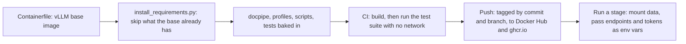

# Running the pipeline

[How the parts fit together](pipeline.md) lists ten stages: file
processing, layout detection, structure assembly, refinement, visuals,
chunking and embedding, extraction, the knowledge graph, inference and
the app. This page covers the first eight as batch commands, then
inference and the app together as one runnable unit, since a question
is a turn inside the running Streamlit process, not a command of its
own.

## The command

Everything starts with one command, `docpipe` ([the command and its
settings](stages/command.md)):

```bash
docpipe [--profile P] [--config FILE] <command> [arguments]
```

`docpipe <command> --help` shows what a command takes. A stage command runs
the stage the way `python -m docpipe.<stage>` runs it, with the same
arguments, and that form keeps working:

| command | the same as |
|---|---|
| `docpipe ingest` | `python -m docpipe.ingest`, earlier `python -m scripts.fileprocessing` |
| `docpipe preprocess` | `python -m docpipe.preprocessing` |
| `docpipe refine` | `python -m docpipe.refinement` |
| `docpipe visuals` | `python -m docpipe.visuals` |
| `docpipe chunk` | `python -m docpipe.chunking` |
| `docpipe extract` | `python -m docpipe.extraction` |
| `docpipe reanchor` | `python -m docpipe.extraction.identity` |
| `docpipe compile` | `python -m docpipe.compile` |
| `docpipe preflight` | `python -m docpipe.extraction.preflight` |
| `docpipe evaluate` | `python -m docpipe.extraction.evaluate` |
| `docpipe benchmark` | `python -m docpipe.extraction.benchmark` |
| `docpipe export` | `python -m docpipe.serve.export` |
| `docpipe serve` | `python -m docpipe.serve` |
| `docpipe lexical` | `python -m docpipe.inference.lexical` |
| `docpipe sandbox` | `python -m docpipe.app.sandbox_service` |

`docpipe chat` starts the chat, and `docpipe init`, `doctor`, `config` and
`profiles` look after the project, and `docpipe column` writes the spec of a
question of one's own for a trial harvest (see Extraction, below); they are
described below. `docpipe run`,
`status` and `estimate` are commands of their own too: they start the stages
in one go, say what each document has, and say what a run will cost (see
Running the stages together, below, and [the command and its
settings](stages/command.md)).

## Installation and environment

`pip install .` installs the package and the command. It brings what every
stage needs that asks a model over an API; the stages that run a model in
the process are extras (`layout`, `embed`, `app`, `kg`, `kwp`, `sandbox`,
`anthropic` and `dev`, named in `pyproject.toml`), for example
`pip install ".[layout,embed,app]"`. Python 3.9 or newer; the documentation
build uses 3.11. `requirements.txt` is the lock the container image is built
from, and `docs/requirements.txt` is the documentation build's own short list.

The GPU stack is optional: nothing refuses to start without one. Stage 2's
layout model and the local embedding backend move to CUDA when available and
fall back to the CPU otherwise. Refinement, visuals and extraction load no
model in the pipeline's process: each is a client to a model API, a server of
one's own that speaks the OpenAI API or a hosted provider chosen with
`LLM_PROVIDER` and `VLM_PROVIDER` (see [the provider layer](stages/providers.md)),
so their GPU can run on a different machine.

A project is a folder with a `docpipe.toml`. `docpipe init` writes one, with a
profile of its own that extends the built-in `default` profile:

```bash
mkdir heatplans && cd heatplans
docpipe init
docpipe doctor
```

The project file `init` writes carries `[refine] return_corrections = true`,
so refinement asks for corrections and not for every section retyped; the
setting's own default stays off. `docpipe init NAME --shapes [FILE]` also writes
`profiles/NAME/extraction_spec.draft.json`, the draft of an extraction spec,
from the SHACL shapes in FILE or, with no file, from a small metadata shape
the package brings (title, author, publisher, date, version, language, abstract,
keywords). It needs `rdflib` (`pip install "docpipe[kg]"`), reads the shapes
before it makes a folder and stops with "nothing was written" when the file
cannot be used. The draft is no spec: `docpipe extract` stops until
`compile examples` and `compile apply` have finished it into
`extraction_spec.json` (see [the spec compiler](stages/compile.md)), and
`docpipe preflight` will fail on the finished spec until the profile's schema
file is written and the graph's base IRI is a real one.

The keys of the project file are the settings the environment already has,
and the environment wins. A `.env` beside it takes the keys and tokens, which
the project file refuses. `docpipe config` lists every setting with its value
and where the value comes from; `docpipe doctor` checks packages, profile,
model servers and data without a GPU or a model question and exits 1 on a
failure.

The profile is the `profile` key of the project file, `--profile` on the
command (a name, or the directory of a profile), or `DOCPIPE_PROFILE`. A
profile is found on a search path: `DOCPIPE_PROFILE_PATH`, the project's
`profiles/`, installed packages, the `profiles/` of this repository and last
the built-in `default`; `docpipe profiles` lists what is found. Refinement,
visuals and extraction refuse to run without a profile, in one line that names
the available ones; the chat is the one command that does not stop, it runs on
the built-in `default` profile and says so. `DOCPIPE_DATA_ROOT` moves a profile's PDFs, database and
FAISS index to `<root>/<profile name>/`; without it they are under `data/`
beside the project file.

## Container image

`docker/Containerfile` builds one OCI image for stages 1 to 8, on top of
`vllm/vllm-openai:v0.23.0-cu129-ubuntu2404`, pinned by digest so a moved tag
cannot change what gets built (`docker/Containerfile` line 8). The base image
starts `vllm serve`; this one clears the entrypoint, so every invocation says
whether it runs the server or a stage (lines 13 to 14). `docpipe/`,
`profiles/`, `scripts/`, `tests/`, `docker/` and `requirements.txt` are copied
in under `/opt/docpipe` (lines 22 to 27). Weights (the HF cache), `data/`, the database, the FAISS
index, outputs and tokens are not baked in: they are mounted or passed at run
time, through the same environment variables as the venv (see the
configuration reference below).

`requirements.txt` is installed by `docker/install_requirements.py`, not by
pip directly (`docker/Containerfile` lines 18 to 20): a package the base image
already has (torch, its CUDA wheels, transformers, ...) is skipped so the base
version wins, every base package is passed to pip as a constraint so nothing
pulled in drags one along, a plain `opencv-python` is installed headless since
the image carries no libGL, and the build fails if installing anyway changed a
base package (`docker/install_requirements.py` lines 56 to 72, 82 to 110).
`tests/test_container_requirements.py` covers that logic directly, no image
needed.

Every push to `production` builds the image in CI
(`.github/workflows/image.yml`), runs the test suite inside it and publishes
it as `ghcr.io/openenergyplatform/municipal-heat-planning-pdf-processing` and,
with the user and token from the `dockerhub` environment (restricted to
`production`), as `<user>/docpipe` on Docker Hub, both tagged with the commit
(12 characters) and the branch. To build and check it by hand, from a clean
export of one commit, without a GPU or network:

```bash
podman build -f docker/Containerfile --build-arg REVISION="$(git rev-parse HEAD)" -t docpipe .
podman run --rm --network none -e DOCPIPE_PROFILE=kwp docpipe python3 -c "import sys,types,pytest; m=types.ModuleType('tests'); m.__path__=['tests']; sys.modules['tests']=m; sys.exit(pytest.main(['tests','-q','--ignore=tests/test_docs_build.py']))"
```

`tests` is pinned because the base image ships its own top-level `tests`
package, which shadows the repo's. To run a stage, mount the data at
the paths the profile expects, pass the endpoints and tokens as environment
variables, and set `PYTHONSAFEPATH=1` when the working directory holds another
copy of the code. The code-exec sandbox is not part of the image. The same
image runs under Apptainer.

The image, end to end:


```mermaid
flowchart LR
    cf[Containerfile: vLLM base image] --> ir[install_requirements.py: skip what the base already has]
    ir --> bake[docpipe, profiles, scripts, tests baked in]
    bake --> ci[CI: build, then run the test suite with no network]
    ci --> push[Push: tagged by commit and branch, to Docker Hub and ghcr.io]
    push --> run[Run a stage: mount data, pass endpoints and tokens as env vars]
```

## Running the stages together

```bash
docpipe run
docpipe status
docpipe estimate refine visuals chunk
```

`docpipe run` starts ingest, preprocess, refine, visuals, chunk and the word
index (`lexical`) one after the other, each as its own `docpipe <stage>`
process with the arguments the profile gives it, says which stage starts, and
stops at the first one that ends non-zero, with that stage's exit code.
`--from`, `--to` and `--skip` choose the stages; an empty or reversed range is
refused with exit 2. The harvest is not part of it. A stage that lacks an
argument the profile cannot give is named before anything starts: `kwp` and
`scenarios` need `--source` for ingest, so run `docpipe ingest --source FILE`
first and then `docpipe run --skip ingest` (or `--from preprocess`). `docpipe
status` shows every document once, with an `x` for each stage whose output for
it is there, and changes nothing; `docpipe estimate` counts the requests,
tokens and price the named stages still have ahead of them without calling a
model. The details are on [the command and its
settings](stages/command.md).

The stages one by one need what `run` supplies from the profile:
`docpipe preprocess` needs its PDF folder and `docpipe refine` and
`docpipe visuals` need `--batch`, as the commands below show. `run` does not
change how a stage behaves: preprocess still ends 0 when single PDFs failed,
so `docpipe status` is where a gap shows, and it passes no
`--transcribe-missing-text`.

## Running each stage

Every stage also accepts `--log-level` (`DEBUG`, `INFO`, `WARNING` or
`ERROR`, default `INFO`; `docpipe/preprocessing/pipeline.py` lines 486
to 487), omitted below.

### 1. File processing

```bash
docpipe --profile kwp ingest --source kww.xlsx
```

`--source` is the profile's document list: an Excel export for `kwp`, a
crawl index for `scenarios`, a folder of PDFs for a profile that extends
`default` (left out, the PDFs lying in the data directory). For a folder, the
catalog of the built-in profile shows each PDF's own title and creation date,
read from its information dictionary, with the file name where it has none. `--db` and
`--data-dir` default to the profile's own. `--backfill-meta` skips the run
and only refreshes metadata for municipalities already registered, with no
downloads (`docpipe/ingest/cli.py`). No
separate step creates the database: `ingest` applies the core schema,
then the profile's own `schema.sql`, before registering any document
(`docpipe/store/schema.py` line 40; `docpipe/ingest/pipeline.py` line
123). The stage writes rows into `Documents` and, for `kwp` on every run,
`OrganisationUnits`, `Municipalities`, `DocumentMeta` and
`MunicipalityMeta` (`profiles/kwp/source.py` lines 193 to 196;
`docpipe/ingest/pipeline.py` line 150). It resumes on the filename
already in `Documents` (`docpipe/store/documents.py` lines 29 to 32):
removing the PDF alone does not trigger a refetch; deleting the row
does.

A download is streamed to disk, with the `%PDF` check on its first bytes, and
is refused over `DOCPIPE_MAX_DOWNLOAD_MB` (500 by default) with its size;
`DOCPIPE_USER_AGENT` sets the User-Agent it sends. The URL a file came from is
kept beside it as `<name>.url`, and a second, different URL for that file name
is refused with both URLs named, instead of being read from the first one's
bytes. A refused download is listed in `unreachable_pdfs.txt` with the files
that could not be fetched, and the run goes on. `docpipe ingest` still ends 0
then, logging one warning with the number of (file name, URL) pairs and the
worklist's path, so a chain of stages is not stopped by one dead link.

### 2 and 3. Layout and structure (preprocessing)

```bash
docpipe preprocess data/kwp/pdf
```

The input is a PDF file or a folder of PDFs and has no default
(`docpipe/preprocessing/pipeline.py` lines 462 to 464); `docpipe run` passes
the profile's PDF folder. The output
directory defaults to the profile's processed directory. `--glob` filters
a folder run's files, default `*.pdf`; `--pages START END` limits a
single-PDF run to a 0-indexed page range (lines 481 to 482).
`--force-reextract` reruns layout detection and text extraction from the
PDF, ignoring both caches; `--rebuild-stage3` reruns only section
assembly, from a cached `pages.json`, with no PDF and no layout model;
`--transcribe-missing-text` turns on a vision fallback for pages with no
text layer (lines 476 to 480), reusing the visuals stage's client at
`VLM_BASE_URL` (`docpipe/preprocessing/page_text_fallback.py` lines 339
to 340). The stage writes `pages.json`, then `sections.json`.
It resumes on those two files existing and loading cleanly; a run that
dies partway through a document leaves no cache for it and starts that
document over.

### 4. LLM refinement

```bash
docpipe refine --batch
```

`--batch` refines every document directory under the input path, found at any
depth, which defaults to the profile's processed directory; without `--batch`
that directory would be taken for one document, which is why `docpipe run`
passes it. `--force`
re-refines even where `sections_refined.json` already exists;
`--force-stale` only where the recorded prompt hash moved;
`--print-context-budget` prints the worst-case tokens one request needs
and exits, to size the vLLM server's maximum context length
(`docpipe/refinement/pipeline.py` lines 205 to 209). The stage writes
`sections_refined.json` and resumes on that file already existing; the
server at `LLM_BASE_URL` is checked for the needed context first
(`docpipe/llm_preflight.py`).

A window the server does not serve (no connection, a timeout, a 429, a
5xx) leaves the document unrefined, and the stage exits non-zero: no
`sections_refined.json` is written, the usable replies are kept in
`sections_refined.partial.json`, which also names the missing windows under
`unserved_windows` (`docpipe/refinement/refine.py` lines 1186 to 1205);
`refinement_report.json` is left as it was. The next run, with or without
`--force`, asks only for those windows, provided the sections, the prompts,
`WINDOW_SIZE` and the model name are as they were; otherwise it drops the
partial file and starts over (lines 1160 to 1179). A
`sections_refined.json` from an earlier pass stays in place until a pass
finishes. The cut of an oversized section is asked again while the server does
not answer; if it stays unanswered the stage writes nothing at all, not even a
partial file, and the next run starts with the cut (lines 908 to 912, 1187 to
1191).

### 5. Image processing (visuals)

```bash
docpipe visuals --batch
```

`--batch` processes every document directory under the input path, found at
any depth; `--dry-run`
reports cached and pending counts without contacting the server;
`--force` reprocesses every table and figure regardless of cache,
`--force-stale` only where the prompt changed
(`docpipe/visuals/pipeline.py` lines 443 to 475). The stage writes
`visuals.json` and resumes per item, not per document: an item already
carrying a `markdown` or `description` key is copied through unchanged,
so an interrupted run continues on exactly the items missing one.

### 6. Chunking, embedding, database

```bash
docpipe chunk
```

With no `--step`, the run does merge, database population and embedding
in sequence; the three positional paths default to the profile's own.
`--step merge`, `--step db` or `--step embed` runs one alone;
`--step enrich-bbox`, `--step enrich-page-source` and
`--step enrich-caption` are additive maintenance passes that backfill
one column family on an already-built corpus without re-embedding
(`docpipe/chunking/pipeline.py` lines 337 to 348). `--force` reprocesses:
merge ignores its modification-time cache, db deletes and reinserts a
document's rows, embed evicts and re-adds its vectors. The stage writes
`document.json`, then rows in SQLite and vectors in the FAISS index,
each step resuming on its own marker: merge on `document.json` not
older than its inputs (`docpipe/chunking/merge.py` lines 49 to
68), db on the document already having `Sections` rows
(`docpipe/chunking/database.py` line 320), embed on the database already
recording an item's embedding triple (`docpipe/chunking/database.py`
line 648). A document with `sections.json` and no `sections_refined.json`
is left out of the merge, and one warning names up to twenty of them
(`docpipe/chunking/merge.py` lines 168 to 177).

An append to an index that holds vectors of another embedding model than the one
configured stops before a vector is written: the stage ends 1 with one error
line that names both models and the ways out (`EMBEDDING_MODEL` set back to the
recorded one, a run without `--step` and with `--force` that embeds the whole
corpus again, or `EMBEDDING_ALLOW_MIXED_INDEX=1`, which allows the mixture and
records both models). An index with vectors and no recorded model records the
configured one, and the log says it could not check them (see [chunking](stages/chunking.md)).

The stage ends 1 when the embed step left inputs without a vector, a batch the
embedder failed: it finishes the other batches, saves the index with what was
made, and logs `Embedding incomplete: N input(s) of M document(s) have no
vector (type=n, ...); a rerun embeds them`. Such an input has no `Embeddings`
row, so a document with missing vectors is not done and a rerun embeds exactly
those. Importing the chunking package no longer needs `faiss`; the embed step
still needs it at its start.

### 7. Extraction

Before a corpus run, and after a change to the spec, a prompt or the
profile's `extraction.py`, the profile is checked without a GPU or a model:

```bash
docpipe preflight kwp
```

It reads the spec the profile names (`extraction.SPEC_PATH`, and no other),
its extraction prompts, the shape it publishes and the writer of its graph,
prints one line per check and exits 1 when one fails. With no name it checks
the profile in effect, and it holds for any profile, one of this repository or
a project's own, which may be named by its directory (see [the extraction
stage](stages/extraction.md)). Then the harvest:

```bash
docpipe extract data/kwp/kwp.db data/kwp/faiss_index.bin data/kwp/extraction
```

The three positional paths (database, FAISS index, output directory)
have no profile default. `--document` restricts the run to one document
id and is repeatable. `--image-root`, left unset, defaults to
`<pdf-root>/processed` when `--pdf-root` is given and to the profile's
processed directory otherwise (`docpipe/extraction/runner.py` lines
5108 to 5110). `--pdf-root` has no such default: left unset it stays
`None` and disables the digit-exact native check that locates a quote's
highlight rectangles in the source PDF (lines 4833 to 4834, 4083 to
4087). `--force` and `--force-stale` behave as in refinement.
The stage writes one `<doc>.jsonl` harvest and one `<doc>.stamp.json`
per document, and resumes per question, not per document, detailed in
[the extraction stage](stages/extraction.md) and below.

A request that ends on a 429 or a 5xx was not answered: it waits on the
long retry curve between attempts, and a row or field request that ends
there counts towards the dead-server streak. A document with such a
request is written but not stamped, so the next run harvests it again, and
`--top-up` leaves that file's stamp as it was. A stamp from an earlier run is
removed before the file is written. A document left unstamped counts as a
failed document, and the run returns 1 for it (lines 5543 to 5544, 5579). If
the run's own anchor requests end there, the stage returns 1 before it
harvests anything, and the next start asks only for the anchors still missing
(`docpipe/extraction/runner.py` lines 5303 to 5314).

### 8. The knowledge graph

```bash
docpipe extract data/kwp/kwp.db data/kwp/faiss_index.bin data/kwp/extraction --serialize data/kwp/graph.ttl
```

`--serialize` switches the run to serialize-only: no harvest, no model.
It hands the JSONL already in the output directory to the profile's
`kg.make_serializer` and writes Turtle; a profile with none is written by
the generic writer from the `graph` block of its spec, and refused where the
spec has no such block either (`docpipe/extraction/runner.py`). Beside the
graph it writes `<graph>.prov.ttl`, where each value comes from;
`--no-provenance` leaves that out. Unlike the earlier stages it does not
resume: it walks the whole harvest directory again on every call
(`docpipe/extraction/serialize.py`).

### After the harvest

Commands that work on what the stages left behind:

```bash
docpipe reanchor data/kwp/kwp.db data/kwp/extraction
docpipe evaluate data/kwp/extraction --gold data/kwp/gold.jsonl
docpipe benchmark benchmarks/kwp --record
docpipe benchmark benchmarks/kwp
docpipe export data/kwp/extraction --out values.csv
docpipe serve data/kwp/extraction --http
docpipe lexical data/kwp/kwp.db
docpipe compile spec --shapes shapes.ttl --out draft.json
```

- `reanchor` finds each harvested row's passage again after the database was
  rebuilt (`--dry-run` shows what it would do); see [extraction](stages/extraction.md).
- `evaluate` counts precision and recall against the decisions people made on
  the chat's review page, and `benchmark` records a harvest once with a model
  (`--record`) and makes it again without one. `docpipe evaluate NEW --diff
  OLD` needs no decisions: it compares two harvests of the same documents and
  counts, per parameter and per field, the rows that are the same, changed,
  gone and new, how the coordinate states and the trust levels moved, and the
  largest changes (`--top`, `--max-changed` and `--max-gone` set a ceiling for
  an exit 1); see [measuring a harvest](stages/evaluation.md).
- `export` and `serve` (`--http` or `--mcp`) hand the harvested values on as a
  table, a JSON API or a tool server. `export --what states` and `--what
  refusals` write what the harvest says where it has no value, and the server
  answers the same through `get_states`, `get_coverage` and `find_refusals`
  (HTTP `/states`, `/coverage`, `/refusals`), and searches the corpus passages
  by word through `search` (`/search`) when it knows the corpus database and
  the word index; see [handing the values on](stages/serve.md).
- `lexical` builds the word index beside the database that the chat searches
  with the vectors (`--check` says whether it is current); see [asking the
  corpus](stages/inference.md).
- `compile` drafts an extraction spec from the shapes of a graph; see [the
  spec compiler](stages/compile.md).

## Configuration reference

The flags for each stage are named above; the table gives the
environment variables setting a stage's server and model defaults. They are
also keys of `docpipe.toml`, and `docpipe config` lists all of them with
their values and where each value comes from.

| Stage | Variable | Default | Effect | Where read |
|---|---|---|---|---|
| Refinement | `LLM_BASE_URL` | `http://localhost:8000/v1` | refinement's request endpoint | `docpipe/refinement/config.py:25` |
| Refinement | `LLM_MODEL` | `Qwen/Qwen3.5-122B-A10B-FP8` | model name requested | `docpipe/refinement/config.py:26` |
| Visuals | `VLM_BASE_URL` | `http://localhost:8001/v1` | the vision client's endpoint | `docpipe/visuals/config.py:42` |
| Visuals | `VLM_MODEL` | `Qwen/Qwen3.5-122B-A10B-FP8` | served model name requested | `docpipe/visuals/config.py:43` |
| Chunking | `EMBEDDING_BACKEND` | `local` | `local`, `api`, or an import path | `docpipe/embedding/config.py:19` |
| Chunking | `EMBEDDING_MODEL` | `Qwen/Qwen3-VL-Embedding-8B` | HF model id for every embedding | `docpipe/embedding/config.py:21` |
| Extraction | `LLM_BASE_URL` | `http://localhost:8000/v1` | harvesting model's endpoint | `docpipe/extraction/runner.py:93` |
| Extraction | `LLM_MODEL` | `Qwen/Qwen3.5-122B-A10B-FP8` | harvesting model's name | `docpipe/extraction/runner.py:95` |
| Extraction | `EXTRACT_MAX_RETRIES` | `3` | attempts per LLM request before giving up on it | `docpipe/extraction/runner.py:97` |
| Extraction | `EXTRACT_RETRY_TIMEOUT` | `600` | client timeout (seconds) a retry gets after a request timed out; a request refused at once keeps the client's own timeout | `docpipe/extraction/runner.py:102` |
| Extraction | `EXTRACT_BATCH_SOURCES` | `6` | sources sharing one harvest request | `docpipe/extraction/runner.py:252` |
| Extraction | `EXTRACT_BATCH_DOCS` | `64` | documents kept in flight at once, largest first by section count, filename breaking a tie; one written and replaced by the next as soon as it finishes | `docpipe/extraction/runner.py:5296` |
| Extraction | `EXTRACT_FIELD_ROWS` | `32` | rows one field request answers at once | `docpipe/extraction/runner.py:417` |
| Extraction | `EXTRACT_MAX_MODEL_LEN` | `32768` | fallback context window, used only where the server's own preflight reports none | `docpipe/extraction/runner.py:1275` |
| Extraction | `EXTRACT_LIMIT_ADAPTIVE` | `1` | off (`0`) disables the adaptive request limit; the thread pools alone bound concurrency | `docpipe/extraction/runner.py:1304` |
| Extraction | `EXTRACT_LIMIT_START` | `128` | requests the adaptive limit opens with | `docpipe/extraction/throttle.py:50` |
| Extraction | `EXTRACT_LIMIT_MIN` | `16` | floor the limit backs off to | `docpipe/extraction/throttle.py:51` |
| Extraction | `EXTRACT_LIMIT_MAX` | `512` | ceiling the limit grows to; the server's own max-num-seqs cap must be at least this, or requests queue there instead | `docpipe/extraction/throttle.py:52` |
| Extraction | `EXTRACT_LIMIT_STEP` | `8` | requests added on each growth step | `docpipe/extraction/throttle.py:53` |
| Extraction | `EXTRACT_LIMIT_BACKOFF` | `0.8` | factor the limit is multiplied by on a step down | `docpipe/extraction/throttle.py:54` |
| Extraction | `EXTRACT_LIMIT_POLL` | `5` | seconds between `/metrics` samples | `docpipe/extraction/throttle.py:55` |
| Extraction | `EXTRACT_LIMIT_KV_GROW` | `0.80` | KV cache fraction below which the limit may grow | `docpipe/extraction/throttle.py:57` |
| Extraction | `EXTRACT_LIMIT_KV_HIGH` | `0.92` | KV cache fraction at or above which the limit steps down | `docpipe/extraction/throttle.py:58` |
| Extraction | `EXTRACT_LIMIT_TPOT_MAX` | unset | seconds per output token above which a sample also counts as pressure; unset, token time never steps the limit down | `docpipe/extraction/throttle.py:61` |
| Extraction | `EXTRACT_SERVER_DEAD_AFTER` | `180` | seconds without any reply to a `/models` probe before the harvest ends as if stopped, so a dead server is noticed in minutes | `docpipe/extraction/runner.py:1917` |
| Extraction | `EXTRACT_LOCATE_CACHE_PAGES` | `512` | pages of words cached by `make_locate` across documents; a cache hit is a dict lookup and takes no lock | `docpipe/extraction/runner.py:281` |
| App, serve | `INFERENCE_DB_PATH` | profile `db_path`, else `data/KWP.db` (the chat; `serve` has none) | SQLite corpus database, opened read-only; `docpipe serve` opens it for its passage search | `docpipe/app/config.py` |
| App | `INFERENCE_PDF_ROOT` | profile `pdf_dir`, else `data/pdf` | folder of the source PDFs, which the cited page is drawn from | `docpipe/app/config.py` |
| App | `PDF_URL_PREFIX`, `PDF_VIEWER_PREFIX` | empty | URL path an external viewer serves the PDFs and its pdf.js viewer under, for an optional link into it; empty: no link | `docpipe/app/config.py` |
| Ingest | `DOCPIPE_USER_AGENT` | a Chrome 126 browser string | the User-Agent every PDF download sends | `docpipe/ingest/fetch.py` |
| Ingest | `DOCPIPE_MAX_DOWNLOAD_MB` | `500` | largest PDF a download keeps, in megabytes; a larger one is refused with its size | `docpipe/ingest/fetch.py` |
| App | `INFERENCE_INDEX_PATH` | profile `index_path`, else `data/faiss_index.bin` | FAISS index loaded into memory | `docpipe/app/config.py` |
| App | `INFERENCE_KG_TTL_PATH` | profile `root/graph.ttl`, else `data/graph.ttl` | Turtle file from `--serialize` | `docpipe/app/config.py` |
| App | `INFERENCE_HARVEST_DIR` | unset | harvest directory the chat shows values from and the review page reads; unset: neither | `docpipe/app/config.py` |
| App | `INFERENCE_GOLD_PATH` | `gold.jsonl` beside the harvest directory | file the review page appends decisions to | `docpipe/app/config.py` |
| App | `INFERENCE_VALUES_LEVEL`, `INFERENCE_VALUES_LIMIT` | unset, `20` | worst trust level of a value the chat still shows; how many it shows before the count of the rest | `docpipe/app/config.py` |
| App | `INFERENCE_LEXICAL` | `1` | search by word beside the search by meaning where a word index exists; `0` turns it off | `docpipe/app/config.py` |
| App | `CODE_EXEC_URL` | `""` (off) | calculation sandbox endpoint | `docpipe/inference/config.py:64` |
| Refinement, visuals, extraction, chat | `LLM_PROVIDER`, `VLM_PROVIDER`, `EMBEDDING_PROVIDER` | `openai-compatible` | the API behind a role: a server of one's own, `openai`, `anthropic` or `gemini` (embeddings: not `anthropic`) | `docpipe/providers/__init__.py` |
| Stages that ask a model | `DOCPIPE_CASSETTE_RECORD`, `DOCPIPE_CASSETTE_REPLAY` | unset | file a run writes its model answers to, or takes them from in place of a server | `docpipe/providers/cassette.py` |
| Extraction | `EXTRACT_PROVENANCE` | `1` | `0` leaves out the provenance file `--serialize` writes beside the graph | `docpipe/extraction/provenance.py` |
| Refinement, visuals, chunking, extraction | `DOCPIPE_USAGE_DB` | `data/usage.db` | SQLite file the token/request counts of that process are flushed to | `docpipe/usage.py:91-92` |

## The extraction passes

`docpipe extract` accepts flags acting on an
already-written harvest directory, instead of or before harvesting.

- `--print-context-budget` prints the worst-case tokens one harvest
  request needs and exits before contacting a server
  (`docpipe/extraction/runner.py` lines 5214 to 5217); the same check
  runs automatically before the first document too.
- `--recheck` needs no model and no index. It reapplies the
  answer-in-quote rule to a harvest on disk, drops any coordinate whose quote no longer
  carries the answer, and clears the affected stamps unless
  `--keep-stamps` is given. A profile that closes choice lists per
  document has each file read against its own document's lists, and for
  such a profile this pass opens the corpus database read-only. A
  document whose lists cannot be closed is left alone, stamp included,
  and warned about.
- `--remap` needs no model. It maps a coordinate's recorded wording onto
  today's vocabulary, carrying a document's stamp forward for every
  answer space it fully resolves.
- `--top-up`, narrowed with `--top-up-key KEY` (repeatable), needs the
  model and the index. It re-reads only the coordinates a document's
  stamp says moved, instead of harvesting the document again from its
  first passage. A document whose stamp moved outside a coordinate is
  skipped whole.
- `--review`, bounded with `--review-limit N`, needs the model. It reads
  every value nobody can stand behind a second time, over its own
  passage and section, and records only a disagreement as a trust
  reason (`docpipe/extraction/runner.py` lines 5122 to 5172); see
  [the trust contract](contract/trust.md). Each document is read against
  its own lists, as in `--recheck`.
- `--serialize TTL` needs no harvest and no model, as in stage 8 above,
  and produces or refreshes [the knowledge graph](stages/graph.md) and its
  provenance file.

## The chat application

A Streamlit page over the finished corpus, started with the command:

```bash
docpipe --profile kwp chat --server.address 0.0.0.0 --server.port 8501
```

What follows `chat` goes to Streamlit; the app needs the `app` extra. The
older `streamlit run scripts/inference_app/app.py` still works: that file only
hands over to the package (`docpipe/app/`). The corpus the batch pipeline built
is opened read-only (`INFERENCE_DB_PATH`, `INFERENCE_INDEX_PATH`). The app also
needs a model endpoint for the search-phrase, answer and comparison calls
(`LLM_PROVIDER`, `LLM_BASE_URL`), and an embedding backend
(`EMBEDDING_BACKEND`) apart from the batch embedder, so one question needs no
whole GPU. Optional:

- a word index beside the database, built with `docpipe lexical`, which the
  chat searches beside the vectors (`INFERENCE_LEXICAL=0` turns that off);
- a harvest directory (`INFERENCE_HARVEST_DIR`): a question for a number then
  shows the values the harvest holds for it first, each with its quote, page
  and trust level, and a review page offers the decisions that
  `docpipe evaluate` counts against (`INFERENCE_GOLD_PATH`);
- the Turtle file a `--serialize` run wrote (`INFERENCE_KG_TTL_PATH`), which no
  route reads while the graph route is not offered;
- a code-execution sandbox (`CODE_EXEC_URL`, run with `docpipe sandbox`);
- the source PDFs (`INFERENCE_PDF_ROOT`): every citation then has a page
  expander that draws the cited page with the quote marked, and a download of
  the PDF. `PDF_URL_PREFIX` and `PDF_VIEWER_PREFIX` are empty and add a link
  into an external viewer only where a deployment sets them.

A question goes to one document, to several (each asked by itself, then
compared) or, with the checkbox in the sidebar, to the whole corpus, where
only the current version of a document answers but the harvest's values shown
first come from every harvested document, older versions included. The search
scopes offered are the embedding types the index holds, so a text-only index
shows no image scopes, and a warning above the chat says when the index was
built with another model than the one that embeds the questions. The app
opens without a profile, on the `default` profile's English words, prompts and
generic labels, and says in one line that it runs on it (name another with
`--profile`, `docpipe.toml` or `DOCPIPE_PROFILE`); the stages that write a
corpus still stop without one. See [the app](stages/app.md) and [asking a
question](stages/inference.md) for the turn itself.

## Tests and checks

```bash
pytest tests/ -n 8 --dist loadfile
```

is the parallelism `requirements.txt` recommends, near the suite's own
count of about 1,800 tests (`requirements.txt` lines 210 to 211). Heavy or optional
libraries (fitz, cv2, torch, faiss, ollama, openai, PIL, numpy) are
stubbed when not installed, so the suite mostly runs without the GPU
stack; a module needing real tensor arithmetic or vector search skips
rather than failing on a missing attribute (`tests/conftest.py`,
`needs_real`). `DOCPIPE_PROFILE` is `kwp` for the session
(`tests/conftest.py` line 70); a test needing `scenarios` sets it
explicitly.

`tests/test_docs_build.py` renders the documentation once per test module and
every test that reads a page reads that render.

Several procedural gates run manually, outside pytest.

```bash
python scripts/change_audit.py
```

reports what a change touches beyond the lines it edits: a consumer, a
sibling, an added function no test names; it takes an optional commit
range, else compares the working tree against `HEAD`.

```bash
python scripts/preflight_profiles.py
```

runs `docpipe preflight` for the two profiles kept in this repository: it
audits a profile's spec, prompts, schema, graph writer and ontology pin
before a corpus run and exits 1 when a check fails, after printing every
check. With no arguments it audits `kwp` and `scenarios` together, or the
profiles named when given any; `docpipe preflight` itself takes any profile
and checks the one in effect when none is named.

`scripts/inference_app_smoketest.py` checks that `EMBEDDING_BACKEND`
returns vectors of the right dimension, L2-normalized, for a text
query, an image query and a batch.
`scripts/curation_list.py`, `scripts/harvest_compare.py` and
`scripts/trace_report.py` read an extraction harvest on disk, none
loading a model: the values a curator should look at, with page and
cited passage; one harvest measured by tuple count and open
coordinates (two harvests are compared by `docpipe evaluate NEW --diff OLD`);
and the distribution behind every setting the stage
exposes, respectively (each script's own module docstring).

```bash
python scripts/build_docs.py --check
```

renders every generated page fresh and fails, writing nothing, if a
checked-in page has drifted from its source (`scripts/build_docs.py`
lines 1394 to 1423).

## Documentation build

Every page under `docs/` except `pipeline.md`, `running.md` and
`glossary.md` is rendered from the code it describes: module docstrings,
the checked-in extraction schemas, and named constants
(`scripts/build_docs.py`, module docstring). Rendering writes into
`docs/` by default, or elsewhere with `--out`:

```bash
python scripts/build_docs.py --out docs
```

(`scripts/build_docs.py` lines 1440 to 1442).

Sphinx then builds the HTML site, warnings promoted to errors:
`.github/workflows/docs.yml` runs `-W --keep-going -b html docs
_build/html`, and `nitpicky = True` in `docs/conf.py` turns a broken
cross-reference into one of those warnings (`docs/conf.py` line 53).
Read the Docs installs only `docs/requirements.txt` and builds with the
same `fail_on_warning: true` (`.readthedocs.yaml`), one version per
branch and tag (`.github/workflows/docs.yml`, header comment); it never
runs the generator, only Sphinx over what is checked in. The GitHub
Actions workflow checks the pages on a pull request or a tag, and
regenerates and commits them on a push to `develop` only on change.
