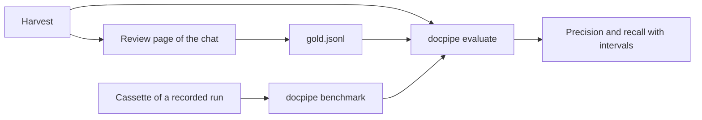

# Measuring a harvest

## What it is for

A harvest says what the run read. Whether that is right is not something the
run can say, and a second model reading the same page cannot say it either.
A person can. This page is the loop that turns people's decisions into
numbers, so a change to a prompt, a spec or the code can be judged by what it
does to the precision and recall of a harvest and not by a few rows looked at.

## The decisions

The decisions file, `gold.jsonl`, is one JSON line per decision, appended and
never rewritten, kept beside the harvest and never in it. Three kinds:

- a verdict: one field of one harvested row (`value`, `unit` or a
  coordinate) is `correct` or `wrong`, with what is right where the person
  gave it;
- missing: the document states a value the harvest does not carry;
- checked: somebody read a whole document for one parameter, or for every
  one. Only then is what the harvest lacks there known, and only over such
  documents is recall counted.

A row is named by its document, its `tuple_id` and its parameter (see
[extraction](extraction.md)), so a decision made once is found again after a
new harvest and after a new build of the database. People decide on the review
page of [the chat](app.md), which appends to the file; nothing in this loop
judges a value, drops one or writes into a harvest.

Two rows of one document can share that name: a table row that prints one
number under two years is one quote and one value, read twice. So a verdict
also notes what its row said beside the value (`row`: the unit and each
coordinate, `signature` in `gold.py`), and it is about that row. A row that
reads the same finds it. A row that reads differently takes it over only when
it is the one row the decision can be about, the same value read again with
another year and not the row beside it; where two such rows are open to it,
neither takes it, because that would be a guess. `row_name` is the name and
the signature as one text, for an order or a key on a page.

A field holds one thing. Where it was decided more than once, the newest
decision about the content it has now counts. Failing that, the newest
decision that names what is right (`expected`) settles it: the content is
correct if it is that, wrong if it is not. Failing that, content that
somebody found correct in the field makes this content wrong, and decisions
that only found other content wrong say nothing about it. A `missing` value
written down twice, with the same value, unit and coordinates, is one value.

## Counting

`docpipe evaluate HARVEST_DIR --gold gold.jsonl` counts precision field by
field over the rows somebody decided, and recall over the documents somebody
read whole. Without `--gold` the file is `gold.jsonl` beside the harvest
directory, however that is spelled (`.` and `..` are resolved first). Every
share comes with its 95 percent interval (Wilson): forty
decided rows with two wrong are 95 percent, anywhere between 84 and 99, and a
change that moves precision inside that range has shown nothing. What nobody
decided is counted as undecided and is in no share. The numbers are split by
parameter, by trust level and by where a value was read (text, table or
figure), because whether level C may stay out of a graph is a question about
the precision of level C.

Recall counts a row as found by its whole-row verdict, as precision counts
it: a row with one wrong field is not found, so the right number under the
wrong year is not the value the document states. A row is found when its
whole row was decided correct, or when it is the value a `missing` decision
names; a value the harvest read twice is found once.

`--baseline DIR` holds a second harvest of the same documents beside this
one, row by row. Rows are paired by their name; where several rows of a
document share one, those that read the same in every field are paired
first, and what is left on both sides is a row read differently. A row only
one harvest carries is counted with what was decided about its value.
`--min-precision` and `--min-recall` make the command exit 1
below a share, for a pipeline that should stop on it. `--json` also writes
the report.

## Benchmarks

`docpipe benchmark DIR --record` harvests once with the configured model and
keeps every answer in a cassette (see [the provider layer](providers.md));
`docpipe benchmark DIR` harvests again from those answers, without a model,
and holds the result against the first harvest and the decisions. A benchmark
is a directory with `benchmark.json` (which profile, database, arguments and
settings), `cassette.jsonl`, the recorded `harvest/` and, once somebody has
decided, `gold.jsonl`. `profile` is a profile's name, or the directory of a
profile as seen from the benchmark (`profile_of`), for one that is not on the
search path where the benchmark is run.

Both runs take their command line and their settings from `benchmark.json`
and from nothing else: no setting of the shell, no project file and no `.env`
reaches the harvest. The one exception is how a model is reached (provider,
address and key, `REACHED`), which a recording takes from where it is run and
a replay does not need. Both runs ask one request at a time
(`ONE_AT_A_TIME`), because a request shows the model what earlier requests of
the same sweep found, and with several in flight its words would depend on
which thread was faster. The harvest runs the package the benchmark command
runs, wherever it is started. A replay counts the trust levels as `docpipe
evaluate` does, with the database's transcribed mark: a document whose pages
a model transcribed is level B at best.

What the replay shows is what a change to the code does to a harvest whose
answers are held still: how a reply is read, what is accepted, how rows are
settled. A change that makes the run ask something else is not answered from
the cassette; the replay says so and fails. The harvest, `--review` and
`--top-up` all end with 1 when a replay was asked something the cassette does
not hold (`unheld_requests`). A request is filed under its messages, and an
image in it under its pixels (`_picture`) and not under the bytes of its
encoding, so another build of the encoder still finds the answer. A text to
embed is filed under the text; an item with an image that the replay embedder
cannot answer is counted as a request the cassette does not hold.

## Module reference

The docstring of each module of this stage, verbatim from the code and generated by `scripts/build_docs.py`. The chapter above is the account; this is the reference. Edit the docstring, not this page.

<code>docpipe/extraction/gold.py</code>

gold.py: What a person decided about harvested values, kept beside the
harvest and never in it.

A harvest says what the run read. Whether that is right is not something
the run can say, and a second model reading the same page cannot say it
either. A person can: with the value, its quote and the page in front of
them they decide, field by field, whether the document says that. Those
decisions are the gold, and the only thing precision and recall are counted
against (`evaluate.py`).

They are one JSON line each in a file of their own, appended and never
rewritten, so two people can decide at once and a decision that was changed
is still there. The last line about one thing is the one that counts.

    verdict   one field of one harvested row is `correct` or `wrong`. The
              field is "value", "unit" or the name of a coordinate; `shown`
              is what the harvest said there when it was decided, and
              `expected` what is right, where the person gave it.
    missing   the document states a value of a parameter that the harvest
              does not carry.
    checked   somebody read the whole document for one parameter (or for
              every one): only then is what the harvest lacks there known,
              and only over such documents is recall counted.

A row is named by its document, `identity.tuple_id` (the quote and the
value as written) and its parameter. Those survive a new harvest and a new
build of the database, so a decision made once is found again by the next
run that reads the same thing.

Two rows of one document can share that name: a table row that prints the
same number under two years is one quote and one value, read twice. So a
decision also notes what the row said in its other fields when it was made
(`row`), and it is about that row. A row that reads the same finds it. A
row that reads differently takes it over only when it is the one row the
decision can be about: the same value read again with another year, and
not the row beside it.

Nothing here judges a value, drops one or writes into a harvest.

Author: Felix Vossel

<code>docpipe/extraction/evaluate.py</code>

evaluate.py: Holds a harvest against what people decided about it.

    docpipe evaluate HARVEST_DIR --gold gold.jsonl
    docpipe evaluate HARVEST_DIR --gold gold.jsonl --baseline OTHER_DIR
    docpipe evaluate HARVEST_DIR --gold gold.jsonl --min-precision 0.9

Precision is counted field by field over the rows somebody decided
(`gold.py`): of the values, units and coordinates a person looked at, how
many does the document say. Recall is counted only over the documents
somebody read whole for a parameter: of the values the document states,
how many does the harvest carry.

Every share comes with its 95 percent interval (Wilson). Forty decided
rows with two wrong are 95 percent, and anything between 84 and 99: a
change that moves precision inside that range has shown nothing, and the
interval is what says so. What nobody decided is counted as undecided and
is in no share.

The numbers are split by parameter, by the level the harvest gave a value
(`trust.py`) and by where it was read (text, table or figure), because
those are the splits a decision hangs on: whether level C may be left out
of a graph is a question about the precision of level C.

`--baseline` holds a second harvest of the same documents beside this one,
row by row: which rows both carry, which only one does, and what was
decided about those. That is the comparison a replayed run is made for.

Nothing here writes into a harvest or decides anything about a value.

Author: Felix Vossel

<code>docpipe/extraction/benchmark.py</code>

benchmark.py: One harvest, recorded once and made again without a model.

    docpipe benchmark DIR --record     harvest with the configured model and
                                       keep every answer
    docpipe benchmark DIR              harvest again from those answers and
                                       hold the result against the first one

A benchmark is a directory:

    benchmark.json    which profile, which database and index, which
                      arguments and settings the harvest is run with
    cassette.jsonl    the answers of the recorded run (`providers/cassette`)
    harvest/          what the recorded run harvested, and its query cache
    gold.jsonl        what people decided about it (`gold.py`), once
                      somebody has

Both runs take their command line and their settings from `benchmark.json`,
so the second one asks what the first one asked. Nothing else reaches the
harvest: no setting of the shell the benchmark is started in, no project
file, no .env. The one exception is how the models are reached (provider,
address, key), which a recording takes from where it is run and a replay
does not need. Which model is asked is a setting like any other.

Both runs ask one request at a time. A request shows the model what earlier
requests of the same sweep found, so with several in flight its words
depend on which thread was faster, and a replay would ask other words than
the recording answered.

What a replay shows is what a change to the code does to a harvest whose
answers are held still: how a reply is read, what is accepted, how rows are
settled. A change that makes the run ask something else (a prompt, the
spec, how passages are picked) is not answered from the cassette. The
replay says so and fails, and that change needs a recorded run of its own.

Recording asks a model and writes down the text of the documents it read,
so it is only done on purpose (`--record`) and only for a profile whose
documents may be passed on.

Author: Felix Vossel

[Back to the index](../README.md)
