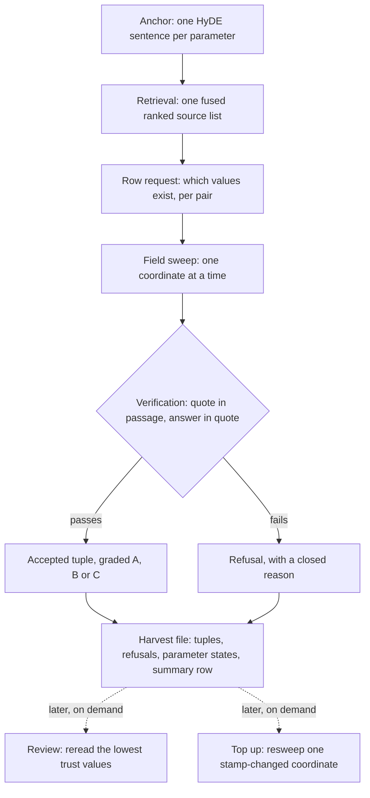
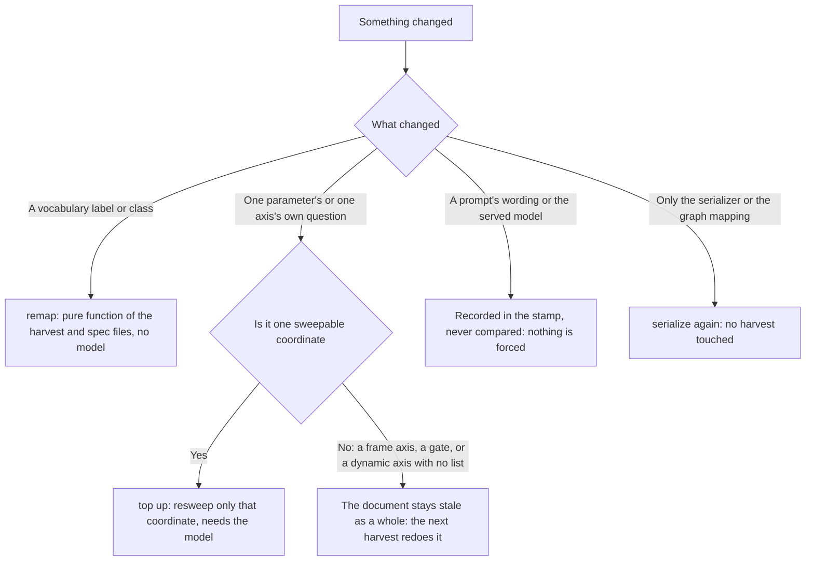

# 7. Reading the values out

## Purpose

`docpipe/extraction/` is the stage where a retrievable passage becomes a
typed value a knowledge graph can hold. Stages 1 through 6 turn a PDF into
sections, tables and figures a search can find; this stage reads those
passages against a profile's ontology contract and writes out value
tuples, a number, a class from a closed vocabulary, or a plain text
string, with its unit or vocabulary entry where the parameter has one,
and a handful of axes (which carrier, which sector, which year, which
scenario) that place it in the ontology's own terms.
`docpipe/extraction/__init__.py` names this ontology-based information
extraction, OBIE.

Nothing here is written on a model's word alone: every claim is checked
against the profile's closed vocabularies and the literal text of its
passage, and what survives carries that evidence, down to each
coordinate's own quote and source. A value the
run cannot back is refused rather than written with a gap where its
evidence should be. That is what separates this stage from a plain text
search: the question it answers is not only what the document says but
whether this run can support it with evidence, and the answer is recorded
next to the value, in a form later stages and the four maintenance
passes can act on without asking a model again.

## Position in the pipeline

| | |
|---|---|
| **In** | The corpus [chunking](chunking.md) built: the SQLite database's `Sections`, `Tables`, `Images`, `Embeddings`, `Documents` and `DocumentMeta` rows, and the FAISS index. No file under `results/` is read directly. Also a profile's validated `extraction_spec.json` (`spec.load`). |
| **Out** | One `<document>.jsonl` harvest and one `<document>.stamp.json` resume stamp per document, a per-document trace file under `trace/`, and, written once per run, `anchors.json` and `query_cache.db`. A `--serialize` call reads the harvest back and writes one Turtle file, feeding [the knowledge graph](graph.md) stage. |
| **Resumes on** | `<document>.stamp.json`, compared against what today's spec would produce, one key per parameter, value list, axis and slot; the whole-file spec sha stands in only for a stamp that carries none of those. The model, the anchor set and every prompt are written into the stamp for a reader and are never compared. A document with no stamp is read as fully stale, never as finished, and a document one of whose requests ended on a 429 or a 5xx is not stamped, which the run counts as a failure and answers with exit code 1. |
| **Needs** | A served LLM reached over the network, the query embedder, the FAISS index, the corpus database, and, unless `EXTRACT_LOCATE=0`, the source PDF (`--pdf-root`) to place a quote's highlight rectangles. Unless `EXTRACT_ATTACH_IMAGES=0`, also the `images/` directory (`--image-root`) with the table and figure crops that ride along with every request. |

Extraction is the seventh of the pipeline's eight stages. [Chunking,
embedding, database](chunking.md) precedes it and is the last stage to
write anything under `results/`; from here on, a document's state lives
in the database and its stamp. [The knowledge graph](graph.md) follows,
reading only the tuples this stage accepted, never a refusal or the
spec itself.

One document, from its anchor to its summary row:

## Method

### Loading and validating the spec

`spec.load` parses a profile's `extraction_spec.json` into a `Spec` of
`Parameter` and `Axis` objects, refusing anything wrong: too short a
parameter description, a numeric parameter missing a unit factor, two
vocabulary labels folding to one spelling under two different classes,
or an axis naming more than one of vocabulary, enum, type or dynamic.
`SpecError` names the offending field, failing at load time rather than
partway through a batch. A
parameter carries one of four value types, `spec.VALUE_TYPES`: `float`
and `int` take a unit, `category` a closed vocabulary, and `text` a
plain string compared verbatim rather than mapped to a class; `text` is
the majority type in the scenarios profile, 11 of its 18 parameters
(`profiles/scenarios/extraction_spec.json`). Vocabulary labels are
compared after `fold_label`, not as raw strings. A unit is never
folded: it is read as its own coordinate, against the literal entries
of `units_accepted` (`fields.unit_slot`), and `Parameter.unit_factor`
is an exact lookup of the entry chosen, not a spelling match
(`spec.py:180-189`). A spelling table stood in for that reading once;
measured on 641 plans of corpus_m5, it let 3,324 tuples carry an entry
their wording contradicts (`spec.py:41-47`). An axis that still sets
an evidence rule is refused at load time (`spec.py:270-275`): a
coordinate is checked for its quote and its answer, wherever the
passage stands.

### The retrieval plan

`pipeline.plan_document` builds one plan per document, not per parameter,
since which quantity a number belongs to is asked as a coordinate later.
Two rules used to feed it: every table and figure taken whole through the
`structure` callable, since over 65 documents 12,094 of 15,082 values
came from one of the two (`pipeline.py:236`); prose ranked and capped at
`prose_top` sections, the half a ranking retains. A newer
single cut (`top`, `EXTRACT_PLAN_TOP`) replaces both with one fused
ranking, keeping the structural floor only as a counter of what it would
have missed. There are no repeated rounds: retrieval is asked once per
document, not asked again with everything already found excluded. The
single call fuses every probe into one ranked
list rather than concatenating a ranking per probe: over 65 documents and
15,082 values, concatenation put a value's real source at median rank 77,
fusion at rank 26 (`runner.py:507`).

That single cut is not a plain slice of the ranking either.
`with_visual_share` (`pipeline.py:185`) holds a share of `top`'s room,
`VISUAL_SHARE` (env `EXTRACT_VISUAL_SHARE`, default `0.5`,
`pipeline.py:71`), for figures and tables before prose can fill it,
pulling the best-ranked ones up into that room when the head of the
ranking does not already hold its share and putting the result back into
rank order, so batching and every rank written into the report stay what
they were. The cap itself does not move and the taken sources stay in
ranking order; only which of them make the cut does. Measured on
corpus_m5: figures and tables carried 71% of every tuple in the harvest,
yet only 13 to 40% of a document's own figures and tables ever reached a
question at all. Emskirchen showed the model none of its 12 tables,
Bremen 13 of its 323 figures, Kassel none of its 23 figures, and on the
30 thinnest documents only 42% of tuples came from an image, against 71%
everywhere else.

### Anchors

The plan searches not with the spec's query templates but a sentence
written as a document would state the answer, a HyDE anchor; two
mechanisms produce them. `document_anchor` (`runner.py:1087`) writes the
plan's own probe per document and parameter, from the parameter's
label, description, the document's name and an early caption; recorded,
never compared, in the stamp as `question_text/<key>`.
Dropping query templates for it was measured directly: with templates
included alongside the anchor, a value's real source sat at median rank
84; without them, rank 26 (`pipeline.py:246`). `plan_document` falls back to
`queries.expand`'s templates only when no anchor exists. `make_anchors` (`runner.py:1771`) is the second,
corpus-wide mechanism: one set per question the field sweep asks, each
axis question and the parameter choice, written once per run and cached
per question. The value itself has no set: the plan searches with the
one short sentence `document_anchor` writes (`anchor_targets`,
`runner.py:1058`). This set backs the field sweep once a
coordinate is not in the value's own passage, and is fingerprinted as
one `anchors` stamp key.

### The frame

Some coordinates belong to the document, not the row: a plan's scenario
containers and reference years stand in headings, captions and column
headers rather than varying cell by cell. `runner.find_frame` reads these
once, before any value, over up to `FRAME_ROUNDS` rounds of up to
`FRAME_SOURCES` passages, keeping only pairs with their own verbatim
quote (`frame_pairs`). A
deterministic cross-check, `years_in_sources`, scans the same passages
for year-shaped numbers the model did not name and offers them back once,
never adding a year on its own. Which coordinates form a frame is named
by the profile: kwp sets `FRAME = ("scenario", "year")`
(`profiles/kwp/extraction.py:73`); the scenarios profile sets none. A frame axis is built from the run's
spec, so a list closed per document is not supported on one. The frame
request puts the entries of a closed frame coordinate under a key of its body
that the profile names: `_frame_payload` says the phrase `frame_options` with
the coordinate's name as `slot`. `kwp` and `scenarios` say `"scenarios"`, one list
for every closed coordinate; the built-in profile says `"{slot}_options"`, one
list per coordinate. Its frame prompt names no key ("the list the request
gives for `scenario`"), and its `frame_not_an_option` phrase is handed the key
that was sent, as `{options}`, so a profile that extends it and words only
`frame_options` differently has moved the request, the correction and the
prompt together. The frame prompts of `kwp` and `scenarios` and their
`frame_not_an_option` phrase name `"scenarios"` in their own words.
`pipeline.apply_frame` projects each pair onto its rows, state `read`,
before any field job is queued; a row that already answered better keeps
its own reading. A passage that prints several pairs, a table with a
column per year, is read under each of them, and each request takes its
own pair's column
(`test_a_passage_of_several_pairs_is_read_under_each_of_them`,
`tests/test_extraction_frame.py:650`). A passage that prints none of a
request's pair used to give no row at all: its claims were refused as
`passage is not of this pair` (`rows_from_reply`, `pipeline.py:612`). Two
helpers get a look at the claim first now: `pair_of_claim`
(`pipeline.py:564`) asks the claim's own quote and `pair_of_source`
(`pipeline.py:591`) asks the whole passage whether exactly one OTHER pair
of the document is named there; if so the claim becomes a row carrying
that pair in its own `pair` and `pair_index` fields (`Row`,
`pipeline.py:452`), for `project` (`runner.py:3573`) to stamp instead of
the request's own, drawn from `Batch.pairs` (`pipeline.py:135`), set by
`pair_batches` (`runner.py:4760`). Exactly one, or the claim still stays
refused. Measured on corpus_m5: of 120,442 claims refused this way, 52.8%
came back later under the same quote, 17.8% as the same value under
another quote, and 29.4%, 35,407 values, were never read under any pair
at all; their units are the corpus's own, GWh/a (7,445), MWh/a (7,016),
t CO2eq/a (3,836), from tables (14,227), figures (11,869) and prose
(9,311). The gain from the frame itself was measured directly: before it
existed, the year axis alone produced 1,849 refusals against 0 readings,
since every window after the first excluded the row's own source
(`runner.py:3579`).

### Base years

A row's own table sometimes names no year at all, only the plan's word
for its own state: "Basisjahr", "Ist-Zustand", "Bilanzjahr". Which frame
pair is that state is named by the profile, kwp's `BASE_YEAR =
{"scenario": "status_quo"}` (`profiles/kwp/extraction.py:83`).
`base_years` (`pipeline.py:859`) reads the document's base year off that
pair, one entry per year with the frame's own quote and source, and every
batch of the document carries them as `Batch.bases`, framed or not, since
a passage naming only "Basisjahr" is exactly the one that needs them
(`runner.py:5523`, `:5528`).

A year answer whose quote carries this wording but not the number now
reads (`base_year_named`, `pipeline.py:908`) when the number given is one
of those base years (owner decision 2026-09-22): the model chooses among
the plan's own base years rather than the run guessing which one
"Basisjahr" means. `merge_field` (`pipeline.py:932`) then cites the
frame's passage for the number, window `["base_year", <pair index>]`, and
keeps the row's own passage as `<axis>_link_quote`/`<axis>_link_source`.
Before this reading existed, corpus_m5 dropped 127,233 year answers whose
wording stood in their quote and whose number did not, "Basisjahr" among
the most common (`profiles/kwp/extraction.py:80-82`). The year field's
own request is shown the plan's base years alongside the question,
`"base_years"` (`runner.py:2734-2737`), and the trace's `field` event
counts how many of a window's answers came this way, `via_base`
(`runner.py:3393-3410`).

### The row request

Which values exist at all is decided once, by the value request
(`make_harvester` with `ROWS_PROMPT_ID`, `find_rows` inside
`make_fieldwise_harvester`). `pipeline.rows_from_reply` turns its claims
into `Row` objects through `route_claims`: the quote decides which source
a value belongs to, a label only breaks a tie, and a claim naming no real
source and quoting nothing findable is an orphan rather than filed under
the first source. Routing matches a quote to its source with the same
whitespace-collapsed test verification uses, `quote_in`, not a literal
substring test: a stricter test would refuse claims verification would
have accepted, since a table row retyped without its padding is the
normal case, not the exception, worth 276 of one pilot's refusals
(`pipeline.py:429`). A
wording not in its own quote is caught here too, before it becomes a
row (`pipeline.py:502`). Where a spec has no numeric parameter, as the
scenarios spec, every string is a wording and so is a bare year
(`fields.is_wording`), which is dropped here when its own quote does not
print it, with the reason `text value not in its quote`. A `Row` is
created only here, never later. The
request can turn to a code sandbox, bounded to `CODE_ROUNDS` rounds. A
reply that will not parse is asked again with the cause named,
`_reply_fault` (`runner.py:2113`), rather than the same message twice, and
with the retried attempt's sampling temperature raised a step: on
corpus_m5, a field retry asked again at temperature 0
repeated its first reply byte for byte and lost all three tries. Every
retry loop of this stage (phrase, frame, anchors, harvest, field and
review) raises the step, `retry_temperature` (`runner.py:115`, env
`EXTRACT_RETRY_TEMPERATURE_STEP`, default `0.1`), once per fault and
capped at `1.0`. One cut off at the token ceiling is asked again as two
halves instead of kept half-read, its labels renumbered onto the whole
batch, `_split_harvest` (`runner.py:2203`). A single passage still too
long for that gets its own ceiling doubled, up to four times, before it
is written as a `_why: cut_off` sentinel instead (`runner.py:2666`).

A profile may close a choice list per document (`document_axes`; the AR6
profile closes its scenarios and its regions). `runner.fill_dynamic_axes`
copies the spec with those lists filled in, parameter and unit questions
kept, and every batch of the document carries the copy (`Batch.spec`, read
through `runner.spec_of`): the value request, the field slots, the rows
handed to the next batch and `fold_batch` read it, not only the plan's
search. Stamps, fingerprints and the context budget stay on the run's own
spec.

### The field sweep: three window stages and a budget

Every coordinate a row still needs is asked for on its own by
`sweep_field` (`runner.make_sweeper`). Asking per field is why a
whole-tuple request cannot quietly drop an unsure coordinate: on a
204-document run, one combined request left the year missing on 63.5%
of values (`fields.py:15`). The sweep walks three stages, each with its own
allowance rather than a shared pool. **Own** reads
the value's own sources and the section its table stands in, for up to
`FIELD_ATTEMPTS` (3) attempts, each retry naming the reason. **Retrieval**
follows, searching further out with the per-question anchors in short,
non-overlapping windows (`FIELD_WINDOW` 2) for up to `FIELD_ROUNDS` (4)
rounds, asking the search for at most as many passages as the windows
still left can show rather than the whole ranked document, since handed
over whole it marked every passage seen after one round and left the
rest stage nothing to read. **Rest** is the floor, its own windows still
overlapping by `FIELD_OVERLAP` (1): once retrieval has nothing new,
`rest_of_document` reads the document's own remaining sections in
order, each followed by its own tables and figures in page order, not
sections alone, rotated to start near the open rows, until the
coordinate closes or the document runs out (`runner.py:3484`). A
coordinate the search or the rest stage cannot close before its budget
runs out is `exhausted`, never `unstated`: the first is a finding about
the run, the second about the document. The budget sums to
`FIELD_MAX_WINDOWS` (24) plus `REST_MAX_WINDOWS` (12) per coordinate; a
profile's `SEARCH_SHARE` can scale a named coordinate's retrieval and
rest allowance by a fraction, at least one window staying either way
(kwp halves `sector` and `aggregation`,
`profiles/kwp/extraction.py:93`). Every request now
asks one coordinate, not several at once: five coordinates for every
row of a batch in one request wanted up to 27,311 prompt tokens and
came back refused or cut off (`runner.py:2864`). Its rows are chunked
to at most `FIELD_ROWS` (32, env `EXTRACT_FIELD_ROWS`), about 2,600
answer tokens at the measured p90, sized against the server's own
window before the request is sent rather than shrunk after a refusal,
`answer_room` (`runner.py:1343`); a chunk still too large for its room
is halved before it is sent (`runner.py:2907-2917`).

### The reply grammar

A field request now goes out with `response_format`, a JSON schema built
by `field_response_format` (`runner.py:2800`) from the coordinate's own
contract: the asked field under its own name, `groups` and `answers`, and
a `value` that is one of the slot's options (`out:unstated` included) or,
for a number, an integer, nothing beyond that: `additionalProperties:
False` throughout. vLLM generates the reply inside that shape rather than
around it, sent on every attempt (`make_field_asker`, `runner.py:2853`,
`:2942`). Nothing in the grammar is a check: every key stays as optional
as the field prompt leaves it, and what the reply says is still verified
by `merge_field` exactly as before. 70,395 field replies of corpus_m5
carried text beside the object and were asked again for it; under the
grammar none can.

### Requests the server did not serve

Every request loop of this stage reads the exception's HTTP status to tell
three ends apart. A request that never arrived has no status and is the
server's: `server_side` is true, and the loop waits on the long curve,
`retry_wait(attempt, transport=True)`, rather than the short one the model's
own mistakes get (`runner.py:172-186`, `178-185`). A 429 or a 5xx is
`unserved` (`runner.py:189-197`): the server was there and did not do the
work, which says nothing about the request, so it is `server_side` too,
waits on the long curve, and ends the request as unserved if the last
attempt still got it. Any other 4xx refuses the request itself, and every
retry would be refused alike: the row, coordinate, frame and review loops
stop at once, and a passage ends as `no_answer`.

What an unserved end means depends on the request. A passage's rows request
writes one sentinel per source with `_why: "unserved"` (the harvest
schema's `_why` has four values: `unreachable`, `unserved`, `no_answer`,
`cut_off`; `docpipe/extraction/schema.py:505-506`), and such a sentinel
counts towards the dead-server streak like an `unreachable` one
(`runner.py:2639-2642`, `4036-4038`). A coordinate request, the frame
request and a search-sentence request return nothing, as they do for any
failure; what marks the document is `UNSERVED.note(document_id)`, which
counts it in the registry `UNSERVED` (`runner.py:210-237`, noted at
`1160-1161`, `1454-1455` and `3076-3079`). The coordinate request's own streak counts it
too (`runner.py:2989`). The run's anchor requests belong to no document and
are counted under `None` (`runner.py:1848-1851`).

### The adaptive request limit

A fixed thread pool bounds how many requests can be sent at once; how many the
server can usefully answer at once moves with what is asked and with its own
queue. `throttle.start` (`throttle.py:332`) reads vLLM's `/metrics` every
`EXTRACT_LIMIT_POLL` seconds and steers one `AdaptiveLimit` every client waits
in (`runner._client`, `runner.py:1969`), additive increase / multiplicative
decrease: it grows while nothing is waiting, the KV cache stays under
`EXTRACT_LIMIT_KV_GROW` and the limit is actually being reached, and steps back
on two consecutive waiting samples, the KV cache at `EXTRACT_LIMIT_KV_HIGH`, or
a preemption (`throttle.Controller.decide`, `throttle.py:237`).
`EXTRACT_LLM_PARALLEL` and `EXTRACT_FIELD_PARALLEL` stay ceilings it cannot
rise past, and a server with no `/metrics` gets no adaptive limit at all, the
pools alone deciding as before. `EXTRACT_LIMIT_ADAPTIVE=0` turns it off
(`runner.start_limit`, `runner.py:1300`).

### Merging a coordinate

`pipeline.merge_field` folds each field's answers onto the open rows,
holding every answer to the two clauses the value's own quote is held to:
its cited passage sits verbatim in a shown source, and it contains the
answer, with a floor of `MIN_QUOTE_CHARS` so that a quote names a place.
Those are the check for a quote (`pipeline.py:1065-1103`;
`test_a_coordinate_is_dropped_for_the_agreed_reasons_and_no_other`,
`tests/test_extraction_reasons.py:114`). Without its own `value_raw`
wording, a closed-list answer's quote is checked against every spelling the
spec lists for the chosen option, not only its label: the real classes
carry the ontology's English names, which stand in no German plan, and
corpus_m5 had dropped 284,643 quantity answers on exactly that gap before
this widened (`answer_in_quote`, `pipeline.py:686`, owner's decision
2026-09-13); a wording that is given still has to stand in the quote
itself. A year counts only where its own four digits stand in the quote
in one run, so "2.022 MWh" no longer backs the year 2022 though a dated
"31.12.2022" still does; and a spelling counts only where no longer
entry of another option of the same list stands at that spot, so a bare
"MWh" is not backed by a passage's "MWh/a", though the chosen option's
own longer spelling still is (`stands_in`, `pipeline.py:732`, owner's
decision 2026-09-23). A closed-list coordinate answers a third clause
too: naming one of
the list's own entries, by label, spelling or URI, or it is never marked
read (`option_named`, `not_an_option`, `pipeline.py:776-790, 1031-1046`, the owner's
rule of 2026-09-11). Which table the
passage belongs to, how far from the row it stands and which column of a
table it heads are the model's reading, not a rule. Failures are recorded
separately, `unquoted` against `unbacked`, so a retry can name what to fix. A
coordinate already read once is never overwritten by a later window
(`pipeline.py:994`). A wording naming no token of the option
it claims is counted `raw_foreign` rather than trusted silently.

### Folding and verification

`pipeline.fold_claims` hands every claim to `verify.verify_tuple`, the
last check against the spec's closed lists and the literal source text. A
number is compared digit for digit after `canonical_number` normalises
locale grouping and decimal marks; a category or text value is compared
case- and whitespace-folded against its own wording, through `verify.flat`
(`verify.py:161`). The set of numbers a quote is checked against,
`numbers_in` (`verify.py:129-137`), also credits the year of a dotted
German date, "09.12.2025" or "03.2030", since read as one token it is the
ungrouped number 09122025 and the year it plainly prints would otherwise
be missing from that set: 12 years were dropped so on the corpus_m5
canary. That fold now runs `unicodedata.normalize("NFKC", ...)`
first and maps the quotation-mark, dash and thin-space variants and the
soft hyphen onto one spelling each, before the existing whitespace
collapse: the passage comes out of the PDF and the quote out of the
model, through two different encoders, and a ligature, a decomposed
umlaut or „Bestand" against "Bestand" used to read as two different
sentences. Not a new check: the shape both sides of the one existing
comparison are brought into. Measured on corpus_m5, before this fold
existed: 1,458 claims were refused as `quote not found in the source it
cites` and 17,422 values were downgraded to `unbacked` for exactly this
gap between two encoders.

Where a quote is
not verbatim in its source but the value occurs there
exactly once, the quote is rebuilt around that occurrence rather than the
claim refused: on the 16-document pilot, 303 of 377 such refusals were
repaired this way, against 8 where the value truly was absent
(`verify.py:333`). A verified tuple's tier comes from its source
alone, not whether the quote could be placed on the page:
`text_located` for prose, `visual_source` for a table transcription or
figure description, an uncheckable model reading of a picture. A prose
quote that could not be placed on the PDF page still keeps the
`text_located` tier; it only gains a `not_located` flag (`verify.py:485`).
Non-fatal findings are carried as flags: `quote_repaired`, `computed`
(a sandbox result checked against its own printed output),
`not_located`, `unmapped:<axis>:<wording>`, and, for an amount over a
span, `period:unstated` when the entry chosen for the unit names no
period at all.

### Trust levels

`trust.trust` grades every accepted tuple deterministically, from what
the harvest already recorded, no further model call and no tuned
threshold. Level A: its own text states it, every coordinate read.
Level B: the same, from an image transcription or a model-transcribed
page. Level C: one of the following holds: a coordinate the sweep could
not back or gave up on, a repaired quote, a computed number, or a
contested identity decided at graph build time. Where a coordinate's
passage stands is no reason. A second
reading from `--review` can mark a tuple `corroborated`, described
under The passes that revisit a harvest, but never raises its level.
`trust.document_summary`
folds one document's tuples into a closing line, its level distribution
and reason counts. See [how much of a value the run can stand
behind](../contract/trust.md) for the full list.

### The harvest file, the stamp and the trace

Before any of that is computed, `runner.finish_document` calls
`pipeline.drop_repeats` (`pipeline.py:1588`), which removes a row that
agrees with an earlier row of the same document in every field but
`provenance`: the same reading written twice by two different requests
is one reading, not two, and counting it twice would throw off the
parameter states and the summary computed next from it. `provenance` is
left out of the comparison because it is about the writing and not the
reading; the first of a repeated pair is kept, so the file stays in the
order the harvest produced. Measured on corpus_m5, which ran with no
such pass: 1,152 of 62,290 tuples were repeats, in 192 documents, up to
77 in one plan, and one office name written eleven times.

`pipeline.write_report` writes one document's tuples, refusals, parameter
states and closing summary to a temp file and only replaces the real
`.jsonl` once complete, so a killed process cannot leave a truncated
harvest; every rewrite in this stage follows the same rule. The stamp is
withheld until `runner.finish_document` decides a harvest genuinely
happened, not merely that a file was written, and it removes an earlier
stamp before it writes the file (`runner.py:4498-4499`); see Failure modes
for when it withholds one. What the stamp records,
`_stamp_current`, is deliberately not one hash over the whole spec file:
`spec.fingerprints` computes one sha per question, so `runner.stale`
names exactly which one moved. The earlier whole-file design cost this
project directly: one new vocabulary spelling made all 1,082 documents
stale at once, about 93 GPU hours to re-read a corpus over one word
(`remap.py:6`). The coarse `spec` key is compared only while no finer
key exists; once fine keys exist, a changed value and a dropped
question are both checked. Beside every harvest sits
`<document>.trace.jsonl`, on by default and disabled with
`EXTRACT_TRACE=0`.

Every tuple, refusal, parameter state and summary line is checked
against the published schema before it is written:
`_harvest_validators` builds one `jsonschema` validator per branch from
`schema.build(spec)["harvest"]`, run by `check_against_schema` inside
`finish_document` on every call carrying a spec (`runner.py:4496-4497`). A
row the schema refuses is counted
and logged as an `invalid` trace event, never withheld, since blocking on
a schema mismatch would turn a documentation defect into a data loss.
The preflight (`docpipe preflight`, see The check before a run) calls
`schema.build` directly, ahead of any run, to confirm a profile's published
schema file is current (`preflight.audit`, the checks `schema present` and
`schema current`). `python -m docpipe.extraction.schema <name> --write` writes
that file into the profile's directory, from the spec the profile names
(`extraction.SPEC_PATH`), wherever it lies.

### The passes that revisit a harvest

Four passes act on a harvest already written, without starting a
document over from its first passage, and they differ in what they cost
and what they may touch. What changed decides which one applies:

| Pass | Needs | May touch | Leaves the stamp |
|---|---|---|---|
| `--recheck` | No model, no GPU, no index; the corpus database, read-only, where the profile closes lists per document | Every tuple's coordinates | Clears every stamp in the directory (unless `--keep-stamps`), except a document left alone |
| `--remap` | Nothing: no model, no GPU, no index | A category coordinate's mapped class | Writes forward only the answer spaces it fully settled |
| `--top-up` | The model, the FAISS index, the embedder, the database | One named coordinate of every row that has it | Writes forward only the exact stamp keys it could settle, and none when one of its requests ended on a 429 or a 5xx |
| `--review` | The model, and the crops for image-attached prompts | Only a row's `flags` | Adds `review/prompt` and `review/model`, compared by nothing |

`--recheck` (`recheck.py`) reapplies the answer-in-quote rule to the
wording and quote already on disk: a coordinate whose quote does not
contain its claimed answer is stripped back to `unanswered`; on a
corpus written before the rule existed, 27.6% of years cited a passage
with no year at all (`recheck.py:8`). A stripped
coordinate can only be repaired by a real harvest, so `recheck.run`
deletes every stamp by default; `--keep-stamps` keeps one that no longer
matches the file. Where the profile closes lists per document, each file
is read against its own document's lists, so the pass then opens the corpus
database read-only; a document whose lists cannot be closed is left alone,
stamp included, and counted under `fields.LISTS_UNREADABLE`. `--remap` (`remap.py`) re-resolves a coordinate's
recorded wording against today's vocabulary instead, a pure function of
the harvest and spec files: a newly listed wording is rewritten and its
stale flags dropped, one in neither list or with none recorded is left
as it stands, and a refusal a grown list might now place keeps its axis
stale, since only a real harvest turns a refusal into a tuple.
`stamp_forward` writes forward only the answer spaces a file fully
settled.

`--top-up` (`topup.py`) is the one pass that is not free: it costs a
model call, but only for the coordinate a stamp says moved, over the
harvest's own sweep. `actionable` blocks the whole document the
moment a changed key names anything other than one sweepable
coordinate: a key naming no coordinate the spec still asks blocks
outright, and so does one naming a frame axis, since the frame decides
how many passes a document gets, or, unless allowed, a dynamic axis
with no per-document list, since sweeping it empty would demote a class
to a wording (`topup.py:71-108`). `--top-up-key` names one axis
coordinate, `axis/<uri>/<name>`, or `slot/unit`, the unit of every
numeric parameter, swept parameter by parameter since a stored row
already knows its own (`targets_of`, `topup.py:125-142`); nothing
sweeps every asked coordinate of every row at once any more. `reopen` strips one coordinate's keys before
the sweep runs; `restore` puts the old block back unless the fresh
sweep genuinely improves on it. A top-up whose own requests ended on a
429 or a 5xx leaves the file's stamp as it was, so the next top-up asks
again; the stat lines count it as `stamps left, a request ended on 429 or
5xx` (`topup.py:377`, `433-437`). A row whose passage no longer carries
its stored quote is left untouched, and top-up traces land under their
own `trace-topup/` directory, `open_trace` first closing any file an
earlier directory left open. A re-swept `year` carries base years too:
`base_years_of` (`topup.py:198`) rebuilds the document's base-year pairs
from the frame's own readings already sitting in the harvest file and
hands them to every batch, the same as the main harvest, so a re-swept
year that names only "Basisjahr" still reads.

`--review` (`review.py`) differs from the other three: it writes only
`review/prompt` and `review/model`, recorded and never compared, so it
never makes a document look stale. It rereads a harvest's lowest-trust
values once more, over a window narrowed to the value's own two legal
passages, a self-consistency check rather than an independent opinion.
Only a disagreement counts as a trust reason; an agreement is marked
`corroborated` without raising the level. The second reading goes to
`review.csv`, never onto the tuple itself. A value is read against its
document's own lists, and a document whose lists cannot be closed is left
alone, as in `--recheck`.

Three further scripts, `curation_list.py`, `harvest_compare.py` and
`trace_report.py`, read a harvest and print or write a report, described
under Modules; none writes back into one.

### What names a row, and who words the stage's own sentences

A row points at its passage with the database's own ids (`provenance`:
`owner_kind`, `owner_id`), and those are counters: build the chunks of a
document again and every section, table and figure gets new ones. What does
not move is what the row says. `identity.tuple_id` names a row from the
document, the quote and the value as it was written. It survives a re-chunk,
and a re-harvest that reads the same thing gives the same name, so a
decision, an export and a provenance record can hold on to it. After a
rebuilt database, `docpipe reanchor DB HARVEST_DIR` (`--dry-run` to look
first) finds each row's passage again: the one passage of its kind in the
document that carries the quote. Neither adds a key to a row or judges one,
and a row whose passage is not found again is left as it is and counted.

The sentences the stage writes itself outside its prompts (why an answer was
not taken, what was wrong with a reply that could not be read, how the closed
list names a meaning) go back to the model in the next request, so they are
in the language of the prompts and belong to the profile: its
`extraction.PHRASES`, where a profile that extends another one writes only
the ones it words differently (`wording.py`). One of them, `frame_options`,
is not a sentence but the key of the frame request's list of a closed
coordinate (see The frame).

### The check before a run

`docpipe preflight [PROFILE ...]` (`preflight.audit`) holds a profile to what a
corpus run rests on before a GPU is spent. It prints one line per check, takes
the profile in effect when none is named, and ends 1 when a check fails, which
a line marked as a warning does not. A profile may be named by its directory,
as for `--profile`. A name that is no profile is one failed line
(`profile found`); a profile the audit cannot get through is one failed line
(`the audit ran to its end`), the tables of the other profiles are still
printed, and the command still ends 1. It reads what the run reads: the spec
the profile names (`extraction.SPEC_PATH`, and no other: a profile that names
none fails on `spec present`, as the built-in profile does, also when an
`extraction_spec.json` lies beside it, and the line says so), the extraction
prompts (one that cannot be loaded fails its own line and every line about
what it has to hold), the writer of the graph (the profile's own
`kg.make_serializer`, else the generic writer, built as the run builds it by
`graph.make_serializer` from the `graph` block of the spec; a block it refuses,
such as the placeholder base that `docpipe compile spec` drafts, fails
`serializer present`) and, for a profile that has a `vocabulary` module, its
ontology pin; a module that has `check` but not `load` or `foreign_labels`
fails `vocabulary module is whole`.
The keys of a request and of a reply belong to the stage and are checked by
name. A passage a prompt has to hold belongs to the profile, in the language
of its prompts, and is declared in `extraction.PROMPT_CHECKS` as entries
`(what is checked, prompt id, passage, has to be there)`; a profile that
extends another one inherits the checks until it declares its own. An entry of
any other shape is named as a failure and not run (`preflight.prompt_checks`).
`scripts/preflight_profiles.py` runs the same checks for the two profiles kept
in this repository, `kwp` and `scenarios`.

How precision and recall are counted and how a recorded run is made again
without a model is on [measuring a harvest](evaluation.md); how the values
are handed on is on [handing the values on](serve.md).

## Data model

A harvest line is one of four kinds, named by its `kind` field.

| Kind | Carries | Written by |
|---|---|---|
| `tuple` | A resolved value, every filled coordinate (`_state`, `_raw`, `_quote`, `_source`, `_window` each), an evidence tier, non-fatal flags, and provenance | `verify.verify_tuple`, folded by `pipeline.fold_claims` |
| `refusal` | The raw claim plus a reason from a closed family | `verify.verify_tuple`, or `pipeline.route_claims` if unroutable |
| `parameter_state` | One line per spec parameter with no tuple at all: its state and its tuple/refusal counts | `trust.parameter_states` |
| `summary` | The document's trust-level distribution and reason counts, the last line | `trust.document_summary` |

A refusal whose claim carries `_harvest_failed` is a sentinel: a passage the
run never got an answer for. Its `_why` is one of `unreachable` (the request
never arrived), `unserved` (the server answered 429 or a 5xx), `no_answer`
(the model answered nothing, or the server refused the request with another
4xx) and `cut_off` (the reply did not fit and there was nothing left to
split); a trace `error` event with `kind: gave_up` carries the same value as
`why`. `scripts/harvest_report.py` counts the sentinels of a harvest by these
four causes (`SENTINEL_WHY`, `scripts/harvest_report.py:45`) and marks any
other value as unknown.

A coordinate's own `<name>_state` is one of seven values, each a
different kind of finding.

| State | What it says |
|---|---|
| `read` | Answered; the cited passage carries the answer |
| `derived` | Not asked: the spec decided it from the row itself |
| `unstated` | Answered: the shown passages do not state it |
| `unanswered` | The field reply never mentioned it |
| `exhausted` | Still open when the window budget ran out, document unread to the end |
| `unbacked` | Answered, but no shown passage carried it, it was another row's, or (a closed list) it named none of the list's entries |
| `out_of_slice` | Never asked: a gate coordinate put the row outside what this run serializes, or no parameter of the spec could hold it |

The resume stamp, `<document>.stamp.json`, is a flat dict: `spec` (the
whole file's sha; see Method for how it is compared), `slot/parameter`
(the value question itself), `slot/unit` (the unit question and its
entries, only where a spec has a numeric parameter), `parameter/<uri>`
and, where it has one, `value/<uri>` per parameter, `axis/<uri>/<name>`
per axis; these are the only keys `stale` compares. `model`, `anchors`, one entry per
`PROMPT_IDS` prompt, `question_text/<key>` and `review/*` are written
into the stamp too, so a reader can place a harvest, and are never
compared. A trace event is one JSON
line, `{"t": kind, "doc": document_id, ...}`, of one of eleven kinds
(`schema.py`'s `trace_schema`): `plan`, `anchor`, `frame`, `rows`,
`field`, `sweep`, `drop` and `error` from the harvest loop, `coord` and
`refusal` per folded tuple or refusal, and `invalid` from the schema
self-check described under Method. `review.csv` carries one line per
field a review asked about, named by `review.COLUMNS`.

A harvest directory (`out`) holds, per document,
`<name>.jsonl`, `<name>.stamp.json` and `trace/<name>.trace.jsonl`; per
run, `anchors.json` and `query_cache.db`; and, only after `--top-up`,
`trace-topup/<name>.trace.jsonl` beside it. `--review` also writes
`review.csv` at the top.

## Configuration

| Name | Kind | Default | Effect | Where read |
|---|---|---|---|---|
| `EXTRACT_FIELDWISE` / `EXTRACT_FIELD_WINDOW` / `_OVERLAP` | env var | `1` / `2` / `1` | `FIELDWISE`: one request per coordinate, not one per whole tuple. `WINDOW`: sources per retrieval- or rest-stage window. `OVERLAP`: how many of a rest-stage window repeat in the next one; a retrieval-stage window never repeats one | `runner.main`, `runner.make_sweeper` |
| `EXTRACT_MAX_RETRIES` / `EXTRACT_RETRY_TIMEOUT` | env var | `3` / `600` | `MAX_RETRIES`: attempts every retry loop of this stage gets per request. `RETRY_TIMEOUT`: client timeout (seconds) a row- or field-request retry gets after a request timed out; one refused at once keeps the client's own timeout instead | `runner.py`, `runner.make_harvester`, `runner.make_field_asker` |
| `EXTRACT_RETRY_WAIT` / `_MAX` / `EXTRACT_TRANSPORT_WAIT` / `_MAX` | env var | `2` / `6` / `15` / `120` | Seconds before the next attempt. The short curve, `RETRY_WAIT` times the attempt up to `RETRY_WAIT_MAX`, follows the model's own mistake. The long curve, `TRANSPORT_WAIT` doubling per attempt up to `TRANSPORT_WAIT_MAX`, follows a request that never arrived or ended on a 429 or a 5xx | `runner.retry_wait` |
| `EXTRACT_FIELD_ROWS` | env var | `32` | Rows one field request answers at once; a coordinate's open rows are chunked to this many per request, halved again if the chunk still leaves too little room for its answer | `runner.make_field_asker` |
| `EXTRACT_FIELD_ROUNDS` / `EXTRACT_FIELD_ATTEMPTS` | env var | `4` / `3` | Retrieval rounds before falling to the rest stage; retries of the own-stage window when unbackable | `runner.make_sweeper` |
| `EXTRACT_FIELD_MAX_WINDOWS` / `EXTRACT_REST_MAX_WINDOWS` | env var | `24` / `12` | Own plus retrieval windows, and the rest stage's separate allowance, before a coordinate is exhausted | `runner.make_sweeper` |
| `EXTRACT_PLAN_TOP` / `EXTRACT_PROSE_TOP` | env var | `100` / `200` | `PLAN_TOP`: the fused top-N cut replacing the older structural-floor plan; raised from 50 once that cut was measured holding only 40% of a document's tables and 15% of its figures. `PROSE_TOP`: ceiling on prose sections drawn from, always overriding `plan_document`'s own default of `50` | `runner.main` |
| `EXTRACT_VISUAL_SHARE` | env var | `0.5` | Share of the `PLAN_TOP` cut held for figures and tables before prose fills what is left, so the cap does not fall entirely to whichever ranks higher | `pipeline.with_visual_share` |
| `EXTRACT_FRAME_ROUNDS` / `_SOURCES` / `EXTRACT_FRAME_YEAR_MIN` / `_MAX` | env var | `3` / `12` / `1990` / `2100` | Rounds and passages per round the frame request may spend; bounds of a calendar year for `years_in_sources`, its deterministic cross-check | `runner.find_frame`, `runner.years_in_sources` |
| `EXTRACT_CODE_ROUNDS` / `EXTRACT_FIELD_RE_ENTRY` | env var | `2` / `3` | Sandbox rounds the row request may spend on a self-checked value; already-shown passages carried into a coordinate's next field window | `runner.make_harvester`, `runner.make_sweeper` |
| `EXTRACT_LLM_PARALLEL` / `EXTRACT_PLAN_PARALLEL` / `EXTRACT_FIELD_PARALLEL` | env var | `128` / `8` / `192` | Concurrency ceilings the adaptive request limit cannot rise past (see The adaptive request limit): LLM requests for the whole run, planning threads (retrieval, SQL and the document's phrase requests, which run in parallel per parameter), and field-sweep threads beneath row-request batches | `runner.harvest_batches`, `runner.main`, `runner.make_fieldwise_harvester` |
| `EXTRACT_ATTACH_IMAGES` / `EXTRACT_LOCATE` | env var | `1` / `1` | Off, respectively: no crop attaches to a row, field, frame or review request (no `images/` dir needed), or `make_locate` returns `None`, no quote placed on the page | `runner.py` askers, `runner.make_locate` |
| `EXTRACT_LOCATE_CACHE_PAGES` | env var | `512` | Pages of words `make_locate` keeps across documents; a cache hit is a dict lookup and takes no lock, only a miss enters MuPDF under one | `runner.make_locate` |
| `EXTRACT_BATCH_DOCS` | env var | `64` | Documents kept in flight at once under rolling admission, largest first by section count, filename breaking a tie; a finished one is written at once and the next starts, so no document waits on a group | `runner.main`, `runner.harvest_documents`, `runner._documents` |
| `EXTRACT_MAX_MODEL_LEN` | env var | `32768` | Fallback context window a request's answer room is sized against; overwritten by `set_model_len` from the server's own preflight report where it gives one | `runner.set_model_len`, `runner.answer_room` |
| `EXTRACT_RETRY_TEMPERATURE_STEP` | env var | `0.1` | Sampling temperature of a retried attempt raised by this step, once per unreadable reply, capped at `1.0`; every retry loop of this stage applies it (phrase, frame, anchors, harvest, field, review) | `runner.retry_temperature` |
| `EXTRACT_TRACE` | env var | `1` | Off, every trace call returns immediately and no trace file is written | `trace.py` (`ENABLED`) |
| `--document ID` / `--force` / `--force-stale` | CLI flag (ID repeatable) | none / off / off | `--document` restricts a run to named ids; `--force` redoes every document, `--force-stale` only those `stale` | `runner.main`, `runner.stale` |
| `--image-root` / `--pdf-root` | CLI flag | profile's processed dir / none | Crop directory for `EXTRACT_ATTACH_IMAGES`, and source PDF directory for `EXTRACT_LOCATE`; `--pdf-root` also backs `--image-root` when absent | `runner.main`, `resolve_image_root`, `make_locate` |
| `--recheck` / `--remap` / `--keep-stamps` | CLI flag | off | Runs `recheck.run` / `remap.run` over `--out`, no model needed, though `--recheck` opens the database read-only where a profile closes lists per document; `--keep-stamps` (recheck only) leaves stamps instead of clearing them | `runner.main`, `recheck.run` |
| `--top-up` / `--top-up-key KEY` | CLI flag (KEY repeatable) | off / none named | Runs `topup.run`, needing the model and index; `--top-up-key` restricts the changed keys swept to the named coordinates | `runner.main`, `topup.actionable` |
| `--review` / `--review-limit N` | CLI flag | off / `0` | Runs `review.run`, one request per level-C value, up to N total | `review.run` |
| `--profile NAME` | CLI flag | `$DOCPIPE_PROFILE` | names the profile whose spec, prompts and hooks the run reads; the stage refuses to run without one, in a line naming the available profiles, and `__main__.py` binds the flag before `runner` is imported | `runner.main`, `docpipe/profile.py` |
| `--serialize TTL` / `--print-context-budget` | CLI flag | none / off | `--serialize`: no harvest, hands `--out` to `serialize.run`, which calls the profile's `kg.make_serializer`. `--print-context-budget`: prints the tokens one harvest request needs, then exits | `serialize.run`, `runner.main` |
| `SLICE` / `FRAME` | profile hook | none / none (every coordinate per row) | `SLICE`: gate coordinate(s) asked first, a row that fails them never asked its others. `FRAME`: document-level coordinates found once and projected onto every row | `runner.main`, `topup.actionable` |
| `SEARCH_SHARE` | profile hook | none (every coordinate gets the whole budget) | Fraction of the retrieval and rest allowance a named coordinate gets; kwp halves `sector` and `aggregation`. At least one window stays per stage | `runner.make_sweeper` |
| `PROMPT_CHECKS` | profile hook | the extended profile's, else none | Entries `(what is checked, prompt id, passage, has to be there)`: passages the profile's prompts have to hold or must not. Read by `docpipe preflight` and by nothing in a run | `preflight.audit`, `preflight.prompt_checks` |

The context budget (`runner.context_budget`, printed by
`--print-context-budget`) is the tokens one request needs at worst. Its
payload term is the larger of the widest single parameter, which a
request planned for one parameter carries whole, and all parameters'
class lists together, which a request planned for no parameter carries at
once. A profile with several long lists, as scenarios has, can therefore
need a window above the 32768 that `EXTRACT_MAX_MODEL_LEN` falls back to,
and the model is then served with the larger of the budget and 32768.
`tests/test_extraction_runner.py` states the ceiling a profile may ask
for, 40960, and keeps kwp within 32768
(`test_every_profile_fits_the_window_it_will_be_served`).

## Failure modes

A claim is refused, not silently dropped, whenever `verify.verify_tuple`
finds a fixed problem: the value is not a number where required, its
unit is not one entry of `units_accepted` (named by the document's own
wording, `_check_value`), a required axis is missing or outside its own
list, the quote is missing, too short, or not found in its source even
after repair, or the value does not occur in its own quote. `pipeline.route_claims` refuses a
claim before verification when it names no real source and quotes
nothing found in any of them. A category or axis value the model chose
that is outside the spec's vocabulary is not refused outright, unless
the axis is required: it is kept with its wording and flagged
`unmapped:<axis>:<wording>`, since refusing every unforeseen spelling
would shrink the harvest on exactly the wordings a vocabulary review
most needs.

Inside the field sweep, an unbacked or unquoted answer does not end a
row's chance of being read: it stays open (`unbacked`, never final)
until a later window, stage or round closes it, or budget runs out
with the document unread, turning it `exhausted`. A reply that does not
parse, is empty, or arrives as a non-dict is coerced to an empty one at
every fold point, so a bad batch yields zero claims and the loop moves
on.

At the document level, `finish_document` writes the JSONL file every time
and withholds the stamp entirely, forcing a full redo on the next run, in
three cases: more than half a document's planned sources came back from a
server it could not reach (`UNREACHABLE_LIMIT`, `0.5`, `runner.py:4442`,
`:4504-4508`), not one batch answered at all (`runner.py:4509-4512`), or any
one of its requests ended on a 429 or a 5xx (`runner.py:4513-4518`). The last
count adds the `unserved` sentinels to the document's entry in `UNSERVED`,
which the callers pass as `lost` (`runner.py:4407`, `5379`); one is enough,
because such a request was never answered and nothing says it cannot be.
Only a resume, not a byte count, tells these cases apart from a genuinely
finished document. In all three cases an earlier stamp is removed before the
file is written (`runner.py:4498-4499`): it vouched for the file this one
replaces, and left in place it would have a resume skip a document whose
stamp was just withheld.

`finish_document` returns whether the document is stamped, and a document
written but left unstamped is a failed document. `verify` hands the
value on (`runner.py:5379-5384`), `harvest_document` returns
`(stamped, failures)` with one failure added when the document is not stamped
(`runner.py:5550-5551`), `harvest_documents` adds the failures up
(`runner.py:3900-3901`), and `main` returns 1 when there are any
(`runner.py:5587`). The exit code is 1 for a document written and left
unstamped as it is for a server that stopped answering
(`runner.py:5564-5569`). The run's own anchor requests are the other case:
if any ended on a 429 or a 5xx, `main` returns 1 before anything is
harvested, and the anchors already written stay in `anchors.json`, so the
next start asks only for the rest (`runner.py:5188-5199`). A document left
with batches never harvested is not written at all and adds no failure of
its own (`runner.py:5544-5547`); the dead server or the SIGTERM that left it
decides the exit code. `run_document`, the one-document path for a caller
outside the run's own loop, withholds the stamp the same way and returns
what `finish_document` returned (`runner.py:4390-4408`).

A time limit ends a run the same careful way. `install_stop_handler`
(`runner.py:124`) puts a SIGTERM handler in place, so that a time-limit
trap or a manual kill sets `STOP` (`runner.py:112`)
instead of letting the interpreter die where it stood. Documents run
under rolling admission, `harvest_documents` (`runner.py:3856`), at
most `EXTRACT_BATCH_DOCS` in flight at once, their batches sharing one
`batch_pool` and one `DeadStreak` (`runner.py:3836`) across every
document in flight and across the field sweep's own requests too,
rather than a separate dead-server count per document or per pool: the
run gives up once `max(64, EXTRACT_LLM_PARALLEL)` requests in a row
were not served by the server (not reached, or a 429 or a 5xx). The rows
pool and the field pool log it as "requests in a row the server did not
serve" (`runner.py:4039`, `2990`). Once
`STOP` or a dead server sets `Halted` (`runner.py:5394-5399`), no new
document starts, and a document already in flight leaves its own
`harvest_batches` call at once instead of waiting out its open
requests; such a document lands in `unfinished` and is not written, so
a resume harvests it whole instead of the run stamping it as though
every batch had come back. Once `STOP` is set the run logs, closes the
trace and exits hard with `STOPPED_EXIT` (`143`, `runner.py:120`,
`:5580`) rather than waiting on the field-sweep threads still open,
which are not daemons and could hold the process for minutes.

Among the four maintenance passes, `--recheck` and `--remap` never call a
model, so their only failure mode is a coordinate they cannot settle,
left open rather than guessed at; `--recheck` and `--review` also leave
alone, stamp included, a document whose lists cannot be closed. `--top-up` blocks an entire document
the moment a changed stamp key names anything it cannot sweep, and a
re-swept claim the verifier refuses keeps its prior reading. `--review`
never overwrites a value; a row
already flagged `review:` is never asked twice, and a reply the model
never sends leaves no trace, so the row is offered again later.

## Measured behaviour

- Planning per parameter instead of per document once turned one
  document's owner set into three documents' worth of requests: 804
  planned sources against 234 real owners (`fields.py:169`).
- The kwp spec's numeric units, nine for energy and forty-two for
  emissions, share not one spelling; on Kassel not one of 559 accepted
  tuples contradicted its own unit, yet asking the model to choose the
  parameter anyway cost 322 of 1,043 field windows, 30.9%, and 18.0 of
  187.5 field minutes per plan, before the unit was used to derive it
  instead: the sweep now asks the unit first, as its own coordinate,
  and `derive_parameter` settles the parameter from the entry chosen, or,
  for a wording, from the spec's one text parameter
  (`fields.py:308-335`).
- Letting the passage a coordinate was last read in drop out of the
  window after one use, rather than remaining in the window, cost one
  batch 520 dropped readings against 31 kept (`runner.py:3348`).
- On the 20-plan draft where the slice gate was measured, of 6,763
  harvested tuples the serializer dropped 1,554 for a quantity the graph
  does not hold and, while the scenario axis still gated a row, 2,510
  more for not being the target scenario (`profiles/kwp/extraction.py:11`).

## Verification

`tests/test_extraction_spec.py` pins spec validation and the fingerprint
functions the stamp is built from. `tests/test_extraction_pipeline.py`
pins the retrieval plan and routing, among them
`test_the_plan_asks_retrieval_once_and_not_until_the_document_is_gone`,
`test_every_table_is_planned_whether_or_not_a_probe_ranked_it` and
`test_only_verified_values_become_the_next_batch_s_prior`.
`tests/test_extraction_fieldwise.py` pins the field sweep and its two
checks: `test_an_answer_whose_evidence_is_not_in_the_source_is_not_written`,
`test_a_quote_that_does_not_contain_the_answer_is_not_evidence`,
`test_the_field_prompt_states_the_two_checks_and_no_other`,
`test_a_read_coordinate_is_not_overwritten_by_a_later_window`,
`test_a_row_outside_the_slice_is_not_asked_for_its_other_axes`,
`test_a_sweep_that_ran_out_of_budget_still_reads_the_rest_of_the_plan`,
`test_the_last_stage_keeps_its_allowance_when_it_is_larger_than_the_first`,
`test_the_sweep_starts_again_where_it_last_read_instead_of_striking_it_off`,
`test_the_sweeper_is_the_one_the_harvest_uses` and, for the lists a document
closes and the year of a spec that measures nothing,
`test_a_documents_own_list_is_what_the_field_request_offers`,
`test_a_year_is_a_wording_where_nothing_is_measured` and
`test_a_follow_up_batch_reads_against_the_same_document`.
`tests/test_extraction_frame.py` pins the frame's two quotes per pair and
its projection onto rows: `test_every_half_of_a_pair_quotes_for_itself`,
`test_a_frame_reading_may_quote_a_heading_anywhere_in_the_plan`,
`test_a_passage_of_several_pairs_is_read_under_each_of_them`,
`test_every_row_gets_the_year_of_its_own_pair`,
`test_a_coordinate_the_row_itself_answered_is_not_overwritten`,
`test_a_search_that_never_completes_says_exhausted_rather_than_complete`,
and, for the claim a request's own pair does not cover,
`test_a_quote_that_names_a_pair_itself_beats_the_title`,
`test_a_claim_that_names_two_pairs_stays_refused` and
`test_a_claim_that_names_no_pair_stays_refused`.
`tests/test_extraction_verify.py` pins `canonical_number`, quote repair,
the evidence tiers, and, for the fold `quote_in` and `value_in_quote`
share, `test_a_ligature_and_a_decomposed_umlaut_are_the_letters_they_are`,
`test_the_quotation_marks_of_a_plan_are_quotation_marks` and
`test_the_year_of_a_dotted_date_is_a_number_of_the_quote`.
`tests/test_extraction_trust.py` pins the level
cutoffs. `tests/test_extraction_reasons.py` pins that a coordinate is
dropped for the agreed reasons and no other, that every reason a claim is
refused for is a published one, and that no closure in the package reads
a name bound after it. `tests/test_extraction_schema.py` validates
that a harvest, a stamp and a trace event all conform to the published
contract. `tests/test_extraction_unserved.py` pins the 429 and 5xx rule:
`test_a_429_and_a_5xx_are_the_servers`,
`test_any_other_4xx_refuses_the_request_itself`,
`test_a_passage_the_server_did_not_serve_is_named_as_that`,
`test_the_last_word_decides_what_a_passage_ended_on`,
`test_a_refused_passage_stays_the_models_and_is_asked_once`,
`test_a_coordinate_the_server_did_not_serve_is_counted_on_its_document`,
`test_the_runs_own_anchors_are_counted_under_no_document`,
`test_one_unserved_passage_withholds_the_stamp`,
`test_an_unserved_request_of_any_kind_withholds_the_stamp`,
`test_a_withheld_stamp_takes_the_earlier_one_with_it`,
`test_the_one_document_path_withholds_the_stamp_as_well`,
`test_a_document_with_an_unserved_request_is_harvested_again`,
`test_a_forced_run_that_loses_a_request_is_not_hidden_by_the_old_stamp`,
`test_a_lost_search_sentence_leaves_its_document_unstamped` and
`test_nothing_is_harvested_without_the_anchors_the_server_did_not_serve`.
`tests/test_extraction_runner.py`, 120 tests, pins `runner.py`
itself: among them `test_a_document_the_server_never_answered_for_is_not_stamped`,
`test_a_document_no_reply_ever_came_back_for_is_not_stamped`,
`test_the_image_root_follows_the_pdf_root`,
`test_the_context_budget_holds_a_full_window_and_a_crop`,
`test_the_context_budget_counts_every_list_a_reading_request_carries`,
`test_the_context_budget_counts_the_widest_single_parameter`,
`test_figures_and_tables_keep_their_share_of_the_plan`,
`test_the_share_is_room_held_and_not_room_promised`,
`test_what_is_taken_stays_in_the_order_it_was_ranked`,
`test_the_same_reading_written_twice_is_one_reading`,
`test_a_stop_returns_at_once_and_names_the_documents_left_open`,
`test_sigterm_sets_the_stop_instead_of_killing_the_run`,
`test_each_unreadable_reply_raises_the_temperature_of_the_retry` and, for
the lists a document closes,
`test_the_value_request_offers_the_documents_own_lists` and
`test_the_halves_of_a_cut_off_request_keep_the_documents_lists`.
`tests/test_extraction_ranking.py` pins the fused ranking behind the
retrieval plan: `test_the_structural_floor_is_every_table_and_every_figure`,
`test_a_table_whose_content_is_gone_is_skipped_and_not_planned_empty`
and `test_the_plan_is_built_from_the_anchors_and_not_from_the_templates`.
`tests/test_extraction_dry_run.py` pins the spec-to-schema round trip, the
context budget against the batch size and, in the gate that runs before a
harvest, the lists a document closes:
`test_every_example_survives_its_own_round_trip`,
`test_the_answer_budget_and_the_batch_size_agree` and
`test_the_lists_a_document_closes_reach_its_requests_and_their_check`.
`tests/test_extraction_trace.py` pins the trace file itself:
`test_switched_off_it_writes_nothing_at_all`,
`test_a_document_harvested_twice_does_not_leave_two_traces_in_one_file` and
`test_a_second_trace_writes_under_its_own_directory`.
`tests/test_extraction_document_lists.py`, 10 tests, pins the lists a
document closes from the copy of the spec to the passes over a harvest on
disk: `test_only_the_lists_differ_in_a_documents_spec`,
`test_a_choice_outside_the_documents_list_is_not_taken_for_one`,
`test_a_year_its_quote_does_not_print_is_dropped_before_it_is_asked`,
`test_every_batch_of_a_document_reads_against_its_lists` and
`test_a_recheck_leaves_a_document_whose_lists_cannot_be_closed`.
`tests/test_preflight.py` builds a profile to break each promise of the
preflight: `test_a_profile_without_a_spec_fails_on_that_and_is_told_what_drafts_one`,
`test_the_spec_read_is_the_named_one_and_not_the_one_beside_the_profile`,
`test_a_profile_with_neither_writer_nor_graph_block_fails`,
`test_a_graph_block_the_generic_writer_refuses_fails_before_the_harvest`,
`test_a_prompt_in_another_language_is_held_to_the_inherited_passage`,
`test_a_check_that_cannot_be_read_is_named_and_not_run` and
`test_a_profile_the_audit_cannot_finish_fails_and_the_others_are_printed`.
`tests/test_extraction_wording.py` pins where the frame request puts a closed
list: `test_a_profile_that_names_the_coordinate_keeps_two_lists_apart`,
`test_the_german_frame_prompts_read_the_list_where_the_request_puts_it`,
`test_the_built_in_frame_prompt_names_no_key_that_could_go_stale` and
`test_a_project_words_the_key_of_the_list_itself`.

For the four maintenance passes, `tests/test_extraction_recheck.py` pins
`test_a_coordinate_its_quote_carries_survives`,
`test_a_year_whose_caption_names_no_year_does_not_stay`,
`test_a_coordinate_with_no_quote_at_all_does_not_stay`, and
`test_the_stamps_go_with_the_rewrite` against
`test_keeping_the_stamps_is_something_you_have_to_ask_for`.
`tests/test_extraction_remap.py` pins
`test_a_wording_the_new_list_knows_reaches_its_class`,
`test_a_wording_in_no_list_keeps_the_reading_it_has`,
`test_a_fully_remapped_answer_space_is_written_forward` against
`test_a_space_the_pass_could_not_settle_stays_stale`, and
`test_a_refusal_the_grown_list_might_place_keeps_its_space_stale`.
`tests/test_extraction_topup.py` pins
`test_only_a_coordinate_key_is_topped_up_and_the_rest_blocks`,
`test_a_frame_coordinate_is_never_a_top_up`,
`test_the_old_reading_comes_back_unless_the_new_state_is_better`,
`test_a_row_whose_source_no_longer_carries_its_quote_is_left_alone`, and
`test_the_top_up_writes_its_trace_beside_the_harvests_and_not_over_it` and
`test_a_top_up_that_lost_a_request_keeps_the_old_stamp`.
`tests/test_extraction_review.py` pins
`test_only_the_values_nobody_can_stand_behind_are_reviewed`,
`test_a_row_is_reviewed_once`,
`test_a_corroborated_row_is_still_a_c`,
`test_a_disagreement_is_a_reason_a_curator_can_count`,
`test_the_limit_bounds_the_whole_run_and_not_each_document`,
`test_a_row_is_read_again_against_its_documents_own_lists` and
`test_a_document_whose_lists_cannot_be_closed_is_left_alone`.

## Modules

`spec.py` loads and validates a profile's contract into `Spec`,
`Parameter` and `Axis`, and computes the per-question fingerprints the
stamp is built from; every other module imports it. `fields.py`
computes a tuple's deterministic skeleton, its slots, from the spec
alone, and defines the seven coordinate states. `queries.py` expands a
profile's query templates into retrieval probes, a fallback used only
when no anchor could be written.

`pipeline.py` holds the harvest loop itself: the retrieval plan, batching,
routing a claim to its real source, `merge_field`, and the `Sweep` object
sharing verified answers across a document's batches regardless of
order. `verify.py` is the last
check a claimed tuple passes, value against the spec's closed lists and
units, quote against the literal source text, returning a `Verified`
tuple or a `Refusal`. `trust.py` grades an accepted tuple's evidence, A, B
or C, from what the harvest already recorded, and folds a whole
document's tuples into the closing summary line; every maintenance pass
calls it to recompute a rewritten file's summary.

`trace.py` writes the per-event trace files this stage and `--top-up`
produce, never aggregating anything itself; `schema.py` generates the
published JSON Schema for a harvest line, a stamp and a trace event from
the spec and from `trust.py`'s own constants, so the two cannot drift
apart. Called by the tests, its own CLI entry point, `runner.py`'s
schema self-check, and `preflight.py`. `serialize.py`
walks a harvest
directory, keeps only the rows a run accepted (`collect`), and hands
each document's rows to the profile's own `kg.make_serializer`; `run`
refuses to write when no document produced anything, so an empty or
unreadable directory cannot overwrite a valid graph from an earlier
run. Called only by `runner.py`'s `--serialize` branch.

`runner.py` is the harvest CLI, 5,482 lines against the next-largest
module's 1,673 (`pipeline.py`): the retrieval, anchor and frame
machinery described above, the field sweep, the resume-stamp
comparison, and the argparse branches dispatching `--recheck`,
`--remap`, `--top-up`, `--review` and `--serialize` to their own
modules.

`throttle.py` reads the server's own queue and steers the adaptive
request limit every client `runner.py` makes waits in; see The
adaptive request limit under Method.

`identity.py` names a harvested row from what it says and finds its passage
again after a rebuild; `wording.py` is where the stage's own sentences come
from, per profile; `preflight.py` is the check a profile passes before a
corpus run (see The check before a run), started by `docpipe preflight`;
`replies.py` holds the reply schemas of the stage's
requests, for an API that generates inside one (see [the provider
layer](providers.md)). `gold.py`, `evaluate.py` and `benchmark.py` are
[measuring a harvest](evaluation.md).

`scripts/curation_list.py`, `scripts/harvest_compare.py` and
`scripts/trace_report.py` are read-only reporting tools over a harvest
directory: a sorted list of untrustworthy values, a profile's own
acceptance numbers, and a trace's event distributions, called only by
a person from the shell.

See [the harvest contract for kwp](../contract/kwp.md) and [the harvest
contract for scenarios](../contract/scenarios.md) for what a profile's
parameters and vocabularies publish, [what a coordinate's state
means](../contract/states.md) for the seven states in full, [how much of
a value the run can stand behind](../contract/trust.md) for the trust
levels and reasons, and [the knowledge graph](graph.md) for how only
an accepted tuple becomes a triple.

## Module reference

The docstring of each module of this stage, verbatim from the code and generated by `scripts/build_docs.py`. The chapter above is the account; this is the reference. Edit the docstring, not this page.

<code>docpipe/extraction/__init__.py</code>

__init__.py: Marks the extraction package as the OBIE stage.

OBIE (ontology-based information extraction) turns passages a document's index
already found into typed value tuples for a knowledge graph, using a profile's
ontology as the contract. This file carries no code besides the docstring;
`pipeline.py` holds the harvest loop, `runner.py` wires it to a live corpus and
model, `spec.py` loads the contract, and `queries.py` builds the retrieval
probes the loop searches with.

Author: Felix Vossel

<code>docpipe/extraction/pipeline.py</code>

pipeline.py: The harvest loop that turns a document's retrieved passages into
verified value tuples.

`plan_document` builds one retrieval plan per document rather than per
parameter: every table and every figure, taken whole because being a table or a
figure predicts a value better than any similarity ranking does, plus the best
ranked prose sections. `group_items` folds the plan into batches read in one
request each. A batch stays inside one document and one parameter, or the whole
document when the plan is not split by parameter, so it never mixes what a
different parameter's choice list would need. Every claimed tuple, whichever
request produced it, passes `verify_tuple`; refusals are kept alongside the
accepted tuples, because a harvest that cannot say what it threw away reads as
complete when it is not.

`Sweep` and `build_sweeps` carry the tuples a document's batches have already
verified forward as a hint to later batches, and grant a bounded follow-up
budget when a reply says more passages are needed (`follow_up`).
`fold_claims` and `fold_batch` verify a reply's claims into a
`DocumentReport`; `write_report` writes that report's tuples, refusals,
per-parameter states and one summary line to one JSONL file, atomically.

A coordinate is checked for two things and no third: its quote stands in a
passage that was shown, and the quote carries the answer (`merge_field`).

The three expensive dependencies, retrieval, the harvesting LLM call, and
locating a quote on its PDF page, are injected callables. The module's own
correctness is a pure-code property and is tested without a GPU; the wiring to
the live inference stack lives in `runner.py`.

Author: Felix Vossel

<code>docpipe/extraction/runner.py</code>

runner.py: Wires the pure harvest loop of `pipeline.py` to the live stack.

This module supplies the loop's expensive dependencies from the real world:
FAISS retrieval with owner exclusion, the harvesting LLM call, and locating a
quote on its page in the source PDF, plus resume stamps and the CLI. Heavy
imports (faiss, torch-backed embedders, fitz) happen inside functions, so
importing this module stays cheap and a test that only touches the package pays
for no GPU stack it does not use.

`make_retrieve` fuses every probe handed to it into one FAISS search per
document and ranks each owner by the best score any probe gave it; measured
over 65 documents and 15,082 values, the fused ranking put the source a value
was really read from at median rank 26, against 77 for the old per-probe
concatenation. A probe is either one
of the spec's query templates (`queries.expand`), stable across the whole
corpus so `prime_probe_cache`'s embeddings hit for every document, or a
HyDE-style anchor sentence a model writes: `make_anchors` writes one set per
question the field sweep asks, cached under `anchors.json` and reusable across
documents, and `document_anchor` writes the one short sentence per parameter
the document being planned is searched with, which is a cache miss by
construction.

`make_harvester` and `make_fieldwise_harvester` build the request to the model
and parse its reply strictly: one JSON object and nothing else. A reply that is
not that is asked again with the cause named (`_reply_fault`), and one cut off
at the token ceiling is asked again over half the passages (`_split_harvest`)
rather than half-read. `make_sweeper` drives the field-wise
sweep: a coordinate the value's own passage does not answer is asked for again
over short overlapping windows of the rest of the document (`window_sources`),
bounded per axis. `find_frame` and `make_frame_asker` read a document's frame,
its scenario and year pairs, once before any value, so a value request states
the pair rather than deciding it. `harvest_batches` runs every batch of a whole
run in flight at once, not as ordered per-document chains.

`make_locate` finds where a quote sits on its page in the source PDF, through
the same alignment the app highlights with. Resume stamps (`_stamp_current`,
`stale`) record a fingerprint per question a spec asks (`spec.fingerprints`),
so an ontology edit restales only the documents asked through the coordinate it
touched, not the whole corpus. `main` is the CLI: a normal harvest, and the
`--recheck`, `--remap`, `--serialize`, `--review` and `--top-up` maintenance
passes over a harvest already written.

Author: Felix Vossel

<code>docpipe/extraction/spec.py</code>

spec.py: The contract between a profile's ontology knowledge and the core.

The core never reads OWL or TTL. A profile distils its ontology into this
declarative form: which parameters to extract, along which axes, with which
closed vocabularies, and one real example per parameter. Everything the
extraction stage does downstream (prompt building, verification, refusal of
out-of-vocabulary answers) leans on this file being right, so loading is
strict. `load` fails loudly here, naming the field, rather than three hours
into a batch.

The module also computes a fingerprint per question a spec asks: one sha256 per
parameter, per category answer space and per axis (`fingerprints`), plus one
for the coordinate that names which parameter a value belongs to
(`parameter_slot_fingerprint`). `runner.stale` compares a document's stamp
against these keys rather than against the whole file's hash, so an edit that
touches no question a document was asked through, such as a graph block or a
comment, costs nothing on the next run.

Author: Felix Vossel

<code>docpipe/extraction/fields.py</code>

fields.py: Computes the deterministic skeleton of a tuple from the spec.

A tuple's shape is not something a model decides. The spec already
states which coordinates a parameter has, which of them are a choice
from a closed list, and which are a number or a wording, and that
shape is identical for every value in the corpus. So the shape is
computed here, from the spec, and the model is never asked for it. It
is asked, one field at a time, to fill the shape in.

Asking per field is the point. One request for a whole tuple lets a
model quietly drop a coordinate it is unsure of, and dropping is
free: the field stays nullable, nothing refuses it, nothing counts
it. Measured on the 204 document corpus run, the year was missing on
63.5 percent of all values, and on 13 percent of those it stood in
the very quote the model had itself cited. A request that asks for
one field and shows the choices has no such exit: it names the entry
and the passage it was read in, or it states that the passage does
not say.

Author: Felix Vossel

<code>docpipe/extraction/queries.py</code>

queries.py: Expands a profile's query templates into retrieval probes drawn
from the spec.

One broad question per parameter under-harvests. Retrieval ranks, a rank has a
cap, and the tenth-most-similar table wins over the eleventh for no reason a
corpus cares about. So the profile supplies query templates and the spec
supplies the material, a parameter's label and its axis vocabularies, and every
combination becomes its own retrieval probe. The templates live with the
profile because their wording is corpus language (German for kwp's plans); this
module only expands placeholders.

Placeholders:
    {label}        the parameter's label
    {axis:NAME}    one query per vocabulary entry of that axis, using the
                   entry's first (primary) corpus label

Author: Felix Vossel

<code>docpipe/extraction/verify.py</code>

verify.py: Checks a claimed tuple against the spec and the source text before
it is written to the harvest.

An extraction reply states a value and cites the passage that supports it.
Before anything is written, the claim is checked against what the model does
not control: the spec's closed vocabularies, and the source text the quote has
to sit in verbatim.

A claim that passes carries an evidence tier stating how well it is backed.
`TIER_TEXT` applies when the quote sits in the document's refined section text
and the passage was located in the source PDF; the value can then be shown
highlighted on its page, the strongest evidence available. `TIER_VISUAL`
applies when the quote sits in a table transcription, a caption, or a figure
description, or the model read it off the image itself; the evidence is then
the page and that image. A `TIER_VISUAL` claim cannot be confirmed
automatically, because the transcription is itself a model output, so checking
the claim against it would compare one model output to another; confirmation is
left to a person who looks at the picture. A claim backed by neither tier is
refused: it is recorded with a reason and never reaches the output.

Values are not only numbers. An ontology asks for categories and for plain
statements as often as for numbers, and each is evidenced the same way, by the
passage it stands in. Only the comparison between a value and its quote
differs: digits for a number, text for anything else.

Author: Felix Vossel

<code>docpipe/extraction/trust.py</code>

trust.py: Grades every harvested value by how far the run can stand
behind it.

Every accepted tuple is verified: its number is in its quote, its
quote is in a shown source, and every coordinate names the passage it
was read in, and that passage carries its answer. That is a floor, not
a grade. Two values that both clear it can still differ: one was read
out of the document's own text with every coordinate read, the other
out of a picture, with a coordinate the run gave up on.

The module computes a deterministic level per value, from what the
harvest already records: no model call, no second opinion, no
threshold anybody tuned.

  A  the document's own text states it, every coordinate read
  B  the same, but read out of a table transcription or a figure
     description (a model's reading of a picture), or out of a
     document whose pages had no text layer and were transcribed page
     by page
  C  something is off: a coordinate the run gave up on or could not
     back, a repaired quote, a computed number, a contested identity

The reasons form a closed list, because a reason nobody can enumerate
is a reason nobody can count. What makes a value a C is what a curator
should examine.

Where in the document a coordinate's passage stands is not a reason.
The harvest takes a reading whose quote stands in a shown passage and
carries the answer, and grading it again by that passage's distance
from the row would be a check the harvest does not make.

A value can be read a second time (`review.py`), and what that reading
came to is recorded here as a mark. It never raises a level: the
second reading uses the same model over a narrower window, so an
agreement states that the reading is self-consistent, not that it is
right.

Measured on Kassel's 559 tuples, 527 came out of a table or figure
image, so image origin alone separates nothing and is not by itself a
warning.

Author: Felix Vossel

<code>docpipe/extraction/schema.py</code>

schema.py: Builds a JSON Schema for the harvest, the stamp and the trace.

The harvest is the durable artifact, and the graph is a function of
it. Until this module existed, every later question about a key (what
it means, which OEO predicate it becomes, whether it may be null,
what the closed list is) was answered by reading `runner.py`. That is
not an answer anyone outside this repository can use, and it is not
one this repository can check.

So the schema is generated from the spec, not written beside it. The
parameters, their axes, the closed lists, the questions and the `kg`
blocks all come from `profiles/<name>/extraction_spec.json`, so a
spec change that is not reflected in the schema is a failing test
rather than a stale document. Three schemas come out:

  harvest  one line of <name>.jsonl: an accepted tuple or a refused
           claim
  stamp    <name>.stamp.json, what produced that harvest
  trace    one line of <name>.trace.jsonl, one event of the run

Every property carries a `description`, and every coordinate
additionally carries `x-question` (the German question the model was
asked), `x-options` (the closed list with the corpus spellings) and
`x-kg` (what it becomes in the graph). `x-kg` is the spec's own `kg`
block, the same one the serializer reads, so what a reader is told
and what is written cannot drift apart.

    python -m docpipe.extraction.schema kwp            # print
    python -m docpipe.extraction.schema kwp --write    # write into the profile

Author: Felix Vossel

<code>docpipe/extraction/trace.py</code>

trace.py: Records what the harvest did as one JSON event per line, so it can be
counted after the run.

A text log tells a human reading it live what happened. It cannot answer
questions about a distribution over many requests, such as at which rank a
value was found, in which window a coordinate closed, or whether a retry
helped. Every setting this stage has, including `top_k`, the window budget, and
the batch thread count, was chosen at least once without such a distribution,
and every one of those choices was wrong.

Each document therefore gets a second file next to its harvest, with one JSON
object per event and nothing aggregated. Aggregation is left to the report
script, which can be rewritten when the question changes; the trace itself
cannot be rewritten after the fact.

The cost is a few hundred bytes per model request, about half a megabyte per
document. Setting `EXTRACT_TRACE=0` turns tracing off, and every call to record
an event then returns immediately.

Author: Felix Vossel

<code>docpipe/extraction/recheck.py</code>

recheck.py: Reapplies the answer-in-quote rule to a harvest written before
the rule existed.

A coordinate is only as good as the passage cited for it. For one corpus run,
that passage was checked against the wrong thing: `merge_field` held it to
sitting verbatim in the source, never to containing the answer. In that run,
27.6% of the years cite a passage that contains no year at all; one of them is
a table caption listing existing heat networks and heating plants, offered as
evidence for the year 1990.

Both halves of a coordinate are already in the harvest file, the wording in
`<axis>_raw` and the passage in `<axis>_quote`, so the rule can be applied to
what is written without asking a model anything. Keeping the evidence next to
the claim is what makes this possible: a rule that tightens later can still be
enforced on an earlier harvest.

The pass cannot fill a coordinate it drops. A dropped coordinate is one the
next run has to read again, and it is marked so that the difference between the
plan not stating a value and the last run not having checked it stays visible
instead of collapsing into an empty cell.

Author: Felix Vossel

<code>docpipe/extraction/remap.py</code>

remap.py: Re-resolves a moved or grown vocabulary against a harvest already on
disk.

The resume stamp used to hold one hash over the whole spec file, so a single
new spelling of a term made all 1,082 documents stale at once, about 93 GPU
hours to re-read a corpus over one word. The ontology a spec is written against
keeps moving, so that cost would recur.

None of those hours actually re-read anything. The harvest keeps both halves of
every coordinate, the class in `<axis>` and the document's own wording in
`<axis>_raw`, so that mapping one onto the other is a pure function of the
files on disk. A new alias, a renamed label, or an option moved to another
class is answered by running that function again, with no model, no GPU, and no
index.

Four cases stop the pass from settling a coordinate, and each is counted rather
than silently dropped. No wording: the model never sent `<axis>_raw`, so there
is nothing to map from and only the stored URI survives; the coordinate stays
open for a targeted top-up. Not listed: the wording is in neither the old list
nor the new one, so the model's own reading stands rather than being
overwritten with an empty cell. A refusal: a claim refused on this axis may map
once the list has grown, but only a re-harvest can turn it into a tuple. No
parameter: a row names a parameter the spec no longer has, so the pass leaves
it untouched and does not vouch for the document.

The stamp is carried forward only for what the pass could account for. An
answer space fully re-mapped in a document, `axis/<uri>/<name>` or
`value/<uri>` for a category parameter's own list, is written forward; every
other key keeps what the stamp already said. A document whose carrier list
moved and whose carrier wordings all resolved therefore comes out current,
while one with a wording nobody listed stays stale in that one key and nothing
else.

Author: Felix Vossel

<code>docpipe/extraction/review.py</code>

review.py: Reads again, under a narrower window, the values at the lowest trust
level.

The record this pass writes is read as more than it is, so what it is comes
first: the same model, over the same document, shown a window that is a strict
subset of the one the sweep already walked, the row's own passage and the
section that passage stands in. It is a self-consistency check under a narrowed
window, not an independent second reading.

What it can catch is a reading that does not hold up when the model looks
again at the two passages a row's labels, header and caption stand in. It
cannot catch the same picture misread the same way twice. An independent
second opinion would need a different model or a different window, the page
image rather than the transcription, and this pass is neither.

An agreement between the two readings never raises the trust level; it is
recorded as a mark and nothing else. A disagreement is treated as a reason,
because two readings of the same passage that do not match is a fact about the
value.

What the pass writes is one flag per reviewed row, appended to `flags`, and one
line per reviewed row in `review.csv` beside the harvest. It adds neither a new
record kind nor a new key on a tuple: the tuple branch of the published schema
stays closed, and the second reading's own content is a curation artifact
rather than evidence.

Author: Felix Vossel

<code>docpipe/extraction/topup.py</code>

topup.py: Re-reads the one coordinate a stamp names as moved, instead of the
whole document.

A question is reworded, or an option list gains a class the model can now
choose. The stamp knows exactly which key moved, and a
resume then does the only thing it can: it reports the document stale, and the
next run harvests it again from the first passage. For one axis of one
parameter, that is a full corpus run spent answering a question nothing else
asked.

This module instead takes the coordinate off the rows that carry it, walks the
same sweep the harvest walks (`runner.make_sweeper`, so there is one sweep and
one set of numbers), and writes the answer back. It then carries that one stamp
key forward and leaves every other key exactly as it was, so a later run still
sees what it has to redo.

What the module refuses to touch matters more than what it does. A key that
decided which rows exist, which passages were planned, or which model read them
does not name a coordinate: the rows are then not this run's product at all,
and the document is skipped whole rather than half repaired. The frame is
refused for the same reason one level up, because it decides how many passes a
document gets.

The old reading is restored whenever the re-sweep fails to improve on it. No
coordinate is required in either profile, so an emptied one would otherwise
pass verification in silence, with the reading gone and nothing recording the
loss. Unlike `--recheck` and `--remap`, the pass is neither model-free nor
index-free: it needs the database, the index, the embedder, and a served model,
and what it saves is the plan, the row requests, and the frame.

Author: Felix Vossel

<code>docpipe/extraction/throttle.py</code>

throttle.py: How many model requests the harvest keeps open, steered by the
server's own queue.

A fixed number of client threads left the server idle: at 140 requests in
flight vLLM reported nothing waiting and 58 percent of its KV cache in use,
so the harvest, not the four GPUs, set the pace. The right number is not a
constant either. It moves with what is being asked (a field request over two
passages is a fraction of a rows request over a table) and with how much of
each prompt the server already holds in its prefix cache.

So the limit is steered while the run goes (additive increase, multiplicative
decrease). Every few seconds the controller reads the server's /metrics:

  up    nothing waiting, the KV cache below KV_GROW, and the client actually
        using the limit it has
  down  requests waiting (twice in a row), the KV cache at KV_HIGH, or a
        preemption

The time per output token is not a reason to step down: it grows with every
sequence in the batch while the tokens per second of the whole batch still
rise, and those are what the harvest waits for. EXTRACT_LIMIT_TPOT_MAX makes
it one for a server shared with interactive users.

After a step down it holds for a few samples, so the server can drain before
it is pushed again. A server without /metrics gets no limit at all, and one
that stops answering them leaves the limit where it is. The limit decides only
when a request is sent, never what it asks or what is accepted from its answer.

A hosted API shows no queue. What it does say is "not now": a 429, which
closes the endpoint's gate (docpipe/providers/governor.py). The limit of a
hosted run is steered by that alone: it starts at the minimum, grows while
every request is served and the limit is in use, and steps down each time the
API asks to wait.

<code>docpipe/extraction/identity.py</code>

identity.py: Which value a harvested row is, and where its passage is now.

A row points at its passage with the database's own ids (`provenance`:
owner_kind, owner_id). Those are counters. Build the chunks of a document
again and every section, table and figure of it gets new ones, and a harvest
that was read from the old ones points at nothing. What does not move is
what the row says: the document and the words it quotes.

    tuple_id    a name for a row made from the document, the quote and the
                value as it was written. It survives a re-chunk, and a
                re-harvest that reads the same thing gives the same name, so
                a label, an export and a provenance record can hold on to it.
    reanchor    the passage of a row found again after the database was
                rebuilt: the one passage of its kind in the document that
                carries the quote. Run as a pass of its own
                (`python -m docpipe.extraction.identity DB HARVEST_DIR`); no
                other pass moves a row's address.

Neither adds a key to a row and neither judges one: a row whose passage is
not found again is left exactly as it is and counted.

Author: Felix Vossel

<code>docpipe/extraction/wording.py</code>

wording.py: What the extraction stage says to the model outside its prompts.

The prompts belong to the profile, and so does every sentence the stage
writes itself: why an answer was not taken, what was wrong with a reply
that could not be read, what stands beside an image, how the closed list
names a meaning. These go back to the model in the next request, so they
are in the language of the prompts, and the core does not know which that
is. They stood in the core as German sentences, which nobody saw until a
profile wrote its prompts in another language.

A profile contributes them in `profiles/<name>/extraction.py: PHRASES`. A
profile that extends another one writes only the ones it words differently.
A phrase is a template for `str.format`: the names in braces are filled by
the stage, `!r` shows a value the way the model wrote it, and a brace that
is meant as a brace is doubled.

Author: Felix Vossel

<code>docpipe/extraction/preflight.py</code>

preflight.py: A profile, everything a corpus run rests on.

Not a smoke test. Every line here failed at least once in a way that cost a
GPU run or a night: a prompt whose max_tokens was sized for a contract two
versions old, a vocabulary entry that means "I do not know" sitting where a
class belongs, an axis with no question so the field request carried no
rule.

Prints a table and exits non-zero on a hard failure, so it can stand before
a GPU run:

    docpipe preflight                   the profile in effect
    docpipe preflight kwp scenarios     these

It holds for any profile, wherever it lives. What it reads of a profile is
what the run reads: the spec the profile names (`extraction.SPEC_PATH`),
its prompts, the writer of its graph (its own `kg.make_serializer`, else
the `graph` block of the spec), its `vocabulary` module where it has one.
The keys of a request and a reply are the stage's and are checked here by
name. A wording the run depends on is the profile's, in the language of its
prompts, so the profile says which passages its prompts have to hold
(`extraction.PROMPT_CHECKS`).

Author: Felix Vossel

<code>docpipe/extraction/replies.py</code>

replies.py: The reply each extraction request asks for, as a JSON schema.

The prompts state these shapes in words. Here they are once more as schemas,
for an API that generates inside one: a hosted model is asked for JSON in no
other way, and a server of one's own can be (LLM_SCHEMA=all). The field
request has had its schema since the grammar was introduced for it
(`runner.field_response_format`); these are the other five.

Nothing here is a check. A schema says which keys a reply can have and what
kind of thing stands under each, as the prompt does. Every key the prompt
leaves optional is optional, a closed list is not turned into an enum, and
what a reply says is verified afterwards exactly as before.

Author: Felix Vossel

[Back to the index](../README.md)
