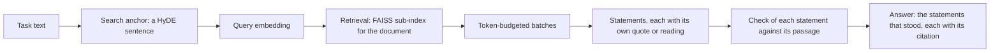

# Asking the corpus

## Purpose

`docpipe.inference` is the query side of the pipeline. Stages 1 through 6
(see [How the parts fit together](../pipeline.md)) build a corpus once,
offline, mostly on a GPU; this package answers a question against that
finished corpus, one turn at a time, with no GPU work. Its
entry point is `answer_question()` in `answer.py`: a caller hands it a
task, a document id, a set of scopes and a `Corpus` (see Data model),
and receives an answer, the citations it stands on, how many statements the
model made and how many of them stood, and follow-up bookkeeping.
`answer_question` is called directly from two places: the Streamlit app
documented on [the chat over the corpus](./app.md), and
`compare.compare_documents`, once per document, itself reached only from the
app. A document id of `None` asks the whole corpus. Nothing here imports a
UI toolkit.

A question answered here is not the same finding as a value the
extraction stage (see [Extraction](./extraction.md)) writes to its
harvest: extraction reads a document once, exhaustively, against a closed
spec and stamps what it verified, while this package grounds each
statement of one free-text answer in a quote checked against its passage at ask
time. A second answer
path exists once the extraction stage's `--serialize` step has written a
plan's numbers as a graph (see [The knowledge graph](./graph.md)):
`kg_route.answer_from_graph` reads that graph directly, with no
retrieval or free-text generation. A third path reads the harvest itself:
`values_route.answer_from_values` turns a question into a parameter and the
coordinates it names and shows the values the harvest holds for them, each
with its quote, page and trust level (see Method).

## Position in the pipeline

| | |
|---|---|
| **In** | The read-only corpus SQLite database and global FAISS index stage 6, chunking (see [Chunking, embedding, database](./chunking.md)), wrote; the source PDF; the profile's wording and prompts; and, where configured, the word index beside the database, a harvest
directory, the graph stage's Turtle file (see [The knowledge graph](./graph.md)) and a code-execution sandbox. |
| **Out** | A per-turn result dict, plus one appended row per turn in a request-log database apart from the corpus; the corpus is never written. |
| **Resumes on** | Nothing. There is no batch and, by design, no answer cache (see Failure modes). |
| **Needs** | A model endpoint (`LLM_PROVIDER`, `LLM_BASE_URL`; see [the provider layer](./providers.md)); a query embedder supplied through `Corpus.embed` (this package runs no embedding model); optionally `CODE_EXEC_URL` and a profile's knowledge-graph hooks. |

This package sits downstream of stage 6, the last stage to write under
`results/` (see [How the parts fit together](../pipeline.md)); it has no
stage after it in the batch chain, a terminal, on-demand read path.

One turn, start to finish:

## Method

### Building the query item and its search anchor

`answer_question` (`answer.py:154`) picks one of three modes: `image_only`
searches on an uploaded image alone, an image with text adds a
caption-style anchor, and text alone anchors on the plain task
(`answer.py:207-224`). The anchor, `llm_client.make_search_phrase`, is a
HyDE-style construction: a short hypothetical passage written as it
would appear in the corpus, not a question. Whatever non-empty phrase the
model writes is used as the anchor; the function falls back to the raw
task text only where its request stayed unreadable (see Reading a model's
reply) or the phrase came back empty, and it never raises
(`llm_client.py:472-509`). Either way the turn's faults say so. The same call
sets `recheck`, true only when the model marks the task a repetition and
history is non-empty (`llm_client.py:506`); when true, `answer_question` walks
history backward, folding every `(owner_kind, owner_id)` pair each turn
examined into one exclude set, stopping at the first non-recheck turn
(`answer.py:233-239`).

### Retrieval narrowed to one document

`faiss_store.retrieve` rebuilds a small in-memory `IndexFlatIP` from the
document's own candidate vectors (`build_subindex`,
`faiss_store.py:60-94`), reconstructed out of the one global FAISS index
stage 6 wrote; no per-document index exists on disk. A table's two
embeddings (`table_text`, `table_vl`) can both surface for one row;
dedup after the search keeps the higher-scoring one per
`(owner_kind, owner_id)` (`faiss_store.py:308-365`); results are capped
at `TOP_K`.

### Searching by word as well, and over the whole corpus

Retrieval is `hybrid.retrieve`. By meaning it is the document's own
sub-index as above or, when no document is named, a search of the global
index. By word it asks the word index (`lexical.py`) where there is one: an
FTS5 file beside the corpus database, `<name>.lexical.db`, built from it by
`docpipe lexical DB` and never written into it. A vector search is weak
exactly where a question is most specific, a name, an abbreviation, a number
or a place, and a word index is not. The two rankings are merged by
reciprocal rank: a passage's score is the sum of 1 / (60 + its rank) over the
searches that found it, because a cosine and a BM25 score share no scale.

The index notes a digest of the passages it was built from: the kind, id,
document, title and text of each. A database that has since changed makes it
stale, and a text rewritten in place does too, which a count of passages would
not see. A stale index is not asked, since a hit for a passage that no longer
exists would be worse than none (`docpipe lexical DB --check` says which it
is). The index is built beside the old one and put in its place whole; where
that fails, because a program such as the chat holds the old file open, the
build says so, removes what it built and leaves the old index as it was.
Without an index, or for a question that is an image, the result is the search
by meaning alone. `INFERENCE_LEXICAL=0` turns the word search off.

The words of a question are lowered and not case-folded: the index folds what
it stores itself and keeps a sharp s, which case-folding would write as "ss".
The word search asks for more than `top_k` passages (`OVERFETCH` times `top_k`,
and the passages already examined besides), because what an earlier turn read
and what an older version of a document says are taken out afterwards and
would otherwise use up the places. The search by meaning over the whole corpus
asks the global index for `OVERFETCH` times `top_k` vectors, since several of
them are one passage, held to `MAX_FETCH`; it asks again, four times as many up
to the same cap, only while fewer than `top_k` passages came out. The ids it
gets back are looked up in the database in parts of `LOOKUP`, under the number
of values a statement may carry.

Over the whole corpus only the current version of a document answers, so two
editions of one plan do not put two numbers for one place into one answer, and
every source says whose it is: the label the caller gives its document, or,
where there is none, the name of the document's file without its ending
(`_whose`).

### Packing sources into token-budgeted batches

The top `MAX_CHUNK_ATTEMPTS` hits are packed by `chunker.pack_chunks`
into batches under `ANSWER_CONTEXT_TOKENS` tokens each
(`chunker.py:100-122`), greedily, one oversized hit getting its own chunk
instead of truncation. Token counts come from the tokenizer
named by `LLM_TOKENIZER_ID`; a char/4 heuristic serves as an offline
fallback only, since German prose runs 3.0 to 3.5 characters per token,
denser than a flat divide by 4 assumes (`answer.py:265-268`).

### Answering across batches, with computation and image requests

For each batch, `llm_client.answer_from_sources` asks the model for statements
(`replies.answer`; see Reading a model's reply). A statement is one claim with
its own basis and its own evidence, and the reply says whether the task is
completely answered by what was said already and these excerpts. The batch is
told what stood its check in the batches before it, as `prior`: the text of
those statements and nothing else. It writes only new statements. What was
checked is carried forward as it was and the model never rewrites it; a
statement that was dropped is not in `prior` (`answer.py:292-293`,
`statements.texts`). Crops of up to `ANSWER_MAX_IMAGES` items go with the call,
so a chart value can be read, and `attached_images` says which of them made it
into the request. `code_exec.py` runs the calculation feature: when
`CODE_EXEC_URL` is set, `run_code` posts the model's Python plus the
context `answer._code_context` builds, `{"tables": [{"caption",
"markdown"}, ...]}`, one entry per table among the batch's sources
(`answer.py:80-95`); the sandbox service turns each key into a variable of
the code it runs (`docpipe/app/sandbox_service.py`), so the
`tables` the compute prompt names exists there, an empty list when the batch
has no table. It parses back `{"ok", "stdout", "stderr", "exit_code", "error"}`
(`code_exec.py:27-62`), never raising (see Failure modes). The runs of one call
are numbered from 1 in the text that is fed back to the model, so that a
statement about a calculated number can name the run that printed it
(`llm_client.py:568-584`). An image requester may separately return a crop the
section text only points at, through `db.request_item`. Both draw one shared
round budget, `CODE_EXEC_MAX_ROUNDS` plus `REQUEST_IMAGE_MAX`
(`llm_client.py:809`); a repeated crop id stops the loop and forces an answer
(`llm_client.py:839-843`), and the last call of the budget has to answer: its
schema requires `statements` and offers no action. The scan of batches ends when
a batch reports complete and at least one statement has stood in the turn so
far (`answer.py:343-344`); a batch that says complete before anything stood does
not stop it (`test_complete_with_nothing_shown_yet_does_not_stop_the_scan`).

### What backs a statement, and what is shown

Each statement is checked on its own against the passage it cites, after its
batch was answered (`statements.back`, called at `answer.py:331-335`). Nothing is
checked beyond these rules:

| basis | the statement carries | it is shown only if |
|---|---|---|
| `text` | an `index` (the excerpt) and a `quote` | the quote stands, whole, in the excerpt of that index and is at least 12 characters (`llm_client.grounded_quote`, `_quote_is_grounded`, `llm_client.py:244-255`) |
| `image` | an `index` of an attached crop, or the `block` of a crop the model asked for, and a `reading` | the crop was attached to this call, or is one the model asked for and got, and the reading is at least 8 characters, so background knowledge alone cannot count as evidence (`llm_client.visual_reading`, `llm_client.py:693-716`) |
| `computed` | an `index`, a `quote` of the inputs, and the `run` that printed the number | the quote stands in that excerpt, as for `text`, AND the run is one of this call that ended without an error; it is shown under its number in the turn (`statements.py:121-134`) |

A quote is matched without regard to case and white space, after one layer of
wrapping quotation marks is taken off, and against the excerpt it names only: a
quote that stands in another excerpt of the batch does not back this statement
(`test_a_quote_that_stands_in_another_shown_passage_does_not_back_this_statement`).
Whether a statement says what its quote says is reading, not a check. A crop
named by its block id is found with or without the brackets it was shown in.

A statement that does not stand is dropped, with one of five causes
(`statements.WHY`): `blank` (no text, a basis that is none of the three, or not
an object), `no_source` (the `index` is no integer, a digit written as text is
none, or it names an excerpt that is not in this batch), `quote`, `image` and
`run`. Every statement the model wrote is exactly one of shown and dropped, so
`statements_made` is `statements_shown` plus `statements_dropped`, and all three
count statements, not batches and not citations
(`test_every_drop_reason_is_reached_and_every_statement_is_one_or_the_other`).

What the reader is told is the count and nothing finer. The app puts one
sentence directly under the answer, "n of m statement(s) removed" in the
profile's words (`UI["statements_dropped"]`), also where every statement was
removed. The cause per dropped statement goes to the process log at info level
(`answer.py:339-341`) and nowhere else; the request log keeps the two counts
(see Data model). A dropped statement is in no text a model or a reader is given
afterwards: it is not in `prior`, not in `answer_text`, and so not in the
history of a follow-up and not in what a comparison reads.

### The citations, the focused read-off and the answer

The citations are made of the shown statements (`statements.citations_of`): one
per distinct source, quote and run, numbered from 1, and each statement is given
the number of its citation. The quote is part of the key, so two statements from
one table with two quotes are two citations, and a reader checking the first is
not sent to the second. A calculated statement is a citation of its own for each
run it names. A crop the model asked for is a citation only where a statement
stands on it; `requested` lists every crop that was delivered all the same.

Every visual citation is then re-read in a focused, single-image call,
`llm_client.read_off_image`, for up to `READOFF_MAX_CALLS` citations per turn: a
first pass often misreads a chart (`llm_client.py:641-683`,
`answer.py:357-369`). The sentence of the focused call is the statement: it
replaces the text and the quote of every statement that stands on the citation,
and the model's first wording of it is not shown
(`test_the_focused_reread_is_the_statement_and_the_citation`). A read-off that
cannot be made, because the crop cannot be read, its reply stayed unreadable or
its reading came back blank, leaves the reading the batch gave, and an
unreadable or blank reply is left in the faults.

`statements.assemble` writes the answer. One shown statement is a sentence
followed by its `[n]`; two or more are a list, one `- statement [n]` line each,
in the order they were made. A statement read off a picture has to say so: where
a visual statement does not carry the profile's `READOFF_MARKER` (compared
without regard to case), the profile's `READOFF_NOTE` is added once, under the
answer and under `answer_text`
(`test_the_readoff_note_is_added_once_when_a_visual_statement_lacks_the_marker`).
`answer_text` is the same statements without list marks and numbers: what the
history of a follow-up and a comparison are given.

A JSON answer is one more call, `llm_client.format_as_json`, over `answer_text`
(`llm_client.py:892-913`, `answer.py:410-426`). The shape the user's task
describes in prose is written by that call, which can add or leave out, and
nothing checks what it wrote statement by statement. The citations stand under
it without numbers: the JSON has no marks to refer to, so each citation loses its
`n`. Where the call cannot be made, because the provider takes schemas only and
the user's shape exists only as prose (`providers.enforces_schema`: a hosted
provider, or `LLM_SCHEMA=all`), `format_as_json` returns `None` and notes the
fault `json_format: not_asked`; where its reply stays unreadable it raises
`ReplyError`, which the turn catches, with the request `json_reply` in the
faults. In both cases the answer stays the checked prose, `as_json` is `False`
and the citations keep their numbers
(`test_where_the_json_cannot_be_made_the_prose_stays_and_says_why`). Every turn
is logged through `request_log.log_request` (`answer.py:447-452`).

### Reading a model's reply

Every request of the chat names the reply it asks for as a JSON schema
(`replies.py`: the search phrase, a closed question, the answer, the focused
read-off, the comparison) and sends it as the grammar of the request, its
`response_format`, on every provider (`providers.grammar`,
`llm_client._reply_format`, `llm_client.py:308-321`). `LLM_SCHEMA` has no say in
that. The one request with no schema, the JSON answer above, asks for a JSON
object and nothing more. Every request also carries `request_extras()`, the
reasoning fields every stage sends: `chat_template_kwargs` with `enable_thinking`
(`LLM_ENABLE_THINKING`, off by default) and `reasoning_effort`
(`LLM_REASONING_EFFORT`, `low` by default)
(`test_the_request_goes_out_with_its_grammar_and_the_extras_of_every_stage`).

The reply is read by `docpipe.reading` (`reading.read`), and read strictly: it
is exactly one JSON object and nothing else. No code fence and no `<think>`
block is stripped, no object is cut out of surrounding text, no bracket is
closed, and nothing is rescued from a reply that was cut off
(`test_nothing_is_repaired`). The key the request needs has to be in the object
and of the kind its schema gives it (`replies.needs` says which: `statements`, a
list, for the answer, or `action` where the model may ask for a calculation or a
crop instead; `answer` of a closed question; `phrase`; `reading`; `comparison`).
It has to be there also where its kind is any, as for the `answer` of a closed
question, so a reply without it is not read as "no answer" but asked again, and
ends as `ReplyError` with the cause `missing_key` where it stays missing
(`test_a_closed_question_answered_with_no_answer_is_asked_again_not_read_as_none`).
A reply that cannot be read is classified by its cause: `cut_off`,
`reasoning_only`, `empty`, `no_object`, `syntax`, `outside_text`,
`not_an_object` or `missing_key` (`reading.CAUSES`, the harvest's own causes in
its order, held against each other by
`test_the_chat_and_the_harvest_agree_on_the_cause`).

A reply that is not the object is asked again at once with its cause named
(`llm_client._chat_json`, `llm_client.py:355-403`): the same single user turn
with the profile's sentence for the cause appended, as one more text part where
the turn carries images, and no assistant turn echoed
(`test_the_correction_rides_along_with_the_images_of_the_request`). There is no
pause for this. A failure of the call itself, a server that does not answer or
refuses the request, starts over from the original turn after a pause of two
seconds times the attempt number, at most ten, and none after the last attempt.
`LLM_MAX_RETRIES` is the number of attempts one request gets, whichever of the
two costs one. When they are used up the request ends with a `ReplyError`, a
`RuntimeError` that carries the last cause, the name of the reply asked for and
the attempts (`llm_client.py:156-173`). The sentences said back are the
profile's `reading.PHRASES` (see The profile's wording contract), spoken through
the profile the chat answers in, and in English in all three shipped profiles,
`kwp` among them.

A reply cut off at its token limit, and not the object, is not asked again as it
stands: `_chat_json` stops at once and `llm_client._ask` decides
(`llm_client.py:269-305`). Where the request can be made smaller, which is the
batch of excerpts of `answer_from_sources`, it is halved and what the halves say
is joined, the second half's run numbers shifted past the first's, up to
`SPLIT_DEPTH` (3) times. A single excerpt, a batch already halved that often and
every request that is no batch are asked again once with twice the tokens
(`LLM_MAX_TOKENS` doubled). If that is cut off too, the request ends as a hole
with the cause `cut_off`. A cut that was answered, by the halves or by the room,
leaves nothing in the faults; one that was not leaves one fault for its request
(`test_a_cut_that_is_answered_leaves_no_fault_and_one_that_is_not_leaves_one`).

A request that stayed unreadable is a hole and never "nothing found":
`answer_from_sources` then returns no statements, `complete` false and the cause
as `fault`, and the turn does not count that batch's sources as examined (see
Data model). The turn keeps a record of every request that ended without a reply
it could read, `llm_client.collecting()` (`answer_question` opens one, and
`compare_documents` one for its comparison call): a list of `{"request",
"cause"}`, the request being the name of its reply (`answer_reply`,
`search_phrase_reply`, `choice_reply`, `readoff_reply`, `comparison_reply`,
`json_reply`) or `json_format`. So a caller that swallows the error of a request
still leaves a record: the search phrase falls back to the raw task, the
read-off keeps the reading the batch gave, the comparison comes back `None`. The
causes are `reading.HOLE_CAUSES` plus `not_asked` (`llm_client.FAULT_CAUSES`) and
`note_fault` refuses any other. A request that was read but came back blank is
noted `wrong_shape`: an empty search phrase, a read-off with a blank reading, a
blank comparison. A server that refuses a request is not told from one that does
not answer; both are `not_served`, so the chat never notes `refused` or `error`.

### The profile's wording contract

Every phrase and label the loop wraps around the model comes from the
active profile through `wording.py`. `phrases()` checks a profile's
`PHRASES` dict against `REQUIRED`, a frozenset of 30 keys
(`wording.py:33-44`). `llm_client.py` calls `phrases()` on first use
(`llm_client.py:106-108`), so this package imports with no active profile.
A lookup with none does not fail: `wording.chat_profile` is the one place
that falls back, to the built-in `default` profile, for the phrases, the
read-off pieces and, through `llm_client._prompt`, every prompt, and it logs one
warning per process that names the profile. A profile that is named is never
replaced. `prompts.load` and `require_profile` are untouched, so the stages
that write a corpus still stop without a profile and only the chat answers on
the built-in one.

The loop loads ten prompts, `llm_client.PROMPT_IDS` (`llm_client.py:66-79`), all
under `inference/`: `phrase`, `chunk_qa`, `image_phrase`, `answer_head`,
`answer_tail`, `json_format`, `compare`, `compute_hint`, `image_hint` and
`readoff`. The answer prompt is `answer_head` and `answer_tail`, with
`compute_hint` added where a sandbox is configured and `image_hint` where crop
requests are on. The prompts themselves state the shape of the reply: no
separate prompt splices an answer format into them, none corrects a reply, and
none revises an answer. The sentences that tell a model what was wrong with a
reply that was not the one object are not in `inference.PHRASES` either. They are
the profile's `reading.PHRASES`, the table of
`docpipe/reading.py` that refinement, the visuals stage and page transcription
use as well. `reading.REQUIRED` names its ten sentences (`shape_rule`,
`reasoning_only`, `empty`, `no_object`, `syntax`, `outside_text`,
`not_an_object`, `key_missing`, `key_not_a_list`, `key_not_text`), and a profile
lays its table over the one of the profile it extends, entry by entry
(`reading.phrases`, `profile.layers`). The three stages check the table before
their first request. The chat does not: it reads the table when a reply was not
the object it asked for, and a profile that lacks a sentence fails there with a
`LookupError` naming it.

### The knowledge-graph route

`kg_route.answer_from_graph` (see Purpose) is offered once the
extraction stage's `--serialize` step has written a plan's numbers as a
Turtle graph. `hooks(profile)` reads a profile's SPARQL query,
coordinate axes, loaded spec, plan-IRI lookup, value-binding builder,
and trust/reason wording, returning `None` where `kg.VALUE_QUERY` is
absent, so `scenarios` gets no route at all (`kg_route.py:95-122`).
`to_coordinates` asks one closed
question per axis over the spec's own vocabulary, through
`llm_client.choose` in the app (`llm_client.py:406-430`,
`docpipe/app/app.py:269-272`); an answer outside the vocabulary leaves the axis
unbound (`kg_route.py:174-216`), and the route proceeds only once a
coordinate lands on one of the `DECIDING_AXES`, quantity, scenario or
year (`kg_route.py:61`). It runs the profile's SPARQL and reads a
value's evidence and trust from the serializer's comment lines,
recovered from the raw Turtle text (`kg_route.py:148-171`); a value with
no trust comment withholds the whole answer (see Failure modes, and
[How much of a value the run can stand
behind](../contract/trust.md)). Every decline is one of five closed
tokens, `REASONS` (`kg_route.py:57`) (see Failure modes);
`answer_from_graph` returns only four, the fifth, `no_graph`, left to
the caller.

### Numbers from the harvest

`values_route.answer_from_values`, called by the app before the documents are
searched, needs no graph and no query of the profile: the harvest and the spec
are enough, so it works for every profile that has both, over one document or
all of them. The question is turned into a parameter and the coordinates it
names, one closed question each over the spec's own lists, asked with the same
`llm_client.choose` and the `kg/coordinate` prompt as the graph route. An
answer outside a list leaves that coordinate open, and an open coordinate
narrows nothing; a question that names no parameter is not one for this
route, and the caller searches the documents. What is shown is what
`docpipe/serve/values.py` holds for the values, as it holds them (see
[handing the values on](./serve.md)), limited only by the caller's worst
trust level and count.

### Comparing several documents

`compare.compare_documents` asks the same question of up to
`COMPARE_MAX_DOCUMENTS` documents (`config.py:57`); documents beyond the
cap are named in `dropped`, not silently left out (`compare.py:96-100`).
Each document keeps its own retrieval, its own statements and its own counts and
faults: a row is one `answer_question` result with its `document_id` and `label`.
Once at least two produced an answer, that is, kept at least one statement that
stood its check, `llm_client.compare_answers` compares the finished prose, given
only each label and its `answer_text`, so that a dropped statement cannot reach
it, and never a source passage (`compare.py:64-75`, `compare.py:110-117`). The
comparison call is not told why a row has no answer: it gets `None` for a row
whose replies could not be read as it does for one whose statements all failed.
The result's own `faults` holds the requests of that call that stayed unreadable.
A document that answered nothing keeps its row (see [What a coordinate's state
means](../contract/states.md)); the app says on that row whether its replies
could not be read or nothing stood (see [the app](./app.md)).

### Measuring the chat's search against a harvest

`scripts/chat_search_recall.py HARVEST_DIR [--profile P] [--db DB] [--index
INDEX] [--whole-corpus] [--documents N]` counts how often the chat's search puts
the passage a harvested value was read from, and the page it starts on, among
its hits, and answers nothing. The harvest's two checks already say that
passage carries the value, which is a target nobody has to judge. For each
accepted value the script puts the spec's label of the value's parameter, and
only that, to the chat's own search path: the search sentence the model writes,
its embedding and the hybrid search over the scopes the index holds
(`answer.search_hits`, taken out of `answer_question` so that the chat and the
script share one definition). It counts the passage and the page among the first
`MAX_CHUNK_ATTEMPTS` hits (10 by default) and among all the up to `TOP_K` (50),
split by how the harvest came to read the passage, as far as its trace says:
found by a search of its own (the plan listed it as a retrieval hit), found by
structure (the plan listed it so), not in the plan (no plan event of its
document lists it, for instance a passage the model asked for after the plan,
which a search found as well) and no plan in the trace. A search sentence equal
to the question means the model gave none and the chat's own fallback searched
with the question; that is counted and said. Values the measurement cannot
speak about are counted apart and named: a value with no address, one whose
parameter has left the spec, and one whose passage is not in the database under
its document. The database's ids are counters, so after a rebuild run
`python -m docpipe.extraction.identity` first or a value's passage is another
one. The script needs the model server and the embedder, opens the database and
index read-only and does not cache vectors, so it measures the embedder
configured now.

## Data model

`Corpus` (`answer.py:37-54`) is the bundle every turn works on, a
dataclass this package never builds:

| field | holds |
|---|---|
| `conn` | the read-only corpus connection, opened by `db.connect_readonly` |
| `index`, `id_to_pos` | the global FAISS index and its faiss_id-to-position map |
| `embed` | a callable, a query item to `(vector, came_from_cache)` |
| `resolve_image` | a callable, a stored image path to a readable path or `None` |
| `log_conn` | an optional connection to the request-log database |
| `lexical` | the connection to the word index beside the vectors, or `None`: the search is then by meaning alone |
| `document_label` | a callable, a document id to what a reader calls the document; asked only when the whole corpus is searched, where `_whose` falls back to the file's name |

`answer_question()` returns one dict per turn, every key fixed in the
function's own docstring (`answer.py:159-183`, the dict built at
`answer.py:195-200`):

| key | holds |
|---|---|
| `answer`, `answer_text` | the final answer and the prose kept for follow-up; both `None` when no statement stood. `answer` is one statement as a sentence, two or more as a list with `[n]` marks, or the JSON where the JSON step ran; `answer_text` is the same statements without list marks and numbers |
| `statements` | the statements that were shown, as dicts: `text`, `basis`, `index` (`None` for a crop the model asked for), `block`, `owner_kind`, `owner_id`, `quote`, `visual`, `computed`, `run` and `citation`, the number of its citation; empty where none stood |
| `statements_made`, `statements_shown`, `statements_dropped` | what the model wrote, what stood its check and what did not, counted in statements; made is shown plus dropped |
| `citations` | the accepted citation list, below |
| `n_findings` | the number of accepted citations, `len(citations)`: distinct sources, quotes and runs, not statements |
| `faults` | the requests of the turn that stayed unreadable, `[{"request", "cause"}]` (see Reading a model's reply); with no statement made and a fault on `answer_reply`, the sources were not read, which is not that nothing stood in them |
| `as_json` | the caller's request for a JSON answer, set back to `False` where the JSON step did not happen: the answer is then the prose, and `faults` holds the cause |
| `phrase`, `recheck`, `n_excluded` | the search anchor, whether this is a recheck, and how many prior sources it excluded |
| `n_hits`, `n_batches`, `examined` | retrieval and batching bookkeeping; `examined` feeds a later recheck's exclude set and holds only the sources of batches whose reply was read (and of crops the model asked for and got), so a re-check after an unreadable reply reads them again |
| `compute`, `requested` | the sandbox runs made (`{"code", "output"}`, numbered from 1 in the turn), and the block ids of delivered crop requests |
| `cache_hit` | whether the query embedding came from `query_cache` |

One citation carries `db.fetch_owner_content`'s fields (`db.py:207-287`)
plus what `answer.py` adds:

| field | holds |
|---|---|
| `owner_kind`, `owner_id` | `section`, `table` or `figure`, and that row's id |
| `title`, `text` | the resolved title and body; a section's placeholders are annotated with their caption, a table's or figure's body is unchanged |
| `page_number`, `image_path`, `section_number`, `section_title`, `document_id` | citation/scoping fields; `image_path` relative to `IMAGE_ROOT`, `None` for a section |
| `caption_stored`, `section_id`, `block_id` | table/figure owners only: the stored caption before title resolution, the section's id, and the block id (`db.py:273, 277-278`) |
| `quote`, `visual` | the accepted quote or reading, and whether it was read off an image or a crop the model asked for; added by `statements.citations_of` |
| `computed`, `run` | whether it backs a calculated value, and the number in the turn, from 1, of the run that printed it (else `None`) |
| `n` | the number the `[n]` marks of the answer refer to, from 1; a JSON answer has no marks and its citations have no `n` |

`kg_route.answer_from_graph` returns `{route, reason, values,
coordinates}` (`kg_route.py:272-305`): `route` is `"kg"` or `"rag"`,
`reason` one of `REASONS` or `None`, `values` one dict per matching row
with its `evidence` and `trust`.

Two more SQLite files stay apart from the corpus: `request_log.py`'s
`requests` (`request_log.py:33-50`, one row per turn: `plan_id`,
`query_text`, `mode`, `scopes`, `latency_ms`, `n_hits`, `n_citations`,
`n_statements`, `n_dropped`, `answer_hash`, `error_message`, `cache_hit`), and
`query_cache.py`'s
`query_cache` (`query_cache.py:24-30`: `query_key`, a sha256 of the embedding
model, the vector size, the query mode, text and image bytes, `vector`,
`created_at`; the model and the size default to the configured ones, read at
the call, so a vector of another model is never found for the same question
and entries written under the older key match nothing and are embedded
again). `plan_id` is
the document the question asked and is empty for a question to the whole
corpus. A log made when every question named a document refuses such a row, so
opening it brings it forward: the table is made again and every row is carried
over under its own id (`request_log.py:65-82`). `n_statements` is what the model
made in the turn and `n_dropped` how many of those did not stand their check,
both counted in statements. A row that did not count them, a turn that found no
hits and every row written before the columns existed, holds `NULL`, which says
"not counted" and not "none". A log made before the columns existed gets them
when it is opened (`request_log.py:85-92`, `ALTER TABLE ... ADD COLUMN`) and
keeps its rows; the oldest table gets both migrations in one open
(`test_the_oldest_table_gets_both_migrations_in_one_open`,
`test_a_log_made_before_the_statement_columns_gains_them_and_keeps_its_rows`).
What `error_message` holds is under Failure modes.

The logged `cache_hit` column is not the turn's own value: `_log` always
calls `request_log.log_request` with `cache_hit=False` (`answer.py:447-452`),
so a persisted row never reflects the returned dict's `cache_hit` key.

## Configuration

Every name is read once, at import, from `docpipe/inference/config.py`
unless "where" names another file: env vars and module constants only,
nothing tied to a host name or shared drive. The model's provider is one more
setting, `LLM_PROVIDER` (see [the provider layer](./providers.md)). The
settings of the app itself, the harvest, the decisions file and
`INFERENCE_LEXICAL`, are on [the app page](./app.md); `docpipe config --stage
chat` lists them all.

| name | kind | default | effect | where |
|---|---|---|---|---|
| `LLM_BASE_URL`, `LLM_MODEL` | env vars | `http://localhost:8000/v1`; `Qwen/Qwen3.5-122B-A10B-FP8` | the endpoint every call reaches; the model name per completion | `config.py:19-20` |
| `LLM_API_KEY`, `LLM_TIMEOUT` | env vars | `EMPTY`, `180` s | bearer key and client HTTP timeout | `config.py:21-22` |
| `LLM_TEMPERATURE`, `LLM_MAX_TOKENS` | env vars | `0.1`, `2048` | sampling temperature and `max_tokens` per completion; a request that cannot be split and was cut off at the limit is asked once more with twice the tokens | `config.py:23-24` |
| `LLM_TOKENIZER_ID` | env var | equal to `LLM_MODEL` | tokenizer for token-budget accounting | `config.py:27` |
| `LLM_MAX_RETRIES`, `LLM_STUB_MODE` | env vars | `4`, off | attempts per request after an unreadable reply (asked again with its cause) or a transport error; canned replies with no endpoint call | `config.py:31, 33` |
| `LLM_ENABLE_THINKING`, `LLM_REASONING_EFFORT` | env vars | off, `low` | the reasoning fields every request carries as `extra_body`, as in every stage; read at the call | `llm_preflight.py:105-123` |
| `LLM_SCHEMA` | env var | `auto` | no say over the grammar of the chat's requests, which is always sent; with `all`, as with a hosted provider, the user's own JSON shape is not asked for | `providers/__init__.py:68-72` |
| `SPLIT_DEPTH` | module constant | `3` | how often a batch of excerpts whose reply was cut off is halved | `llm_client.py:55` |
| `SCOPE_*` (6), `SCOPE_TO_EMBEDDING_TYPES`, `ALL_SCOPES`, `VISUAL_SCOPES` | module constants | 6 fixed strings, e.g. `"Body text"` | the `scopes` vocabulary, its embedding-type map, and the visual-only subset `scopes_are_visual` (`answer.py:68-70`) checks | `config.py:74-100` |
| `TOP_K`, `MAX_CHUNK_ATTEMPTS` | env vars | `50`, `10` | candidates kept per retrieval; sources examined per turn | `config.py:38, 40` |
| `ANSWER_CONTEXT_TOKENS`, `ANSWER_MAX_IMAGES` | env vars | `10000`, `4` | token budget per answer batch; crops attached to one answer call | `config.py:43, 46` |
| `ANSWER_IMAGE_MAX_SIDE`, `READOFF_IMAGE_MAX_SIDE` | env vars | `1280`, `1600` | crop downscale side, answer call and read-off | `config.py:47, 60` |
| `REQUEST_IMAGE_MAX`, `READOFF_MAX_CALLS` | env vars | `2` (`0` off), `3` | crop requests per batch; focused re-reads of an image value | `config.py:53, 59` |
| `COMPARE_MAX_DOCUMENTS` | env var | `5` | documents one comparison may ask | `config.py:57` |
| `CODE_EXEC_URL` | env var | empty | sandbox address; empty means off | `config.py:65` |
| `CODE_EXEC_TOKEN`, `CODE_EXEC_TIMEOUT` | env vars | empty (or `KWP_SANDBOX_TOKEN`), `45` s | bearer token and HTTP timeout for the sandbox | `config.py:66-67` |
| `CODE_EXEC_MAX_ROUNDS` | env var | `2` | sandbox runs per batch, shared with `REQUEST_IMAGE_MAX` | `config.py:69` |
| `COORDINATE_PROMPT_ID`, `DECIDING_AXES` | module constants | `"kg/coordinate"`, (quantity, scenario, year) | the axis-question prompt id and the axes that gate the graph route | `kg_route.py:45, 61` |
| `MIN_SCORE`, `MAX_LINES` | module constants | `55.0`, `10` | fuzzy-match floor and highlight-rectangle cap for a located quote | `pdf_locate.py:27-28` |

## Failure modes

An empty hit list is logged as "No hits" and `answer` returns `None`
before the answer is asked for (`answer.py:257-260`). Where hits exist and no
statement stood, `answer` comes back `None` too, and three different things end
a turn there, told apart in the request log's `error_message` and to the reader
(`answer.py:382-403`):

- `No statement backed (n of m statements dropped)`: statements were made and
  none stood its check. The app says that nothing backs an answer.
- `Reply unreadable: n request(s): request: cause`: no statement was made and an
  answer request stayed unreadable, so the sources were not looked at. The app
  says that the model's replies could not be read, with the causes, and does not
  say that nothing is in the sources.
- `No statement made`: the model's replies were read and held no statement. That
  is an honest miss and no fault; the app says that nothing backs an answer.

The requests that stayed unreadable besides, and all of them where an answer
exists, follow as `; n request(s) unreadable: request: cause, ...`, a kind
counted with `xN` where it happened `N` times. An unreadable batch beside
dropped statements stays in that line
(`test_an_unread_batch_beside_dropped_statements_stays_in_the_log`,
`test_unreadable_answer_is_not_nothing_found`). An unknown or missing crop id
comes back `None` and is logged (`answer.py:98-126`); a repeated id stops the
loop and forces an answer (`llm_client.py:839-843`).

`pdf_locate._have_deps()` checks once for PyMuPDF and rapidfuzz and logs
an error (`log.error`) if either is missing; when it fails, quote
location is off for the whole run and every citation loses its
highlight rectangles (`pdf_locate.py:41-64`); the chat's page expander then
says the quote was not located, as it does for a quote that is not on the
page. Every call into PyMuPDF (`page_words` and the app's own draw and
phrase lookups) holds `pdf_locate.MUPDF_LOCK`, because the chat runs each
session on its own thread and the library is not thread-safe.

Inside `llm_client._chat_json`, a reply that is not the one JSON object and a
failed call are each tried again, up to `LLM_MAX_RETRIES` attempts in all: the
first at once with its cause named, the second after a pause of at most 10
seconds, before it raises `ReplyError` with the cause (`llm_client.py:355-403`;
see Reading a model's reply). Callers above it degrade instead:
`make_search_phrase` falls back to the raw task, `read_off_image` keeps the
reading the batch gave, `compare_answers` comes back `None`, and
`answer_from_sources` comes back with no statements and the cause as `fault`; the
request is left in the turn's `faults`, which the app shows under the answer.
`format_as_json` raises `ReplyError` past its own function and
`answer.py` catches it, so the answer stays the prose (`llm_client.py:892-913`,
`answer.py:410-426`). `choose`, the closed question of the values and graph
routes, has no wrapper and lets `ReplyError` through to its caller
(`llm_client.py:406-430`). A cut-off reply is not one of these: it is split or
given room first (see Reading a model's reply). `code_exec.run_code`
degrades without raising: any transport or JSON failure comes back
`{"ok": False, "error": ...}`, read as no calculation, not a failed turn
(`code_exec.py:27-62`).

`kg_route` fails closed on missing trust, withholding the whole answer
with reason `no_trust` (`kg_route.py:298-303`). A profile that leaves a
`REASONS` token unworded, or words an extra one, raises `LookupError`
when the route is built (`kg_route.py:80-92`); a Turtle fragment with no
`@prefix` line is refused outright (`kg_route.py:139-141`).

The wording contract fails the same way: a profile whose `PHRASES` dict
is missing a required key raises `LookupError` at the first check
(`wording.py:141-143`). No active profile is not one of its failures:
`wording._component` (`wording.py:119-120`) asks `chat_profile`, which falls
back to the built-in profile and says so in the log. `llm_client.py` resolves
its own phrases on first use (`llm_client.py:106-108`), so a profile that lacks a
phrase surfaces at the first lookup of a turn and not as an import error. The
profile's `reading.PHRASES` is looked up only when a reply was not the object
asked for: a profile that lacks one of its ten sentences raises `LookupError`
naming it there (`docpipe/reading.py:87-105`).

Answers are deliberately not cached: a follow-up is context-dependent,
and a cache keyed on the question text alone would misfit a later
conversation (`request_log.py:9-11`). The only cache in the path is the
query embedding, reported in `cache_hit` but never used to skip
retrieval or the LLM call.

## Measured behaviour

Reconstructing a document's candidate vectors as one batched call rather
than one `reconstruct()` per vector matters at scale: a plan carries
about 470 candidate vectors, and the batched call measured 0.421 to
0.277 seconds over 50 repetitions, 8.4 milliseconds per document instead
of 5.5 (`faiss_store.py:76-81`).

The grounding gate's floor of 12 characters (`llm_client.py:244-255`) and
the image-reading floor of 8 characters (`llm_client.py:693-716`) are
sized the same way, long enough to reject a short stray word standing
in for evidence; the code names "GmbH" as the concrete case the
12-character floor rejects.

`pdf_locate`'s match floor, `MIN_SCORE = 55.0` (`pdf_locate.py:27`), is a
`rapidfuzz.fuzz.partial_ratio_alignment` score, not a percentage of the
page: the corpus text is never byte-identical to what PyMuPDF reads off
the page, and the floor is tuned to survive that drift, not to demand
an exact match.

## Verification

The turn's core contract:
`test_no_hits_returns_an_empty_answer`,
`test_grounded_answer_carries_its_citation`,
`test_an_ungrounded_answer_is_refused`,
`test_visual_scopes_ask_for_a_caption_style_anchor`,
`test_progress_is_optional_and_silent_by_default`
(`tests/test_answer_core.py`).

The recheck exclusion chain: `test_recheck_excludes_what_earlier_turns_read`
(`tests/test_answer_core.py`);
`test_batched_retrieval_matches_probe_by_probe`,
`test_batched_retrieval_honours_a_prior_exclusion`,
`test_no_probes_and_no_candidates_are_both_empty`
(`tests/test_faiss_retrieve_many.py`).

The sandbox context: `test_the_tables_the_compute_prompt_promises_reach_the_sandbox`
(`tests/test_answer_core.py`).

Crop requests:
`test_the_model_can_ask_for_a_crop_and_gets_it`,
`test_an_unavailable_crop_still_lets_the_model_answer`,
`test_asking_twice_for_the_same_crop_stops_the_loop`,
`test_the_action_is_not_offered_when_it_is_switched_off`
(`tests/test_image_request.py`).

Comparing documents:
`test_every_selected_document_gets_its_own_row_and_its_own_retrieval`,
`test_a_document_that_answered_nothing_keeps_its_row`,
`test_the_comparison_call_never_sees_a_source_passage`,
`test_one_answer_is_not_a_comparison`,
`test_more_documents_than_the_budget_are_named_not_dropped_quietly`,
`test_a_follow_up_searches_past_what_that_document_showed`
(`tests/test_answer_core.py`).

The picker's filters and its fallback:
`test_current_documents_only_unless_asked`,
`test_a_document_covering_several_values_matches_any_of_them`,
`test_without_a_profile_the_generic_catalog_is_used`
(`tests/test_catalog.py`).

The word index and the merged search: `test_two_rankings_are_merged_by_reciprocal_rank`,
`test_an_index_of_another_state_of_the_database_is_not_asked`,
`test_over_the_whole_corpus_only_current_documents_answer`,
`test_without_a_word_index_the_result_is_the_search_by_meaning`
(`tests/test_hybrid_search.py`). The values route:
`test_a_coordinate_the_question_does_not_name_narrows_nothing`,
`test_an_answer_outside_the_list_is_no_answer`,
`test_no_harvest_no_route_and_no_question_asked`
(`tests/test_values_route.py`).

The wording contract: `test_a_profile_that_answers_provides_all_of_it`
(`tests/test_wording.py`); the reading table of every profile:
`test_every_profile_says_every_sentence_with_the_same_names`
(`tests/test_reading_wording.py`). The search anchor is the sentence the model
wrote: `test_the_search_phrase_is_the_sentence_the_model_wrote`
(`tests/test_inference_app.py`).

The statements and what backs them (`tests/test_chat_statements.py`):
`test_one_fabricated_quote_removes_exactly_its_statement`,
`test_a_short_real_substring_is_no_quote`,
`test_a_read_off_is_backed_only_by_a_crop_that_was_attached`,
`test_a_crop_that_was_asked_for_and_never_arrived_backs_no_statement`,
`test_a_computed_statement_needs_a_run_that_ran_and_a_quote_of_its_inputs`.
Each is a case that breaks the promise by construction: a fabricated quote, a
substring too short to be a place, a crop that was never attached, a crop that
never arrived, a run that ended in an error. Beside them:
`test_a_computed_statement_is_shown_under_the_run_of_the_turn`,
`test_a_later_batch_gets_only_the_checked_statements_as_prior`,
`test_a_batch_whose_reply_could_not_be_read_was_not_examined`,
`test_citations_are_numbered_in_order_and_one_per_source_quote_and_run`,
`test_json_answer_is_shaped_from_checked_text_only`,
`test_a_provider_that_takes_schemas_only_is_not_asked_for_the_users_json`,
`test_compare_sees_only_checked_answers`,
`test_a_cut_off_batch_is_halved_and_what_the_halves_say_is_joined` and
`test_a_single_excerpt_gets_more_room_once_and_then_is_a_hole`.

The reading of a reply and the faults (`tests/test_chat_reply.py`):
`test_a_reply_that_is_not_the_object_is_asked_again_naming_the_cause`,
`test_nothing_is_repaired`,
`test_a_request_that_stays_unreadable_raises_with_its_cause_and_counts_attempts`,
`test_a_server_that_does_not_answer_is_retried_after_a_pause`,
`test_a_cut_off_reply_is_not_asked_again_as_it_stands`,
`test_a_unit_that_cannot_be_split_gets_twice_the_room_once`,
`test_unreadable_answer_is_not_nothing_found` and
`test_an_honest_miss_is_not_a_fault`.

The request log: `test_a_turn_logs_how_many_statements_it_made_and_how_many_were_dropped`,
`test_a_new_log_has_the_columns_from_the_start`
(`tests/test_request_log.py`).

The graph route:
`test_the_query_names_only_predicates_the_serializer_writes`,
`test_the_trust_line_is_not_in_the_graph_and_is_recovered_from_the_text`,
`test_a_value_without_a_trust_line_falls_back_instead_of_rendering`,
`test_the_answer_space_is_the_specs_own_list`,
`test_a_synonym_resolves_through_the_axis_not_by_string_match`,
`test_unstated_leaves_the_axis_unbound`,
`test_an_out_class_is_never_bound_as_a_coordinate`,
`test_every_reason_the_route_gives_is_reached`,
`test_every_fallback_reason_has_a_sentence`,
`test_a_fragment_without_its_prefix_header_is_refused_on_load`
(`tests/test_kg_route.py`).

## Modules

`__init__.py` re-exports `Corpus` and `answer_question`, the package's
only public surface, and loads them on first use and not when the package is
imported: a command that builds the word index or reads harvested values has
no use for the answer loop and the libraries it brings. `answer.py` holds
both, the turn's entry point and the dataclass every step reads. `answer_question` is called directly by
`docpipe/app/app.py` and by `compare.py`'s
`compare_documents`, itself reached only from the app.

`catalog.py` holds the generic `Catalog` class, `load_catalog`,
`facet_options` and `apply_filters`. `profiles/kwp/catalog.py` and
`profiles/scenarios/catalog.py` each extend `Catalog` with their own
facets; the app calls `load_catalog` to pick between them. The words the
generic label needs, the tag after a document's name (`version_current`,
`version_old`) and the noun for a document where a profile names none
(`document_noun_fallback`), are not in the module: it reads them from the
`inference.UI` table of the profile it is given, through `wording.ui`, so the
built-in profile says `(current)` and `(old)` and `kwp` `(aktuell)` and `(alt)`.

`chunker.py` holds `pack_chunks`, the token-budgeted batching,
`citation_label`, the source label the answer text and model's excerpt
prompt use, and `get_tokenizer`, the real tokenizer `pack_chunks`
prefers over the char-count heuristic. `answer.py` calls all three; the
app also calls `citation_label` directly.

`llm_client.py` holds every call to the LLM endpoint: `make_search_phrase`,
`answer_from_sources`, the grounding checks `grounded_quote` and
`visual_reading`, `read_off_image`, `format_as_json`, `compare_answers`, and
`choose`. It holds the way a reply is asked for and read as well: `_chat_json`
and `_ask`, `ReplyError`, and the record of unreadable requests, `collecting`,
`note_fault` and `describe_faults` (see Method). `answer.py` calls all of it
except `compare_answers` and `choose`; `compare.py` calls `compare_answers` and
opens its own `collecting`, and the app calls `choose` and `describe_faults`
directly.

`statements.py` holds what a model's statements go through between the model and
the reader: `back`, the check of each statement against its passage, `texts`,
the checked statements as `prior` for the next batch, `blocks_named`,
`citations_of` and `assemble`, which make the citations and the answer from the
statements that stood, and `WHY`, the five causes of a drop. It asks no model and
reads no file. Called by `answer.py` only.

`faiss_store.py` holds `load_global_index`, `retrieve` and
`build_subindex`, the only code touching the global FAISS index. The app
calls `load_global_index` at startup; `answer.py` calls `retrieve`, and
so does the extraction stage's `runner.py`.

`db.py` holds the SQL: `connect_readonly`, `available_scopes` (the search
scopes whose embedding types the `Embeddings` table holds, in the order of
`ALL_SCOPES`), `index_model_notice` (the profile's sentence when the database
records another embedding model than the one that embeds the queries, else
`None`), the candidate-vector query
`faiss_store.py` reconstructs from, `fetch_owner_content` and
`request_item`. Called by `faiss_store.py`, `answer.py`, the app, and
the extraction stage's `runner.py` (as `inference_db`).

`wording.py` holds `REQUIRED`, `phrases` and `readoff`, the profile's
phrase contract described in Method and Failure modes, and `chat_profile`, `ui`
and `UI_REQUIRED` for the profile the chat answers in and the words of its pages.
Called by `answer.py`, `chunker.py` and, on first use, `llm_client.py`.

`code_exec.py` holds `is_enabled` and `run_code`, the sandbox client.
Called by `answer.py` and, for the same feature, `runner.py`.

`compare.py` holds `compare_documents` and `summary`, the multi-document
path. Called only by the app.

`kg_route.py` holds `hooks`, `answer_from_graph`, `load_graph`,
`by_axis`, `trust_level` and `REASONS`, the graph-route contract
described in Method. Called only by the app.

`hybrid.py` holds `retrieve`, the one ranking out of the search by meaning
and the search by word, over one document or all; `answer.py` calls it.
`lexical.py` builds and asks the word index (`docpipe lexical`), called by
`hybrid.py` and the app. `values_route.py` answers a question for a number
from the harvest, called only by the app. `replies.py` holds the reply schema of
every chat request, which is sent as the grammar of that request, and `needs`,
which says from the schema which key the reader requires of a reply.

`request_log.py` holds the `requests` table, its two migrations and
`log_request`. `log_request` is called by `answer.py`'s `_log` helper; the app
opens the log with `connect`.

`query_cache.py` holds the `query_cache` table, `get`, `put` and
`make_key`, whose keyword-only `model` and `dim` default to the configured
embedding model and vector size. Called by the app and, for the same lookup,
`runner.py`.

`pdf_locate.py` holds `_have_deps`, `quote_rects`, `page_words` and
`rects_from_words`, the quote-to-rectangle match described in Failure
modes. Called by `docpipe/app/pdf_link.py` and the extraction
stage's `runner.py`.

`config.py` holds every name in the Configuration table above, read once
at import by every module in the package;
`docpipe/app/config.py` re-exports the names the app reads.

## Module reference

The docstring of each module of this stage, verbatim from the code and generated by `scripts/build_docs.py`. The chapter above is the account; this is the reference. Edit the docstring, not this page.

<code>docpipe/inference/__init__.py</code>

__init__.py: Retrieval and grounded answering, usable from a UI or
from a batch job.

`Corpus` and `answer_question` are loaded when they are first asked for and
not when the package is. A command that builds the word index (`lexical.py`)
or reads harvested values has no use for the answer loop and the libraries
it brings, and a module run as a command must not have been imported by its
own package before it runs.

<code>docpipe/inference/answer.py</code>

answer.py: Runs one retrieval and answer turn, with no user interface
attached.

The chat app and the batch runner ask the same question of the same
corpus. Only what they do with the progress and the result differs,
so everything the turn needs from outside is passed in: the open
corpus, how to embed a query, where an image lives, and an optional
progress reporter.

Author: Felix Vossel

<code>docpipe/inference/catalog.py</code>

catalog.py: Presents a corpus for selection.

Retrieval only ever needs a document id. Everything around that id,
what a document is called in the picker, which filters make sense
over the corpus, what to show about the selected one, is project
knowledge. The core supplies a plain default over the `Documents`
table; a profile replaces it with its own
(`profiles/<name>/catalog.py: CATALOG`) and fills the facets it
declared.

Author: Felix Vossel

<code>docpipe/inference/faiss_store.py</code>

faiss_store.py: Loads the global index and runs scoped retrieval
against an ephemeral sub-index.

The corpus is one global FAISS `IndexIDMap(IndexFlatIP)`. A search is
scoped to a document and a set of embedding types by reconstructing
only the candidate vectors into a small in-memory `IndexFlatIP` and
searching that.

Author: Felix Vossel

<code>docpipe/inference/pdf_locate.py</code>

pdf_locate.py: Locates where a quote sits on the page of the source
PDF.

One implementation serves two callers: the app highlights the
passage it shows, and the extraction stage records the same
rectangles as the provenance of a value. A second implementation
would give two answers to where a value comes from, the one question
the whole evidence chain exists to answer.

The match is fuzzy on purpose. The corpus text has passed through
extraction and refinement, so it is never byte-identical to what
PyMuPDF reads off the page: ligatures, hyphenation, running heads and
column order all differ. Alignment finds the passage anyway; the
score floor keeps it from pointing at something else.

Author: Felix Vossel

<code>docpipe/inference/code_exec.py</code>

code_exec.py: Client for the sandboxed code execution service.

The module posts LLM-written Python to `sandbox_service.py` at the
address `CODE_EXEC_URL` names. It never raises: a sandbox outage
degrades to no calculation rather than breaking a query. The feature
stays off unless `CODE_EXEC_URL` is set, which `is_enabled()` reports.

<code>docpipe/inference/kg_route.py</code>

kg_route.py: Answers a question from the graph the harvest wrote,
before the documents are searched.

`--serialize` turns a plan's harvested numbers into Turtle: one value
node per coordinate tuple (the part of the plan it hangs under, the
quantity class, the carrier, the sector, the year, the aggregation),
with the trust line and the evidence the serializer wrote as comments
above each node. A question that names those coordinates has an
answer in that graph, one no retrieval has to find and no model has
to read off a page: the number, its unit, and how far the run stands
behind it.

The route does not guess. Every coordinate is one closed question
over the spec's own list (one request per field, the harvest's own
rule); an answer outside the list leaves the axis unbound, and an
unbound axis adds no constraint. A value with no trust line is not
shown with a blank badge: the route states why it did not answer,
and the caller falls back to the documents.

Which graph, which query and which axes are the profile's own.
`Hooks` carries them the way `answer.Corpus` carries the corpus, and
this module imports neither `profiles` nor `streamlit`. rdflib is
imported inside the functions that need it, the convention
`docpipe/ontology.py` states: the batch path never touches this
module, and the check that does can run without it.

Author: Felix Vossel

<code>docpipe/inference/hybrid.py</code>

hybrid.py: One ranking out of two searches, over one document or all.

The chat used to search one document by meaning. Two things were missing:
a search over the whole corpus, and a search by word for the questions a
vector is weak at (`lexical.py` says why). This module is both.

    by meaning   the query vector against the passages' vectors: the
                 document's own sub-index as before, or the global index
                 when no document is named
    by word      the question's words against the word index, where there
                 is one

and the two rankings merged by reciprocal rank: a passage's score is the
sum of 1 / (60 + its rank) over the searches that found it. Ranks, not
scores, because a cosine and a BM25 number share no scale; 60 is the
constant of the method's paper and nothing here was tuned on it.

Without a word index, or for a question that is an image, the result is
the search by meaning alone, in its order and with its scores: what the
chat did before.

Over the whole corpus only the current version of a document answers. An
older version of the same plan would otherwise put two numbers for one
place into one answer.

Author: Felix Vossel

<code>docpipe/inference/lexical.py</code>

lexical.py: A word index over the corpus, beside the vector index.

The vector search finds a passage by what it means. It is weak exactly
where a question is most specific: a name, an abbreviation, a number, a
place. "Stadtwerke Marburg" and "Stadtwerke Kassel" are neighbours in the
embedding space and different words on the page, and a search over a whole
corpus that cannot tell them apart answers from the wrong document. A word
index can, so the chat asks both and merges the two rankings
(`hybrid.py`).

The index is a file of its own beside the corpus database
(`<name>.lexical.db`), built from it and never written into it: the corpus
database stays what the chunk stage made, and the chat keeps opening it
read-only.

    docpipe lexical DB          build it, or build it again
    docpipe lexical DB --check  say whether it is there and current

It holds one row per section, table and figure with its title and text
(SQLite FTS5). It notes a digest of the passages it was built from; a
database whose passages have since changed makes it stale, and a stale
index is not asked: a hit for a passage that no longer exists, or for a
word it no longer has, would be worse than none.

Author: Felix Vossel

<code>docpipe/inference/values_route.py</code>

values_route.py: Answers a question for a number from the harvest, before
the documents are searched.

A question like "how much gas in 2030?" names a parameter and some of its
coordinates. The harvest has read exactly those out of the documents, each
with its quote, its page and a trust level. So the number is not looked for
a second time and not written by a model: the question is turned into the
parameter and the coordinates it names, and the values the harvest holds
for them are shown as they are (`docpipe/serve/values.py`).

The route does not guess. Which parameter and which coordinates the
question names is one closed question each over the spec's own lists (the
harvest's rule: one request per field, chosen from the list). An answer
outside the list leaves the coordinate open, and an open coordinate narrows
nothing. A question that names no parameter is not one for this route, and
the caller searches the documents as before.

Unlike `kg_route` this needs no graph and no query of the profile's: the
harvest and the spec are enough, so it works for every profile that has
both, across one document or all of them.

Author: Felix Vossel

<code>docpipe/inference/wording.py</code>

wording.py: What the answer loop says around the prompts.

The prompts belong to the profile; so does everything the loop wraps around
them: the heading over the user's task, the labels inside the history block,
the sentence that tells the model to answer NOW. The core assembles those
pieces and does not write them: it cannot know whether the reader is holding a
German heat plan or an English scenario study.

A profile contributes them in `profiles/<name>/inference.py`. A profile that
extends another one writes only the pieces it words differently: its PHRASES
are laid over those of the profile it extends.

The words of the app's pages come the same way and from the same file: the
profile's `UI` table, which a person reads where a model reads PHRASES. That
includes the picker's labels, the tag after a document's name and the noun
for one. Both tables are checked for the entries the core asks for
(`REQUIRED`, `UI_REQUIRED`).

Author: Felix Vossel

<code>docpipe/inference/replies.py</code>

replies.py: The reply each chat request asks for, as a JSON schema.

Every chat request names its reply as the grammar of the request (see
`docpipe.providers.grammar`). The prompts state the same shapes in words;
nothing here is a check, and what a reply says is verified afterwards.

The answer is a list of statements. Each one carries its own evidence, so
that each can be checked against the passage it cites on its own: a text
statement a `quote` and the `index` of its excerpt, a statement read off a
picture the `reading` and the `index` of the crop that was attached (or the
`block` of a crop the model asked for), a statement about a calculated value
the `run` that printed it and a `quote` of its inputs. There is no prose
answer beside them: what the reader is shown is made of the statements that
stood the check.

One request has no schema: the answer reformatted into a JSON shape the user
wrote into the task. That shape is the user's and only exists as prose.

Author: Felix Vossel

<code>docpipe/inference/statements.py</code>

statements.py: Which of the statements a model made the reader is shown.

The answer of the chat is a list of statements, each with its own evidence
(`replies.answer`). A statement is shown only if its evidence stands, and the
reader is told how many were not (`back`). What a statement has to show is
the existing rule and nothing beyond it:

  text      its quote stands in the excerpt it cites, whole, and is at least
            as long as a quote has to be (`llm_client.grounded_quote`)
  image     the crop it reads off was attached to this call, or is one the
            model asked for and got, and it names what it read
            (`llm_client.visual_reading`)
  computed  its quote stands in the excerpt that holds the inputs AND the run
            it names is a run of this call that ran without an error

Whether a statement says what its quote says is reading, not a check (the
harvest's second half has no counterpart here). Nothing in this module asks
a model anything or reads a file.

Statements are carried forward as checked and never rewritten: what a later
batch is shown of the earlier ones is `texts`, and what it adds is appended.

Author: Felix Vossel

<code>docpipe/inference/request_log.py</code>

request_log.py: Request logging in a separate SQLite file.

One line per chat turn: which document was asked (none for a question to
the whole corpus), the question, the scopes, how long it took and how many
passages, citations and statements it had (`n_statements` is what the model
wrote, `n_dropped` how many of those did not stand their check).

Answers are deliberately NOT cached: follow-up queries ("schau noch einmal
nach") are context-dependent, and a cache keyed on the query text alone serves
an answer from a different conversation.

Author: Felix Vossel

<code>scripts/chat_search_recall.py</code>

chat_search_recall.py - How often the chat's search puts the passage and the
page a harvested value was read from among its hits.

The harvest read every accepted value from one passage, and its two checks
(the quote stands in a shown passage, the answer stands in the quote) already
say that passage carries the value. That is a target nobody has to judge. For
each accepted value this script puts the spec's question for the value's
parameter, the parameter's label, to the chat's own search path: the search
sentence the model writes, its embedding, and the hybrid search over the
scopes the index holds. It then counts whether the value's passage, and the
page that passage starts on, are among the first hits the chat reads and
among all the hits it retrieves.

    python scripts/chat_search_recall.py data/extraction/corpus --profile kwp
    python scripts/chat_search_recall.py <harvest dir> --db <db> --index <index>
    python scripts/chat_search_recall.py <harvest dir> --whole-corpus

The counts are split by how the harvest came to read the passage, as far as
its trace says: found by a search of its own (the plan listed the passage as a
retrieval hit), or by the document's structure (the plan listed it so and not
as a hit). A passage the harvest found by search is one a search is likely to
find again, so that row reads better than the other and the two are not one
number. Two more rows hold what the trace does not say: a passage that no plan
event of its document lists (read after the plan, for instance from a search
the model asked for, so not a finding by structure either) and a document
without a plan in the trace.

It stops after the search. No passage is read, no answer is written, nothing
judges a number, and so nothing here says whether the chat answers right. A
passage is named by the database's own ids, which are counters: a database
built again since the harvest needs `python -m docpipe.extraction.identity`
first, or a value's passage is another one. A value whose passage is not in the
database under its document is counted and left out. Where the search sentence
is the question itself, the model did not answer and the chat's own fallback
searched with the question: that is counted and said, not hidden.

Needs the model server and the embedder, and reads the corpus database and
index read-only. The vectors are not cached, so a run measures the embedder
that is configured now.

Author: Felix Vossel

[Back to the index](../README.md)
