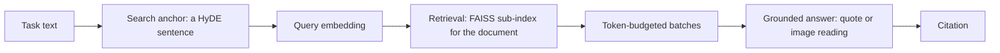

# Asking the corpus

## Purpose

`docpipe.inference` is the query side of the pipeline. Stages 1 through 6
(see [How the parts fit together](../pipeline.md)) build a corpus once,
offline, mostly on a GPU; this package answers a question against that
finished corpus, one turn at a time, with no GPU work. Its
entry point is `answer_question()` in `answer.py`: a caller hands it a
task, a document id, a set of scopes and a `Corpus` (see Data model),
and receives an answer, its citations, and follow-up bookkeeping.
`answer_question` is called directly from two places: the Streamlit app
documented on [the chat over the corpus](./app.md), and
`compare.compare_documents`, once per document, itself reached only from the
app. A document id of `None` asks the whole corpus. Nothing here imports a
UI toolkit.

A question answered here is not the same finding as a value the
extraction stage (see [Extraction](./extraction.md)) writes to its
harvest: extraction reads a document once, exhaustively, against a closed
spec and stamps what it verified, while this package grounds one
free-text answer in a citation resolved at ask time. A second answer
path exists once the extraction stage's `--serialize` step has written a
plan's numbers as a graph (see [The knowledge graph](./graph.md)):
`kg_route.answer_from_graph` reads that graph directly, with no
retrieval or free-text generation. A third path reads the harvest itself:
`values_route.answer_from_values` turns a question into a parameter and the
coordinates it names and shows the values the harvest holds for them, each
with its quote, page and trust level (see Method).

## Position in the pipeline

| | |
|---|---|
| **In** | The read-only corpus SQLite database and global FAISS index stage 6, chunking (see [Chunking, embedding, database](./chunking.md)), wrote; the source PDF; the profile's wording and prompts; and, where configured, the word index beside the database, a harvest
directory, the graph stage's Turtle file (see [The knowledge graph](./graph.md)) and a code-execution sandbox. |
| **Out** | A per-turn result dict, plus one appended row per turn in a request-log database apart from the corpus; the corpus is never written. |
| **Resumes on** | Nothing. There is no batch and, by design, no answer cache (see Failure modes). |
| **Needs** | A model endpoint (`LLM_PROVIDER`, `LLM_BASE_URL`; see [the provider layer](./providers.md)); a query embedder supplied through `Corpus.embed` (this package runs no embedding model); optionally `CODE_EXEC_URL` and a profile's knowledge-graph hooks. |

This package sits downstream of stage 6, the last stage to write under
`results/` (see [How the parts fit together](../pipeline.md)); it has no
stage after it in the batch chain, a terminal, on-demand read path.

One turn, start to finish:

## Method

### Building the query item and its search anchor

`answer_question` (`answer.py:129`) picks one of three modes: `image_only`
searches on an uploaded image alone, an image with text adds a
caption-style anchor, and text alone anchors on the plain task
(`answer.py:154-171`). The anchor, `llm_client.make_search_phrase`, is a
HyDE-style construction: a short hypothetical passage written as it
would appear in the corpus, not a question. Whatever non-empty phrase the
model writes is used as the anchor; the function falls back to the raw
task text only on a transport or parse error, or an empty reply, and it
never raises (`llm_client.py:331-367`). The same call sets `recheck`, true
only when the model marks the task a repetition and history is
non-empty (`llm_client.py:365`); when true, `answer_question` walks
history backward, folding every `(owner_kind, owner_id)` pair each turn
examined into one exclude set, stopping at the first non-recheck turn
(`answer.py:180-186`).

### Retrieval narrowed to one document

`faiss_store.retrieve` rebuilds a small in-memory `IndexFlatIP` from the
document's own candidate vectors (`build_subindex`,
`faiss_store.py:60-94`), reconstructed out of the one global FAISS index
stage 6 wrote; no per-document index exists on disk. A table's two
embeddings (`table_text`, `table_vl`) can both surface for one row;
dedup after the search keeps the higher-scoring one per
`(owner_kind, owner_id)` (`faiss_store.py:308-365`); results are capped
at `TOP_K`.

### Searching by word as well, and over the whole corpus

Retrieval is `hybrid.retrieve`. By meaning it is the document's own
sub-index as above or, when no document is named, a search of the global
index. By word it asks the word index (`lexical.py`) where there is one: an
FTS5 file beside the corpus database, `<name>.lexical.db`, built from it by
`docpipe lexical DB` and never written into it. A vector search is weak
exactly where a question is most specific, a name, an abbreviation, a number
or a place, and a word index is not. The two rankings are merged by
reciprocal rank: a passage's score is the sum of 1 / (60 + its rank) over the
searches that found it, because a cosine and a BM25 score share no scale.

The index notes a digest of the passages it was built from: the kind, id,
document, title and text of each. A database that has since changed makes it
stale, and a text rewritten in place does too, which a count of passages would
not see. A stale index is not asked, since a hit for a passage that no longer
exists would be worse than none (`docpipe lexical DB --check` says which it
is). The index is built beside the old one and put in its place whole; where
that fails, because a program such as the chat holds the old file open, the
build says so, removes what it built and leaves the old index as it was.
Without an index, or for a question that is an image, the result is the search
by meaning alone. `INFERENCE_LEXICAL=0` turns the word search off.

The words of a question are lowered and not case-folded: the index folds what
it stores itself and keeps a sharp s, which case-folding would write as "ss".
The word search asks for more than `top_k` passages (`OVERFETCH` times `top_k`,
and the passages already examined besides), because what an earlier turn read
and what an older version of a document says are taken out afterwards and
would otherwise use up the places. The search by meaning over the whole corpus
asks the global index for `OVERFETCH` times `top_k` vectors, since several of
them are one passage, held to `MAX_FETCH`; it asks again, four times as many up
to the same cap, only while fewer than `top_k` passages came out. The ids it
gets back are looked up in the database in parts of `LOOKUP`, under the number
of values a statement may carry.

Over the whole corpus only the current version of a document answers, so two
editions of one plan do not put two numbers for one place into one answer, and
every source says whose it is: the label the caller gives its document, or,
where there is none, the name of the document's file without its ending
(`_whose`).

### Packing sources into token-budgeted batches

The top `MAX_CHUNK_ATTEMPTS` hits are packed by `chunker.pack_chunks`
into batches under `ANSWER_CONTEXT_TOKENS` tokens each
(`chunker.py:100-122`), greedily, one oversized hit getting its own chunk
instead of truncation. Token counts come from the tokenizer
named by `LLM_TOKENIZER_ID`; a char/4 heuristic serves as an offline
fallback only, since German prose runs 3.0 to 3.5 characters per token,
denser than a flat divide by 4 assumes (`answer.py:222-225`).

### Answering across batches, with computation and image requests

For each batch, `llm_client.answer_from_sources` extends a running
answer with crops of up to `ANSWER_MAX_IMAGES` items, so a chart value
can be read. `code_exec.py` runs the calculation feature: when
`CODE_EXEC_URL` is set, `run_code` posts the model's Python plus the
context `answer._code_context` builds, `{"tables": [{"caption",
"markdown"}, ...]}`, one entry per table among the batch's sources
(`answer.py:80-95`); the sandbox service turns each key into a variable of
the code it runs (`docpipe/app/sandbox_service.py`), so the
`tables` the compute prompt names exists there, an empty list when the batch
has no table. It parses back `{"ok", "stdout", "stderr", "exit_code", "error"}`
(`code_exec.py:22-54`), never raising (see Failure modes). An image
requester may separately return a crop the section text only points at,
through `db.request_item`. Both draw one shared round budget,
`CODE_EXEC_MAX_ROUNDS` plus `REQUEST_IMAGE_MAX` (`llm_client.py:635`); a
repeated crop id stops the loop and forces an answer
(`llm_client.py:658-665`). The loop stops once a batch reports complete
with a citation accepted (`answer.py:296-297`).

### Grounding, image refinement and finishing the turn

Every claim must point at a batch index and either a verbatim quote or,
for an attached image, a reading. A text quote is accepted only through
`llm_client.grounded_quote`, a match of at least 12 characters against
the excerpt shown (`_quote_is_grounded`, `llm_client.py:179-190`). An
image-based support, `visual_reading` (`llm_client.py:557-574`), is
accepted only when its index was among the crops attached to the call
and the reading is at least 8 characters, so background knowledge alone
cannot count as grounded evidence. Citations are deduplicated by
`(owner_kind, owner_id)` (`answer.py:288-291`); an answer with no
accepted citation is refused outright, and the log distinguishes "No
grounded citations" from "Answer ignored the response envelope"
(`answer.py:348-355`).

Every visual citation is then re-read in a focused, single-image call,
`llm_client.read_off_image`, up to `READOFF_MAX_CALLS` per turn: a first
pass often misreads a chart (`llm_client.py:494-499`). Readings fold
back through `revise_with_readings`, unchanged on failure
(`llm_client.py:539-554`).
A JSON answer then goes through `llm_client.format_as_json`
(`llm_client.py:717-732`), the only call here with no failure handling
of its own (see Failure modes); every turn is logged through
`request_log.log_request` (`answer.py:374-379`).

### The profile's wording contract

Every phrase and label the loop wraps around the model comes from the
active profile through `wording.py`. `phrases()` checks a profile's
`PHRASES` dict against `REQUIRED`, a frozenset of 32 keys
(`wording.py:28-39`). `llm_client.py` calls `phrases()` on first use
(`llm_client.py:91-93`), so this package imports with no active profile
and a lookup with none fails (see Failure modes).

### The knowledge-graph route

`kg_route.answer_from_graph` (see Purpose) is offered once the
extraction stage's `--serialize` step has written a plan's numbers as a
Turtle graph. `hooks(profile)` reads a profile's SPARQL query,
coordinate axes, loaded spec, plan-IRI lookup, value-binding builder,
and trust/reason wording, returning `None` where `kg.VALUE_QUERY` is
absent, so `scenarios` gets no route at all (`kg_route.py:95-122`).
`to_coordinates` asks one closed
question per axis over the spec's own vocabulary, through
`llm_client.choose` in the app (`llm_client.py:260-284`,
`app.py:251-254`); an answer outside the vocabulary leaves the axis
unbound (`kg_route.py:174-216`), and the route proceeds only once a
coordinate lands on one of the `DECIDING_AXES`, quantity, scenario or
year (`kg_route.py:61`). It runs the profile's SPARQL and reads a
value's evidence and trust from the serializer's comment lines,
recovered from the raw Turtle text (`kg_route.py:148-171`); a value with
no trust comment withholds the whole answer (see Failure modes, and
[How much of a value the run can stand
behind](../contract/trust.md)). Every decline is one of five closed
tokens, `REASONS` (`kg_route.py:57`) (see Failure modes);
`answer_from_graph` returns only four, the fifth, `no_graph`, left to
the caller.

### Numbers from the harvest

`values_route.answer_from_values`, called by the app before the documents are
searched, needs no graph and no query of the profile: the harvest and the spec
are enough, so it works for every profile that has both, over one document or
all of them. The question is turned into a parameter and the coordinates it
names, one closed question each over the spec's own lists, asked with the same
`llm_client.choose` and the `kg/coordinate` prompt as the graph route. An
answer outside a list leaves that coordinate open, and an open coordinate
narrows nothing; a question that names no parameter is not one for this
route, and the caller searches the documents. What is shown is what
`docpipe/serve/values.py` holds for the values, as it holds them (see
[handing the values on](./serve.md)), limited only by the caller's worst
trust level and count.

### Comparing several documents

`compare.compare_documents` asks the same question of up to
`COMPARE_MAX_DOCUMENTS` documents (`config.py:56`); documents beyond the
cap are named in `dropped`, not silently left out (`compare.py:93-97`).
Each document keeps its own retrieval. Once at least two produced a
grounded answer, `llm_client.compare_answers` compares the finished
prose, given only each label and its `answer_text`, never a source
passage (`compare.py:64-75`, `compare.py:108-113`). A document that
answered nothing keeps its row (see [What a coordinate's state
means](../contract/states.md)).

## Data model

`Corpus` (`answer.py:37-47`) is the bundle every turn works on, a
dataclass this package never builds:

| field | holds |
|---|---|
| `conn` | the read-only corpus connection, opened by `db.connect_readonly` |
| `index`, `id_to_pos` | the global FAISS index and its faiss_id-to-position map |
| `embed` | a callable, a query item to `(vector, came_from_cache)` |
| `resolve_image` | a callable, a stored image path to a readable path or `None` |
| `log_conn` | an optional connection to the request-log database |

`answer_question()` returns one dict per turn, most keys fixed in the
function's own docstring (`answer.py:134-143`); `requested` is not among
them (`answer.py:147`, populated `answer.py:318`):

| key | holds |
|---|---|
| `answer`, `answer_text` | the final answer (JSON or prose) and the prose kept for follow-up; both `None` when nothing was grounded |
| `citations` | the accepted, deduplicated citation list, below |
| `n_findings` | the number of accepted citations, `len(citations)` |
| `as_json` | whether the caller asked for a JSON-formatted answer |
| `phrase`, `recheck`, `n_excluded` | the search anchor, whether this is a recheck, and how many prior sources it excluded |
| `n_hits`, `n_batches`, `examined` | retrieval and batching bookkeeping; `examined` feeds a later recheck's exclude set |
| `compute`, `requested` | the sandbox runs made, and the block ids of delivered crop requests |
| `cache_hit` | whether the query embedding came from `query_cache` |

One citation carries `db.fetch_owner_content`'s fields (`db.py:177-257`)
plus what `answer.py` adds:

| field | holds |
|---|---|
| `owner_kind`, `owner_id` | `section`, `table` or `figure`, and that row's id |
| `title`, `text` | the resolved title and body; a section's placeholders are annotated with their caption, a table's or figure's body is unchanged |
| `page_number`, `image_path`, `section_number`, `section_title`, `document_id` | citation/scoping fields; `image_path` relative to `IMAGE_ROOT`, `None` for a section |
| `caption_stored`, `section_id`, `block_id` | table/figure owners only: the stored caption before title resolution, the section's id, and the block id (`db.py:243, 247-248`) |
| `quote`, `visual`, `requested` | the accepted quote or reading, whether from an image or crop request, added in `answer.py` |

`kg_route.answer_from_graph` returns `{route, reason, values,
coordinates}` (`kg_route.py:272-305`): `route` is `"kg"` or `"rag"`,
`reason` one of `REASONS` or `None`, `values` one dict per matching row
with its `evidence` and `trust`.

Two more SQLite files stay apart from the corpus: `request_log.py`'s
`requests` (`request_log.py:26-41`, one row per turn: `plan_id`,
`query_text`, `mode`, `scopes`, `latency_ms`, `n_hits`, `n_citations`,
`answer_hash`, `error_message`, `cache_hit`), and `query_cache.py`'s
`query_cache` (`query_cache.py:18-24`: `query_key`, a sha256 of the
query mode, text and image bytes, `vector`, `created_at`). `plan_id` is
the document the question asked and is empty for a question to the whole
corpus. A log made when every question named a document refuses such a row, so
opening it brings it forward: the table is made again and every row is carried
over under its own id.

The logged `cache_hit` column is not the turn's own value: `_log` always
calls `request_log.log_request` with `cache_hit=False` (`answer.py:379`),
so a persisted row never reflects the returned dict's `cache_hit` key.

## Configuration

Every name is read once, at import, from `docpipe/inference/config.py`
unless "where" names another file: env vars and module constants only,
nothing tied to a host name or shared drive. The model's provider is one more
setting, `LLM_PROVIDER` (see [the provider layer](./providers.md)). The
settings of the app itself, the harvest, the decisions file and
`INFERENCE_LEXICAL`, are on [the app page](./app.md); `docpipe config --stage
chat` lists them all.

| name | kind | default | effect | where |
|---|---|---|---|---|
| `LLM_BASE_URL`, `LLM_MODEL` | env vars | `http://localhost:8000/v1`; `Qwen/Qwen3.5-122B-A10B-FP8` | the endpoint every call reaches; the model name per completion | `config.py:19-20` |
| `LLM_API_KEY`, `LLM_TIMEOUT` | env vars | `EMPTY`, `180` s | bearer key and client HTTP timeout | `config.py:21-22` |
| `LLM_TEMPERATURE`, `LLM_MAX_TOKENS` | env vars | `0.1`, `2048` | sampling temperature and `max_tokens` per completion | `config.py:23-24` |
| `LLM_TOKENIZER_ID` | env var | equal to `LLM_MODEL` | tokenizer for token-budget accounting | `config.py:27` |
| `LLM_MAX_RETRIES`, `LLM_STUB_MODE` | env vars | `4`, off | retries of one failed call; canned replies with no endpoint call | `config.py:30, 32` |
| `SCOPE_*` (6), `SCOPE_TO_EMBEDDING_TYPES`, `ALL_SCOPES`, `VISUAL_SCOPES` | module constants | 6 fixed strings, e.g. `"Body text"` | the `scopes` vocabulary, its embedding-type map, and the visual-only subset `scopes_are_visual` (`answer.py:68-70`) checks | `config.py:73-99` |
| `TOP_K`, `MAX_CHUNK_ATTEMPTS` | env vars | `50`, `10` | candidates kept per retrieval; sources examined per turn | `config.py:37, 39` |
| `ANSWER_CONTEXT_TOKENS`, `ANSWER_MAX_IMAGES` | env vars | `10000`, `4` | token budget per answer batch; crops attached to one answer call | `config.py:42, 45` |
| `ANSWER_IMAGE_MAX_SIDE`, `READOFF_IMAGE_MAX_SIDE` | env vars | `1280`, `1600` | crop downscale side, answer call and read-off | `config.py:46, 59` |
| `REQUEST_IMAGE_MAX`, `READOFF_MAX_CALLS` | env vars | `2` (`0` off), `3` | crop requests per batch; focused re-reads of an image value | `config.py:52, 58` |
| `COMPARE_MAX_DOCUMENTS` | env var | `5` | documents one comparison may ask | `config.py:56` |
| `CODE_EXEC_URL` | env var | empty | sandbox address; empty means off | `config.py:64` |
| `CODE_EXEC_TOKEN`, `CODE_EXEC_TIMEOUT` | env vars | empty (or `KWP_SANDBOX_TOKEN`), `45` s | bearer token and HTTP timeout for the sandbox | `config.py:65-66` |
| `CODE_EXEC_MAX_ROUNDS` | env var | `2` | sandbox runs per batch, shared with `REQUEST_IMAGE_MAX` | `config.py:68` |
| `COORDINATE_PROMPT_ID`, `DECIDING_AXES` | module constants | `"kg/coordinate"`, (quantity, scenario, year) | the axis-question prompt id and the axes that gate the graph route | `kg_route.py:45, 61` |
| `MIN_SCORE`, `MAX_LINES` | module constants | `55.0`, `10` | fuzzy-match floor and highlight-rectangle cap for a located quote | `pdf_locate.py:26-27` |

## Failure modes

An empty hit list is logged as "No hits" and `answer` returns `None`
before any LLM call runs (`answer.py:214-217`); where hits exist but
nothing could be grounded, `answer` comes back `None` (see Method;
`answer.py:348-355`). An unknown or missing crop id comes back
`None` and is logged (`answer.py:98-126`); a repeated id stops the loop
and forces an answer (`llm_client.py:658-665`).

`pdf_locate._have_deps()` checks once for PyMuPDF and rapidfuzz and logs
an error (`log.error`) if either is missing; when it fails, quote
location is off for the whole run and every citation loses its
highlight rectangles (`pdf_locate.py:33-56`).

Inside `llm_client._chat_json`, a malformed reply or transport error is
retried up to `LLM_MAX_RETRIES` with backoff capped at 10 seconds before
raising `RuntimeError` (`llm_client.py:153-257`); callers above it
degrade instead: `make_search_phrase` falls back to the raw task, and
`answer_from_sources` comes back `{"found": False}`. `format_as_json`
has no such wrapper and can raise past this package
(`llm_client.py:717-732`; `answer.py:357-363`). `code_exec.run_code`
degrades without raising: any transport or JSON failure comes back
`{"ok": False, "error": ...}`, read as no calculation, not a failed turn
(`code_exec.py:36-62`).

`kg_route` fails closed on missing trust, withholding the whole answer
with reason `no_trust` (`kg_route.py:298-303`). A profile that leaves a
`REASONS` token unworded, or words an extra one, raises `LookupError`
when the route is built (`kg_route.py:80-92`); a Turtle fragment with no
`@prefix` line is refused outright (`kg_route.py:139-141`).

The wording contract fails the same way: a profile whose `PHRASES` dict
is missing a required key raises `LookupError` at the first check
(`wording.py:102-104`), and no active profile raises `LookupError` from
`wording._component` (`wording.py:77-81`) for any lookup a turn needs.
`llm_client.py` resolves its own phrases on first use
(`llm_client.py:91-93`), so the
missing-profile case surfaces at the first lookup of a turn and not as an
import error.

Answers are deliberately not cached: a follow-up is context-dependent,
and a cache keyed on the question text alone would misfit a later
conversation (`request_log.py:8-10`). The only cache in the path is the
query embedding, reported in `cache_hit` but never used to skip
retrieval or the LLM call.

## Measured behaviour

Reconstructing a document's candidate vectors as one batched call rather
than one `reconstruct()` per vector matters at scale: a plan carries
about 470 candidate vectors, and the batched call measured 0.421 to
0.277 seconds over 50 repetitions, 8.4 milliseconds per document instead
of 5.5 (`faiss_store.py:76-81`).

The grounding gate's floor of 12 characters (`llm_client.py:179-190`) and
the image-reading floor of 8 characters (`llm_client.py:557-574`) are
sized the same way, long enough to reject a short stray word standing
in for evidence; the code names "GmbH" as the concrete case the
12-character floor rejects.

`pdf_locate`'s match floor, `MIN_SCORE = 55.0` (`pdf_locate.py:26`), is a
`rapidfuzz.fuzz.partial_ratio_alignment` score, not a percentage of the
page: the corpus text is never byte-identical to what PyMuPDF reads off
the page, and the floor is tuned to survive that drift, not to demand
an exact match.

## Verification

The turn's core contract:
`test_no_hits_returns_an_empty_answer`,
`test_grounded_answer_carries_its_citation`,
`test_an_ungrounded_answer_is_refused`,
`test_visual_scopes_ask_for_a_caption_style_anchor`,
`test_progress_is_optional_and_silent_by_default`
(`tests/test_answer_core.py`).

The recheck exclusion chain: `test_recheck_excludes_what_earlier_turns_read`
(`tests/test_answer_core.py`);
`test_batched_retrieval_matches_probe_by_probe`,
`test_batched_retrieval_honours_a_prior_exclusion`,
`test_no_probes_and_no_candidates_are_both_empty`
(`tests/test_faiss_retrieve_many.py`).

The sandbox context: `test_the_tables_the_compute_prompt_promises_reach_the_sandbox`
(`tests/test_answer_core.py`).

Crop requests:
`test_the_model_can_ask_for_a_crop_and_gets_it`,
`test_an_unavailable_crop_still_lets_the_model_answer`,
`test_asking_twice_for_the_same_crop_stops_the_loop`,
`test_the_action_is_not_offered_when_it_is_switched_off`
(`tests/test_image_request.py`).

Comparing documents:
`test_every_selected_document_gets_its_own_row_and_its_own_retrieval`,
`test_a_document_that_answered_nothing_keeps_its_row`,
`test_the_comparison_call_never_sees_a_source_passage`,
`test_one_answer_is_not_a_comparison`,
`test_more_documents_than_the_budget_are_named_not_dropped_quietly`,
`test_a_follow_up_searches_past_what_that_document_showed`
(`tests/test_answer_core.py`).

The picker's filters and its fallback:
`test_current_documents_only_unless_asked`,
`test_a_document_covering_several_values_matches_any_of_them`,
`test_without_a_profile_the_generic_catalog_is_used`
(`tests/test_catalog.py`).

The word index and the merged search: `test_two_rankings_are_merged_by_reciprocal_rank`,
`test_an_index_of_another_state_of_the_database_is_not_asked`,
`test_over_the_whole_corpus_only_current_documents_answer`,
`test_without_a_word_index_the_result_is_the_search_by_meaning`
(`tests/test_hybrid_search.py`). The values route:
`test_a_coordinate_the_question_does_not_name_narrows_nothing`,
`test_an_answer_outside_the_list_is_no_answer`,
`test_no_harvest_no_route_and_no_question_asked`
(`tests/test_values_route.py`).

The wording contract: `test_a_profile_that_answers_provides_all_of_it`
(`tests/test_wording.py`). The search anchor is the sentence the model
wrote: `test_the_search_phrase_is_the_sentence_the_model_wrote`
(`tests/test_inference_app.py`).

The graph route:
`test_the_query_names_only_predicates_the_serializer_writes`,
`test_the_trust_line_is_not_in_the_graph_and_is_recovered_from_the_text`,
`test_a_value_without_a_trust_line_falls_back_instead_of_rendering`,
`test_the_answer_space_is_the_specs_own_list`,
`test_a_synonym_resolves_through_the_axis_not_by_string_match`,
`test_unstated_leaves_the_axis_unbound`,
`test_an_out_class_is_never_bound_as_a_coordinate`,
`test_every_reason_the_route_gives_is_reached`,
`test_every_fallback_reason_has_a_sentence`,
`test_a_fragment_without_its_prefix_header_is_refused_on_load`
(`tests/test_kg_route.py`).

## Modules

`__init__.py` re-exports `Corpus` and `answer_question`, the package's
only public surface, and loads them on first use and not when the package is
imported: a command that builds the word index or reads harvested values has
no use for the answer loop and the libraries it brings. `answer.py` holds
both, the turn's entry point and the dataclass every step reads. `answer_question` is called directly by
`docpipe/app/app.py` and by `compare.py`'s
`compare_documents`, itself reached only from the app.

`catalog.py` holds the generic `Catalog` class, `load_catalog`,
`facet_options` and `apply_filters`. `profiles/kwp/catalog.py` and
`profiles/scenarios/catalog.py` each extend `Catalog` with their own
facets; the app calls `load_catalog` to pick between them.

`chunker.py` holds `pack_chunks`, the token-budgeted batching,
`citation_label`, the source label the answer text and model's excerpt
prompt use, and `get_tokenizer`, the real tokenizer `pack_chunks`
prefers over the char-count heuristic. `answer.py` calls all three; the
app also calls `citation_label` directly.

`llm_client.py` holds every call to the LLM endpoint: `make_search_phrase`,
`answer_from_sources`, the grounding checks `grounded_quote` and
`visual_reading`, `read_off_image`, `revise_with_readings`,
`format_as_json`, `compare_answers`, and `choose`. `answer.py` calls all
but the last two; `compare.py` calls `compare_answers`, and the app
calls `choose` directly (see Method).

`faiss_store.py` holds `load_global_index`, `retrieve` and
`build_subindex`, the only code touching the global FAISS index. The app
calls `load_global_index` at startup; `answer.py` calls `retrieve`, and
so does the extraction stage's `runner.py`.

`db.py` holds the SQL: `connect_readonly`, the candidate-vector query
`faiss_store.py` reconstructs from, `fetch_owner_content` and
`request_item`. Called by `faiss_store.py`, `answer.py`, the app, and
the extraction stage's `runner.py` (as `inference_db`).

`wording.py` holds `REQUIRED`, `phrases` and `readoff`, the profile's
phrase contract described in Method and Failure modes. Called by
`answer.py`, `chunker.py` and, on first use, `llm_client.py`.

`code_exec.py` holds `is_enabled` and `run_code`, the sandbox client.
Called by `answer.py` and, for the same feature, `runner.py`.

`compare.py` holds `compare_documents` and `summary`, the multi-document
path. Called only by the app.

`kg_route.py` holds `hooks`, `answer_from_graph`, `load_graph`,
`by_axis`, `trust_level` and `REASONS`, the graph-route contract
described in Method. Called only by the app.

`hybrid.py` holds `retrieve`, the one ranking out of the search by meaning
and the search by word, over one document or all; `answer.py` calls it.
`lexical.py` builds and asks the word index (`docpipe lexical`), called by
`hybrid.py` and the app. `values_route.py` answers a question for a number
from the harvest, called only by the app. `replies.py` holds the reply
schemas of the chat's requests, for an API that generates inside one.

`request_log.py` holds the `requests` table and `log_request`. Called by
`answer.py`'s `_log` helper and directly by the app.

`query_cache.py` holds the `query_cache` table, `get`, `put` and
`make_key`. Called by the app and, for the same lookup, `runner.py`.

`pdf_locate.py` holds `_have_deps`, `quote_rects`, `page_words` and
`rects_from_words`, the quote-to-rectangle match described in Failure
modes. Called by `docpipe/app/pdf_link.py` and the extraction
stage's `runner.py`.

`config.py` holds every name in the Configuration table above, read once
at import by every module in the package;
`docpipe/app/config.py` re-exports the names the app reads.

## Module reference

The docstring of each module of this stage, verbatim from the code and generated by `scripts/build_docs.py`. The chapter above is the account; this is the reference. Edit the docstring, not this page.

<code>docpipe/inference/__init__.py</code>

__init__.py: Retrieval and grounded answering, usable from a UI or
from a batch job.

`Corpus` and `answer_question` are loaded when they are first asked for and
not when the package is. A command that builds the word index (`lexical.py`)
or reads harvested values has no use for the answer loop and the libraries
it brings, and a module run as a command must not have been imported by its
own package before it runs.

<code>docpipe/inference/answer.py</code>

answer.py: Runs one retrieval and answer turn, with no user interface
attached.

The chat app and the batch runner ask the same question of the same
corpus. Only what they do with the progress and the result differs,
so everything the turn needs from outside is passed in: the open
corpus, how to embed a query, where an image lives, and an optional
progress reporter.

Author: Felix Vossel

<code>docpipe/inference/catalog.py</code>

catalog.py: Presents a corpus for selection.

Retrieval only ever needs a document id. Everything around that id,
what a document is called in the picker, which filters make sense
over the corpus, what to show about the selected one, is project
knowledge. The core supplies a plain default over the `Documents`
table; a profile replaces it with its own
(`profiles/<name>/catalog.py: CATALOG`) and fills the facets it
declared.

Author: Felix Vossel

<code>docpipe/inference/faiss_store.py</code>

faiss_store.py: Loads the global index and runs scoped retrieval
against an ephemeral sub-index.

The corpus is one global FAISS `IndexIDMap(IndexFlatIP)`. A search is
scoped to a document and a set of embedding types by reconstructing
only the candidate vectors into a small in-memory `IndexFlatIP` and
searching that.

Author: Felix Vossel

<code>docpipe/inference/pdf_locate.py</code>

pdf_locate.py: Locates where a quote sits on the page of the source
PDF.

One implementation serves two callers: the app highlights the
passage it shows, and the extraction stage records the same
rectangles as the provenance of a value. A second implementation
would give two answers to where a value comes from, the one question
the whole evidence chain exists to answer.

The match is fuzzy on purpose. The corpus text has passed through
extraction and refinement, so it is never byte-identical to what
PyMuPDF reads off the page: ligatures, hyphenation, running heads and
column order all differ. Alignment finds the passage anyway; the
score floor keeps it from pointing at something else.

Author: Felix Vossel

<code>docpipe/inference/code_exec.py</code>

code_exec.py: Client for the sandboxed code execution service.

The module posts LLM-written Python to `sandbox_service.py` at the
address `CODE_EXEC_URL` names. It never raises: a sandbox outage
degrades to no calculation rather than breaking a query. The feature
stays off unless `CODE_EXEC_URL` is set, which `is_enabled()` reports.

<code>docpipe/inference/kg_route.py</code>

kg_route.py: Answers a question from the graph the harvest wrote,
before the documents are searched.

`--serialize` turns a plan's harvested numbers into Turtle: one value
node per coordinate tuple (the part of the plan it hangs under, the
quantity class, the carrier, the sector, the year, the aggregation),
with the trust line and the evidence the serializer wrote as comments
above each node. A question that names those coordinates has an
answer in that graph, one no retrieval has to find and no model has
to read off a page: the number, its unit, and how far the run stands
behind it.

The route does not guess. Every coordinate is one closed question
over the spec's own list (one request per field, the harvest's own
rule); an answer outside the list leaves the axis unbound, and an
unbound axis adds no constraint. A value with no trust line is not
shown with a blank badge: the route states why it did not answer,
and the caller falls back to the documents.

Which graph, which query and which axes are the profile's own.
`Hooks` carries them the way `answer.Corpus` carries the corpus, and
this module imports neither `profiles` nor `streamlit`. rdflib is
imported inside the functions that need it, the convention
`docpipe/ontology.py` states: the batch path never touches this
module, and the check that does can run without it.

Author: Felix Vossel

<code>docpipe/inference/hybrid.py</code>

hybrid.py: One ranking out of two searches, over one document or all.

The chat used to search one document by meaning. Two things were missing:
a search over the whole corpus, and a search by word for the questions a
vector is weak at (`lexical.py` says why). This module is both.

    by meaning   the query vector against the passages' vectors: the
                 document's own sub-index as before, or the global index
                 when no document is named
    by word      the question's words against the word index, where there
                 is one

and the two rankings merged by reciprocal rank: a passage's score is the
sum of 1 / (60 + its rank) over the searches that found it. Ranks, not
scores, because a cosine and a BM25 number share no scale; 60 is the
constant of the method's paper and nothing here was tuned on it.

Without a word index, or for a question that is an image, the result is
the search by meaning alone, in its order and with its scores: what the
chat did before.

Over the whole corpus only the current version of a document answers. An
older version of the same plan would otherwise put two numbers for one
place into one answer.

Author: Felix Vossel

<code>docpipe/inference/lexical.py</code>

lexical.py: A word index over the corpus, beside the vector index.

The vector search finds a passage by what it means. It is weak exactly
where a question is most specific: a name, an abbreviation, a number, a
place. "Stadtwerke Marburg" and "Stadtwerke Kassel" are neighbours in the
embedding space and different words on the page, and a search over a whole
corpus that cannot tell them apart answers from the wrong document. A word
index can, so the chat asks both and merges the two rankings
(`hybrid.py`).

The index is a file of its own beside the corpus database
(`<name>.lexical.db`), built from it and never written into it: the corpus
database stays what the chunk stage made, and the chat keeps opening it
read-only.

    docpipe lexical DB          build it, or build it again
    docpipe lexical DB --check  say whether it is there and current

It holds one row per section, table and figure with its title and text
(SQLite FTS5). It notes a digest of the passages it was built from; a
database whose passages have since changed makes it stale, and a stale
index is not asked: a hit for a passage that no longer exists, or for a
word it no longer has, would be worse than none.

Author: Felix Vossel

<code>docpipe/inference/values_route.py</code>

values_route.py: Answers a question for a number from the harvest, before
the documents are searched.

A question like "how much gas in 2030?" names a parameter and some of its
coordinates. The harvest has read exactly those out of the documents, each
with its quote, its page and a trust level. So the number is not looked for
a second time and not written by a model: the question is turned into the
parameter and the coordinates it names, and the values the harvest holds
for them are shown as they are (`docpipe/serve/values.py`).

The route does not guess. Which parameter and which coordinates the
question names is one closed question each over the spec's own lists (the
harvest's rule: one request per field, chosen from the list). An answer
outside the list leaves the coordinate open, and an open coordinate narrows
nothing. A question that names no parameter is not one for this route, and
the caller searches the documents as before.

Unlike `kg_route` this needs no graph and no query of the profile's: the
harvest and the spec are enough, so it works for every profile that has
both, across one document or all of them.

Author: Felix Vossel

<code>docpipe/inference/wording.py</code>

wording.py: What the answer loop says around the prompts.

The prompts belong to the profile; so does everything the loop wraps around
them: the heading over the user's task, the labels inside the history block,
the sentence that tells the model to answer NOW. The core assembles those
pieces and does not write them: it cannot know whether the reader is holding a
German heat plan or an English scenario study.

A profile contributes them in `profiles/<name>/inference.py`. A profile that
extends another one writes only the pieces it words differently: its PHRASES
are laid over those of the profile it extends.

The words of the app's pages come the same way and from the same file: the
profile's `UI` table, which a person reads where a model reads PHRASES. Both
are checked for the entries the core asks for (`REQUIRED`, `UI_REQUIRED`).

Author: Felix Vossel

<code>docpipe/inference/replies.py</code>

replies.py: The reply each chat request asks for, as a JSON schema.

For an API that generates inside a schema (see `docpipe.providers`). The
prompts state the same shapes in words; nothing here is a check.

One request has no schema: the answer reformatted into a JSON shape the user
wrote into the task. That shape is the user's and only exists as prose.

Author: Felix Vossel

<code>docpipe/inference/request_log.py</code>

request_log.py: Request logging in a separate SQLite file.

One line per chat turn: which document was asked (none for a question to
the whole corpus), the question, the scopes, how long it took and how many
passages and citations it had.

Answers are deliberately NOT cached: follow-up queries ("schau noch einmal
nach") are context-dependent, and a cache keyed on the query text alone serves
an answer from a different conversation.

Author: Felix Vossel

[Back to the index](../README.md)
